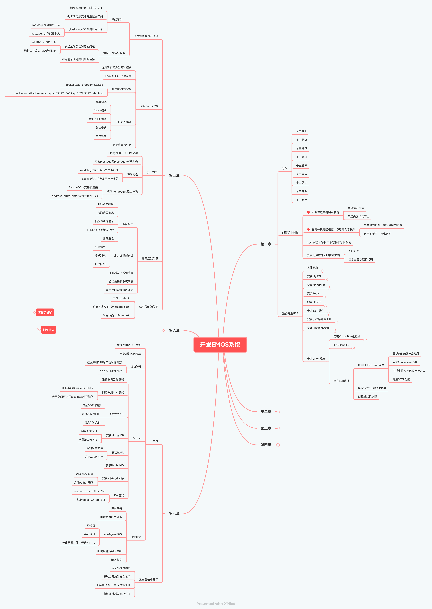

# 开发EMOS系统

## 第一章

### 导学(略)

### 如何学本课程

- 不要快进或者跳跃收看

	- 容易错过细节
	- 前后内容衔接不上

- 看完一集完整视频，然后再动手操作

	- 集中精力理解、学习老师的思路
	- 自己动手写，强化记忆

- 从本课程git项目下载软件和项目代码
- 妥善利用本课程的在线文档

	- 实时更新
	- 包含主要步骤和代码

### 准备开发环境

- 具体要求

	- 硬件环境要求

		- 建议配置

			- CPU：i5以上
			- 内存：16GB
			- 硬盘：20GB空间
			- 显卡：无要求

		- 最低配置

			- CPU：i3以上
			- 内存：8GB以上
			- 硬盘：10GB空间
			- 显卡：无要求

	- 软件环境要求

		- Java开发工具

			- IDEA 2020
			- JDK 14
			- Maven 3.6

		- 小程序开发工具

			- HbuilderX 2.8
			- 小程序开发工具 1.0.3

		- 数据库

			- MySQL 8.0
			- MongoDB 5.0
			- Redis 3.0

		- 虚拟机

			- 原因

				- 为了运行Docker镜像，需要安装Docker
				- Windows和MacOS上的Docker是阉割版的
				- 利用虚拟机软件，先安装CentOS系统，再安装Docker

			- VisualBox虚拟机

				- BUG少
				- 跟VMware功能基本相同

			- VMware虚拟机

				- 不支持新版本Win10系统，安装时候黑屏
				- 启动虚拟机黑屏，需要restart服务
				- SFTP断网
				- 双网卡电脑断网

- 安装MySQL

	- 只选择安装Server Only
	- 选择传统MySQL账号加密方式
	- 导入数据

		- 创建emos数据库
		- 执行emos.sql文件

- 安装MongoDB

	- 课程提供了绿色版MongoDB
	- 执行mongo.bat文件就可以启动
	- 数据库登陆信息

		- 验证库：admin
		- 账号：admin
		- 密码：abc123456

- 安装Redis

	- 课程提供了绿色版的Redis
	- 执行start.bat可以启动Redis
	- 登陆密码：abc123456

- 配置Maven

	- 从课程git上下载Maven
	- 创建repository文件夹
	- 修改config/settings.xml文件第55行内容
	- 配置阿里云仓库
	- 在IDEA上面设置Maven

- 安装IDEA插件

	- Lombok插件

		- 编译字节码的时候自动生成set/get方法

	- Free MyBatis Plus插件

		- 创建数据库连接
		- 根据选中的数据表生成各种MyBatis文件

- 安装小程序开发工具

	- https://developers.weixin.qq.com/miniprogram/dev/devtools/download.html
	- 下载稳定版软件
	- 执行默认安装之后，扫码登陆小程序工具
	- 开放小程序服务端口

- 安装HBuilderX软件

	- 从课程Git上面下载HBuilderX压缩包，解压缩就可以使用
	- 在设置界面，设置小程序开发工具安装路径

- 安装Linux系统

	- 安装VirtualBox虚拟机

		- Bios界面开启CPU虚拟化
		- 选择正确的网卡
		- 设置桥接网络

			- 桥接网络使用独立的IP地址
			- NAT网络共享宿主机IP地址

				- 宿主机是Windows系统
				- Windows不支持多IP和虚拟IP
				- Windows防火墙会影响虚拟机实例

	- 安装CentOS

		- 开启网络服务
		- 设置管理员密码
		- 查看主机IP地址

	- 建立SSH连接

		- 使用MobaXterm软件

			- 最好的SSH客户端软件
			- 只支持Windows系统
			- 可以支持多种远程连接方式
			- 内置SFTP功能

		- 修改CentOS静态IP地址
		- 创建虚拟机快照

## 第二章

### 创建SpringBoot项目

- 利用IDEA的Spring Initializr可以图形化创建项目
- 填写好Maven项目信息
- 勾选若干依赖库

	- SpringBoot DevTool
	- Lombok
	- Spring Web
	- MySQL Driver
	- MyBatis Framework
	- Spring Data Redis
	- Spring Data MongoDB
	- Spring For RabbitMQ
	- Java Mail Sender
	- QuartZ Scheduler

- 配置SpringBoot项目

	- 配置Tomcat
	- 配置MySQL
	- 配置Redis
	- 配置MongoDB

### 配置MyBatis

- 创建数据库连接
- 选中数据表，生成MyBatis文件
- 修改yml文件，添加MyBatis配置信息
- 设置日志输出

### 整合高级功能

- 自定义异常

	- 为什么要继承RuntimeException？

		- Exception类型的异常必须手动处理
		- RuntimeException异常既可以自动处理，也可以手动处理

	- 包含的属性

		- 状态码
		- 异常消息

- 封装R对象

	- JavaWeb项目需要统一数据返回格式

		- 业务状态码
		- 业务消息
		- 业务数据

	- 导入httpcomponents库

		- 定义了很多HTTP状态码
		- 免去我们自定义状态码常量

	- R类继承自HashMap
	- 封装方法

		- ok方法
		- error方法

- Swagger

	- 本课程使用Swagger2
	- 添加依赖库
	- 配置Swagger

		- （ApiInfoBuilder ）定义Swagger页面基本信息
		- （ApiSelectorBuilder ）哪些类中的方法会出现在Swagger上面
		- 开启对JWT的支持

			- List<ApiKey>：用户需要输入什么参数
			- AuthorizationScope[]：JWT认证在Swagger中的作用域
			- List <SecurityReference > ：令牌的作用域
			- List<SecurityContext >：令牌上下文

	- 编写Web接口

		- TestController
		- 类声明要加上@API注解
		- Web方法要加上@ApiOperation注解

	- http://127.0.0.1:8080/emos-wx-api/swagger-ui.html

- 添加后端验证

	- 使用Validation库
	- 添加依赖库
	- 创建Form类

		- 类声明要添加@ApiModel
		- 属性声明要添加@ApiModelProperty
		- 属性声明要添加验证注解

			- @NotNull
			- @NotBlank
			- @Min
			- @Max
			- @Range
			- @Pattern

	- 验证数据要使用@Valid注解

- 抵御XSS攻击

	- 原因

		- XSS攻击通常指的是通过利用网站系统保存数据的漏洞，通过巧妙的方法把恶意指令注入到网页，用户加载网页的时候就会自动执行恶意脚本。
		- 
		- 如果黑客能在你的浏览器上执行javaScript，那么就能窃取Cookie或者Token

	- 导入Hutool依赖
	- 对Http请求中的数据转义

		- 设置过滤器
		- 覆盖Http请求的方法

			- HttpServletRequest是接口，各家服务器厂商会实现它
			- 如果直接继承各厂商的请求父类，那么我们的程序就跟厂商绑定在一起
			- HttpServletRequestWrapper类

				- 使用了装饰器模式
				- 装饰器封装了厂商的Request实现类
				- 只需要覆盖Wrapper类的方法，就能做到覆盖厂商请求对象里方法

			- 创建过滤器，把Request对象传入Wrapper对象

- Shiro和JWT

	- Shiro简介

		- 什么是认证？
		- 什么是授权？
		- Shiro靠什么做认证与授权的？

	- JWT简介

		- 单点系统中的认证方式
		- 集群环境中的JWT认证方式

	- 创建JWT工具类

		- 导入依赖库
		- 生成令牌

			- 密钥
			- 过期时间
			- 用户ID

		- 验证令牌的有效性

			- 内容是否有效
			- 是否过期

	- 把令牌封装成认证对象

		- Shiro框架的认证需要用到认证对象
		- 把令牌字符串做简单的封装

	- 实现认证与授权

		- 创建AuthorizingRealm类的子类
		- 实现认证与授权的方法

	- 如何设计令牌的刷新机制？

		- 为什么要刷新令牌？

			- 令牌一旦生成就保存在客户端
			- 即便用户一直在登陆使用系统，也不会重新生成令牌
			- 令牌到期，用户必须重新登录
			- 令牌应该自动续期

		- 双令牌机制

			- 设置长短日期的令牌
			- 短日期令牌失效，就用长日期的令牌

		- 缓存令牌机制

			- 令牌缓存到Redis上面
			- 缓存的令牌过期时间是客户端令牌的一倍
			- 如果客户端令牌过期，缓存令牌没有过期，则生成新的令牌
			- 如果客户端令牌过期，缓存令牌也过期了，则用户必须重新登录

	- 创建ThreadLocalToken类

		- 该类是用于在过滤器和AOP之间传递Token
		- 因为使用了ThreadLocal，所以是线程安全的

	- 创建过滤器

		- 判断哪些请求应该被Shiro处理

			- options请求直接放行

				- 提交application/json数据
				- 请求被分成options和post两次

			- 其余所有请求都要被Shiro处理

		- 判断Token是真过期还是假过期

			- 真过期，返回提示信息，让用户重新登录
			- 假过期，就生成新的令牌，返回给客户端

		- 存储新令牌

			- ThreadLocalToken
			- Redis

	- 创建ShiroConfig

		- 把Filter和Realm添加到Shiro框架
		- 创建四个对象返回给SpringBoot

			- SecurityManager

				- 用于封装Realm对象

			- ShiroFilterFactoryBean

				- 用于封装Filter对象
				- 设置Filter拦截路径

			- LifecycleBeanPostProcessor

				- 管理Shiro对象生命周期

			- AuthorizationAttributeSourceAdvisor

				- AOP切面类
				- Web方法执行前，验证权限

	- 创建AOP切面类

		- 拦截所有的Web方法返回值
		- 判断是否刷新生成新令牌

			- 检查ThreadLocal中是否保存令牌
			- 把新令牌绑定到R对象中

- 精简返回给客户端的异常

	- @ControllerAdvice可以全局捕获SpringMVC异常
	- 判断异常的类型

		- 后端数据验证异常

			- 精简异常内容

		- 未授权异常

			- "你不具有相关权限"

		- EmosException

			- 精简异常内容

		- 普通异常

			- "后端执行异常"

## 第三章

### 申请微信开发者账号

- 小程序类型

	- 企业类型

		- 可以开发商业类小程序
		- 需要企业资质，并且缴费认证
		- 借用企业开发者身份

			- 开发&真机调试
			- 不能上架发布小程序

	- 个人类型

		- 开发非商业类小程序
		- 需要个人实名认证

- 获取AppId和密钥

### 创建小程序项目

- 项目类型为uni-app
- 填写AppId
- 编译运行小程序

	- 模拟器运行
	- 真机运行

- uni-app简介

	- 基于VUE的跨平台移动端框架

		- 语法简单
		- 学习成本很低

	- 跨平台性

		- 微信小程序
		- 支付宝小程序
		- QQ小程序
		- H5 APP
		- 安卓APP
		- iOS APP
		- H5 网站

### 初始uni-app

- 目录结构
- 基础语法

	- 插值输出
	- 条件判断
	- 循环输出
	- 事件处理
	- 双向绑定

### 开发登陆模块

- 设计登陆页面

	- login.vue
	- login.less

- 完成登陆

	- 获取OpenId

		- 获取微信临时授权
		- 换取OpenId字符串

	- 判定登陆

		- 查询用户表中的OpenId
		- 用户账号必须是有效状态的

	- 查询用户信息

		- 基本信息
		- 权限信息

	- 生成令牌

### 开发注册模块

- 设计注册页面

	- register.vue
	- register.less

- 完成注册功能

	- 获取OpenId

		- 获取微信临时授权
		- 换取OpenId字符串

	- 获取微信帐户基本信息
	- 验证激活码

		- 超级管理员激活码

			- 验证用户表是否存在超级管理员？
			- 检查用户表的root字段

		- 普通员工激活码

	- 把用户记录和微信账号绑定

		- 保存员工信息
		- 查询员工记录ID

## 第四章

### 创建小程序Tab导航

- 创建五个页面
- 修改pages.json
- 跳转到首页

### 开通腾讯云对象存储服务

- 静态资源要在网上

	- 图片和视频
	- 小程序打包体积不能超过2M，分包不能超过8M
	- 小程序页面引用网上静态资源

- 腾讯云COS服务

	- 创建存储桶
	- 上传图片

		- 轮播图
		- 用户头像图片

### 设计英雄区和栏目导航

- Flex布局的优点

	- 可以将控件水平排列
	- 可以动态缩放控件
	- 拥有多种对齐方式
	- 不会出现高度坍塌

- 焦点图

	- <swiper>

		- interval
		- duration
		- circular

	- <swiper-item>

### 设计人脸签到页面

- 调用系统相机

	- <camera>
	-  wx.createCameraContext()
	- takePhoto()

- 业务流程

	- 先拍照
	- 后签到

- 实现签到拍照功能

	- 从首页跳转到签到页面

		- 封装toPage()函数
		- 根据权限判定页面是否可以跳转

	- 实现拍照和重拍功能

		- clickBtn()

			- 拍照

				- 获取图片地址
				- 更改按钮文字
				- 隐藏取景框
				- 显示拍摄的照片

			- 签到

		- afresh()

			- 隐藏拍摄照片
			- 显示取景框
			- 更改按钮文字

	- 缓存系统常量数据

		- sys_config表保存了配置信息
		- 读取常量数据

			- 编写持久层代码
			- 创建封装类
			- 编写SpringBoot初始化方法

				- init()
				- @PostConstruct

	- 检查当天是否可以签到

		- 判断原则

			- 判断日期

				- tb_workday
				- tb_holidays

			- 判断时间

		- 封装持久层

			- 查询工作日和休息日
			- 查询当天是否签到

		- 业务层

			- 调用持久层
			- 根据时间判断是否可以考勤

		- Web层

			- 封装Web方法
			- 不是Shiro默认放行的Web方法

				- 实现认证方法

					- 认证对象内容不能为空
					- SimpleAuthenticationInfo

						- 用户信息
						- Token令牌
						- Realm类的名字

				- 实现授权方法

					- 查询用户权限列表
					- SimpleAuthorizationInfo 

						- 保存权限列表

- 获取签到地址

	- 开通腾讯位置服务

		- 特点

			- 免费注册
			- 每天提供1万次的API调用
			- 可以把GPS坐标转换成地址
			- 提供了JavaScript接口

		- 创建密钥
		- 在小程序中添加腾讯位置服务为合法域名

	- 获取GPS坐标
	- 把坐标转换成地址

- 安装Docker环境

	- 使用原因

		- 人脸识别用Python开发的
		- 人脸识别依赖很多程序包

			- 从国外服务器下载程序包速度慢
			- 程序包对Linux版本要求很严格

		- 很多初学者不知道怎么安装Python环境

	- 安装Docker

		- yum install docker -y
		- service docker start
		- service docker stop

	- 运行人脸识别程序

		- 上传人脸识别程序
		- 上传人脸识别镜像文件
		- 创建Docker容器，运行Python程序

- 实现人脸签到

	- 先判断签到用户是否存在人脸模型？
	- 用签到照片比对人脸模型，识别签到人
	- 根据签到地址判断新冠疫情风险等级

		- 向本地宝H5页面传入URL参数查询疫情风险等级
		- 理由jsoup解析HTML页面中的数据
		- 高风险则发出告警邮件

			- 异步多线程发送邮件

				- 不会阻塞签到业务
				- 多线程发送邮件，速度更快

			- 导入Email库
			- 配置SMTP服务器
			- 定义常用企业邮箱
			- 发送邮件

				- 创建线程池
				- 创建线程任务

	- 存储签到结果

		- 每天只能签到1次
		- 测试的时候要删除当天已有的签到记录

- 设计签到成功页面

	- 内容

		- 用户信息
		- 签到信息
		- 考勤统计

			- 总考勤天数
			- 本周考勤统计

				- 先查询出本周考勤记录、特殊工作日和节假日
				- 用DateUtil.range()生成本周的七天日期对象
				- 用本周每天日期查询当天的考勤情况

					- 先断定当天是工作日还是节假日
					- 未来的日子考勤结果为空字符串
					- 当天考勤结束前，没考勤的结果为空字符串
					- 工作日没有考勤记录就算旷工

	- 展示页面内容

- 月考勤页面

	- 用户可以到月考勤页面查看自己的考勤
	- 用户页面

		- 进入到月考勤页面的链接
		- 移动端权限验证

			- 用户登陆后权限列表保存在Storage里面
			- 用Storage中的权限和目标权限做比较

		- 设计页面，加载数据

## 第七章

### 云主机

- 建议选购腾讯云主机
- 至少2核4G的配置
- 端口管理

	- 数据库和SSH端口暂时性开放
	- 业务端口永久开放

- Docker

	- 设置腾讯云加速器
	- 网络采用host模式

		- 所有容器使用CentOS网卡
		- 容器之间可以用localhost相互访问

	- 安装MySQL

		- 分配500M内存
		- 为容器设置时区
		- 导入SQL文件

	- 安装MongoDB

		- 编辑配置文件
		- 分配500M内存

	- 安装Redis

		- 编辑配置文件
		- 分配300M内存

	- 安装RabbitMQ
	- 安装人脸识别程序

		- 创建node容器
		- 运行Python程序

	- JDK容器

		- 运行emos-workflow项目
		- 运行emos-wx-api项目

- 绑定域名

	- 购买域名
	- 申请免费数字证书
	- 安装Nginx程序

		- 80端口
		- 443端口
		- 修改配置文件，开通HTTPS

	- 把域名绑定到云主机
	- 域名备案

### 发布微信小程序

- 提交小程序项目
- 把域名添加到安全名单
- 服务类型为 工具 > 企业管理
- 审核通过后发布小程序

## 第六章

### 小程序页面

- 会议列表页面

	- 只显示未开始和正在进行的会议
	- 员工只能看到自己参与的会议
	- 按照日期合并成小分组列表
	- 上划触底翻页

- 会议详情页面

	- 查看、修改、添加会议都对应这个页面
	- 延迟一小时为结束时间

- 员工列表页面

	- 按照部门分组
	- 可以多选

- 工作审批页面

### 添加测试数据

- 编写DAO和Service
- 用测试用例方法生成100条会议记录

### 业务实现

- 查询会议列表分页数据

	- 会议状态必须是3和4
	- 发起人必须在职
	- 参会人必须在职
	- 按照会议日期分组

- 查看会议详情
- 添加会议

	- 创建会议记录
	- 创建工作流实例
	- 创建定时器

- 修改会议

	- 会议开始前20分钟无法修改会议
	- 修改会议记录
	- 删除原工作流，创建新的工作流
	- 删除原定时器，创建新的定时器

- 删除会议

	- 删除会议记录
	- 删除定时

- 成员页面

	- 按照部门分组
	- 与员工列表页面排版相似，代码可以复用
	- 执行SQL语句，导入若干员工记录
	- 勾选的员工ID绑定到上一个页面

- 会议审批

	- 待审批列表

		- 分页显示
		- 查询待审批申请

	- 已审批列表

		- 分页显示
		- 查询已审批申请

	- 审批页面

		- 同意
		- 不同意

- 视频会议

	- 开通TRTC服务

		- 免费领取1万分钟流量包
		- 获得AppID和密钥
		- 小程序必须是企业身份才能绑定TRTC服务

	- 借用开发者身份

		- 把学员微信号关联到企业开发账号
		- 每个企业账号只能关联90个微信号
		- 默认免费使用两周时间
		- QQ群共享文件

			- 小程序AppID和密钥
			- 每隔几天小程序密钥就会更换

	- 在线多人视频会议

		- 必要参数

			- TRTC的AppID
			- 用户唯一标识符
			- 用户签名字符串

		- 生成签名字符串
		- 引入<trtc-room>标签
		- 创建TrtcRoom对象

- 首页

	- 日历

		- 标记本月有会议的日期
		- 可以切换月份

	- 会议列表

		- 所有需要你参加的会议
		- 未开始或者正在进行的会议
		- 分页显示

## 第五章

### 消息模块的设计原理

- 数据库设计

	- 消息和用户是一对一的关系
	- MySQL无法支撑海量数据存储
	- 使用MongoDB存储消息记录

		- message存储消息主体
		- message_ref存储接收人

- 消息的推送与收取

	- 发送全站公告消息的问题

		- 瞬间要写入海量记录
		- 数据库正常CRUD受到影响

	- 利用消息队列实现削峰填谷

### 选用RabbitMQ

- 支持同步和异步两种模式
- 比其他MQ产品更可靠
- 利用Docker安装

	-     docker load < rabbitmq.tar.gz
	-     docker run -it -d --name mq  -p 15672:15672 -p 5672:5672 rabbitmq

- 五种队列模式

	- 简单模式
	- Work模式
	- 发布/订阅模式
	- 路由模式
	- 主题模式

- 支持消息持久化

### 设计ORM

- MongoDB的ORM很简单
- 定义Message和MessageRef映射类
- 特殊属性

	- readFlag代表该条消息是否已读
	- lastFlag代表消息是最新接收的

- 学习MongoDB的联合查询

	- MongoDB不支持表连接
	- aggregate函数将两个集合连接在一起

### 编写后端代码

- 业务接口

	- 刷新消息模块
	- 获取分页消息
	- 根据ID查询消息
	- 把未读消息更新成已读
	- 删除消息

- 定义线程任务类

	- 接收消息
	- 发送消息
	- 删除队列

- 注册后发送系统消息
- 登陆后接收系统消息
- 首页定时轮询接收消息

### 编写移动端代码

- 首页（index）
- 消息列表页面（message_list）
- 消息页面（Message）

## 工作流引擎

### 独立成分布式项目

### 在Docker环境中安装JDK15容器

### 修改application.yml文件

- MySQL连接信息
- Redis连接信息

### 会议审批工作流程

- 总经理创建的会议直接通过
- 其他员工创建的会议要部门经理审批
- 跨部门的会议需要部门经理和总经理审批

### 所有请求必须附带code字符串

## 消息通知（略）

