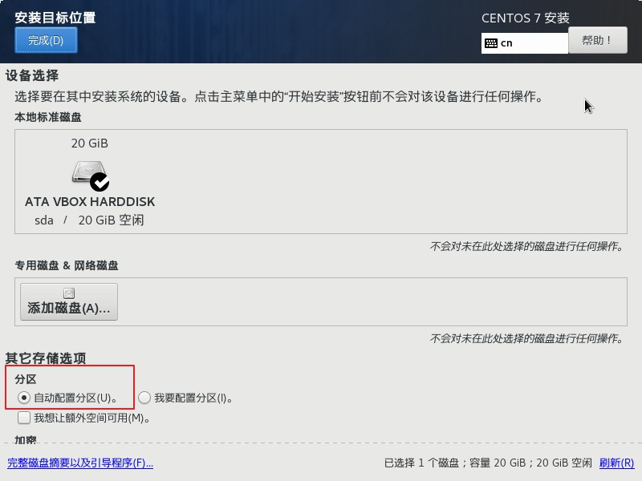

# Linux 入门

## 1.什么是Linux

### 1.1 什么是操作系统

**操作系统（Operating System，OS）**是软件的一部分，它是硬件基础上的第一层软件，是硬件和其它软件沟通的桥梁（或者说接口、中间人、中介等）

并且操作系统具备以下服务：

* 文件系统
* 设备驱动程序
* 用户接口
* 系统服务程序

结构如下：

### 1.2 Linux系统的优缺点

优势如下：

* 大量的可用软件及免费软件
* 良好的可移植性及灵活性
* 优良的稳定性和安全性
* 支持几乎所有网络协议及开发语言

### 1.3 常见的开源协议

* **1)GNU GPL（GNU General Public License，GNU通用公共许可证）**

| 特点     | 说明                                                         |
| -------- | ------------------------------------------------------------ |
| 复制自由 | 允许把软件复制到任何人的电脑中，并且不限制复制的数量。       |
| 传播自由 | 允许软件以各种形式进行传播。                                 |
| 收费传播 | 允许在各种媒介上出售该软件，但必须提前让买家知道这个软件是可以免费获得的；因此，一般来讲，开源软件都是通过为用户提供有偿服务的形式来盈利的。 |
| 修改自由 | 允许开发人员增加或删除软件的功能，但软件修改后必须依然基于GPL许可协议授权。 |

* **2) BSD（Berkeley Software Distribution，伯克利软件发布版）协议**

BSD 协议基本上允许用户“为所欲为”，用户可以使用、修改和重新发布遵循该许可的软件，并且可以将软件作为商业软件发布和销售，前提是需要满足下面三个条件：

> 1.如果再发布的软件中包含源代码，则源代码必须继续遵循 BSD 许可协议。
>
> 2.如果再发布的软件中只有二进制程序，则需要在相关文档或版权文件中声明原始代码遵循了 BSD 协议。
>
> 3.不允许用原始软件的名字、作者名字或机构名称进行市场推广。

BSD 对商业比较友好，很多公司在选用开源产品的时候都首选 BSD 协议，因为可以完全控制这些第三方的代码，甚至在必要的时候可以修改或者二次开发。

* **3) Apache 许可证版本（Apache License Version）协议**

最常见的软件开源协议，程序开发人员在开发遵循该协议的软件时，要严格遵守下面的四个条件：

> 1.该软件及其衍生品必须继续使用 Apache 许可协议。
>
> 2.如果修改了程序源代码，需要在文档中进行声明。
>
> 3.若软件是基于他人的源代码编写而成的，则需要保留原始代码的协议、商标、专利声明及其他原作者声明的内容信息。
>
> 4.如果再发布的软件中有声明文件，则需在此文件中标注 Apache 许可协议及其他许可协议。

* **4）MIT（Massachusetts Institute of Technology）协议**

目前限制最少的开源许可协议之一（比 BSD 和 Apache 的限制都少），只要程序的开发者在修改后的源代码中保留原作者的许可信息即可，因此普遍被商业软件所使用。

* **5）GUN LGPL（GNU Lesser General Public License，GNU 宽通用公共许可证）**

LGPL 是 GPL 的一个衍生版本，也被称为 GPL V2，该协议主要是为类库设计的开源协议。

LGPL 允许商业软件通过类库引用（link）的方式使用 LGPL 类库，而不需要开源商业软件的代码。这使得采用 LGPL 协议的开源代码可以被商业软件作为类库引用并发布和销售。

但是如果修改 LGPL 协议的代码或者衍生品，则所有修改的代码，涉及修改部分的额外代码和衍生的代码都必须采用 LGPL 协议。因此LGPL协议的开源代码很适合作为第三方类库被商业软件引用，但不适合希望以 LGPL 协议代码为基础，通过修改和衍生的方式做二次开发的商业软件采用。

其他协议的信息可以参考：[http://www.gnu.org/licenses/license-list.html](http://www.gnu.org/licenses/license-list.html)

### 1.4 开源与免费的区别

首先是开源和免费的概念区别：

- 开源软件是指公开源代码的软件。开源软件在发行的时候会附上软件的源代码，并授权允许用户更改、传播或者二次开发。
- 免费软件就是免费提供给用户使用的软件，但是在免费的同时，通常也会有一些限制，比如源代码不公开，用户不能随意修改、不能二次发布等。

如支付宝，你可以免费使用，但是如果你将它私自修改，并发布到平台并用以盈利为目的，那么估计阿里能送你一副银手镯

### 1.5 开源软件如何盈利

既然开源软件是公开源代码，并允许其他用户随意更改；但是运营，更新和宣传等活动都是需要花钱，它不可能一直为爱发电还能存活；那么开源软件是如何盈利呢

* **1.双重许可**

有些开源软件不但有一个免费的基础版本，还有一个收费的商业版本。免费版本能够促进传播，让用户爱上该软件；收费版本功能更加丰富，还提供技术支持。这种情况在开源界非常普遍。

例如：日常开发使用比较多的idea开发工具就有社区版和收费版两个版本

* **2.技术支持**

比较经典的就是Mysql数据库了，Mysql是开源免费的软件，但是如果出现了数据库误删，需要找Orcle恢复数据库的时候，那个费用就是按小时计算的（之前论讨里看到的真实案例）

* **3.附加服务**

附加服务就是通过提供技术文档，培训，针对企业级的二次开发支持等服务类型的方式获得收入。

最贴切的例子就是：开源软件出版商 O'Reilly 公司也是这种模式，它不遗余力地联系开源软件的权威人士，组织各种开源软件的会议，虽然知识是免费的，但承载知识的书籍却是收费的。

* **4.应用托管服务**

应用托管是开发者本身不为应用提供服务器，将应用托管给ASP。即由ASP与商务应用外包商合作，为企业提供端到端的托管（即为应用的运行提供主机）服务

比如阿里云和腾讯云，企业可以将自己的服务托管给他们，而自己去专注自己的业务核心；而阿里云和腾讯云通过托管服务获取收益

* **5.软硬件一体化**

比如 IBM、HP 等服务器供应商巨头，通过捆绑免费的 Linux /Winodows 操作系统销售硬件服务器。SUN 公司近期将其 Solaris 操作系统开放源码，以确保服务器硬件的销售收入，也是这种模式的体现。

* **6.部分组件收费**

开源免费的软件可以满足大部分用户的需求，但是也有很多用户需要一些特殊的定制服务，这个时候软件公司就会收取一定的费用。

例如专业版和社区版本的idea，社区版本能满足大部分的开发者需求，但是一些企业需要使用一些专业版的功能，就会申请企业授权码，得到更好的体验。

* **7.版权收费**

虽然代码是开源的，但很多作者会采用一些开源协议来限制自己版权问题，如果用户想要去版权，是需要另外付费的。

这个在论文里面出现得比较多，在自己论文中引用他人的论文是允许得，但是要下载论文全文就需要为版权付费

* **8.赞助捐款**

很多开源软件都有一些捐款渠道，喜爱该软件的用户，或者该软件的受益者都可以进行资金支持。

例如，Python 就有一个软件基金协会，它收到了来自 Facebook、Amazon、Google、Redhat、Microsoft 等巨头的赞助。

这些公司也不傻，他们为什么会赞助 Python 呢？因为这些公司大量使用了 Python 语言，他们是这门语言最大的受益者，他们希望 Python 能够持续发展，如果 Python 倒了，他们也会跟着倒霉。

### 1.6 Linux学习指南

PS：**个人觉得对我比较有用**

* **1.习惯命令行**

因为linux本身并不完全支持图形化界面，而且linux本身是用用在服务器上，若是图形化，进行远程连接会消耗更多的网络带宽。最重要的是命令行是 Linux 系统正常运行的核心，也是专业 Linux 系统工程师必须掌握的技能，所以要习惯使用命令行。

* **2.操作Linux，一定要谨慎**

经常听到的删库跑路，就是犹豫命令行错误，误删了重要文件的情况，如果只是个人学习，还好；若是在企业级开发中，丢失的是公司的核心文件，这就会直接造成惊人的经济损失，其后果非常严重。

所以一定要成勤备份的习惯，这样一旦数据损坏了，还有挽救的余地；饭直，数据五阿发恢复，可能会造成非常严重二代后果

输入命令的速度不要太快，看准了再按回车。另外，对于修改重要的配置文件，一定要养成修改前先备份的习惯，这样一旦出现问题，还可以将文件快速还原。

* **3.远程密码不能太简单**

这个是所有人网络安全必须注意的，就不细讲

## 2.Linux安装教程

Linux的学习环境需要的条件限制要远小于MacOs，因为MacOs只能运行在定制的Mac硬件上（黑苹果的除外，并且黑苹果时间成本也高）；而Linux可以在虚拟机 or Pc上直接部署，所需要的硬件也很容易获得，所以可以有很多种方式体验linux系统

### 2.1 什么是虚拟机

虚拟机是最低成本体验系统的方案，无论是linux还是Windows；那么什么是虚拟机？

* **虚拟机（Virtual Machine）就是允许我们在当前操作系统中运行其他操作系统的软件**

| 虚拟机软件               | 特点及选择建议                                               |
| ------------------------ | ------------------------------------------------------------ |
| VM（VMware Workstation） | 工作站版虚拟化软件，简单、易用，适合用于搭建学习环境。       |
| KVM/Xen Linux 的虚拟化   | 服务器级虚拟化软件，适合企业虚拟化应用，不适合用于搭建学习环境。 |
| Virtual PC               | MAC 平台可以用                                               |
| VirtualBox               | 开源的虚拟机软件                                             |

* **初学者应选择哪款虚拟机软件？**

这个根据需求来说，反正网络资源很多

### 2.2 使用虚拟机（必须会）

首先准备好需要的安装包

>准备工作：
>
>1. 一台可以访问互联网的电脑
>2. 虚拟机软件安装包（这里使用的VirtualBox）
>3. CentOS镜像文件 （这里用的centos8.1）
* 启动虚拟化(不同品牌的电脑配置方式不一样,百度即可，下图分别为AMD和Intel)

  

* 创建虚拟机

定义虚拟机的名字，只要你填写CentOS，下面会自动设置好类型为Linux，版本为RedHat。

虚拟机的内存建议设置成2GB（2048MB）,当然也也根据个人需求来

虚拟磁盘类型使用默认选项

选择动态分配磁盘空间(动态不会持久占用磁盘空间)

磁盘空间上限根据需求设置，这里设置的20G

**修改网络模式为桥接(非常重要)**

>虚拟机默认网络模式为NAT，也就是虚拟机和Windows公用同一个IP地址。由于Windows系统不可以在网卡中设置多个IP地址，所以有时候我们想把部署的程序分配不同的IP和端口就没办法实现，包括搭建Swarm分布式环境的时候，每个虚拟机主机IP必须不同。这么看来，NAT模式不太能满足我们的需求。
>
>我建议大家把网络模式改成桥接，这样虚拟机会使用虚拟的网卡上网，虚拟机会享用一个独立的IP。甚至我们可以在虚拟网卡里面设置多个IP地址，这都是可以的

切记：

> 若是你是用WIFI上网，这里却选择了固定网卡（LAN），那么你在虚拟机中就无法访问外网。所以你用什么方式上网，就选择对应的网卡，这里切记！如果你切换了上网方式，那么也要及时修改虚拟机的网卡才行

到这里完成了虚拟机的配置

### 2.3 在虚拟机上部署Linux（必须会）

在虚拟机设置界面，选择存储

选择创建虚拟光盘文件

点击注册，然后选中CentOS镜像文件

镜像注册完毕，点击Ok确认

然后启动虚拟机

选择第一个任务，开始执行

选择语言（初学建议使用中文）

选择安装位置

自动分区

**打开网络连接(一定要记住ip地址)**

最后完成安装

**最后可以设置root账户的密码（记住哦）**

完成安装

### 2.4 使用U盘安装Linux

前面的操作是可以满足学习的需求，但是现实开发中，需要在Pc上直接安装Linux，这就需要使用到U盘安装了

* **前期准备工作**

>1.大容量的U盘（安装 CentOS 6.x 系统，U 盘容量至少 8 G）；
>
>2.UltraISO 工具，用来制作 U 盘启动盘。除此之外，由于 UltraISO 工具
>
>是 Windows 软件，所以需要一台安装了 Windows 系统的计算机协助；
>
>3.CentOS 6.x 系统的 ISO 映像文件

这里所使用的 UltralISO 只是制作 U 盘启动盘的工具之一，除此之外，还可以选择大白菜、老毛桃等软件，都可实现一键快速制作 U 盘启动盘。(个人喜欢老毛桃和UltraISO)

* **U盘安装Linux系统**

  * 1.在装有 Windows 系统的电脑上下载和安装 UltraISO 软件。（其他软件都一样）
  * 2.用安装好的 UltroISO 制作 U 盘启动盘，具体操作为：
  * 3.将U盘通过USB口插到计算机上（记得要备份，因为制作启动盘要格式化U盘）
    * 启动 UltraISO 软件，依次选择 "文件->打开" 命令，找到已下载的 CentOS 6.x 安装映像文件（iso 文件）；
    * 选择“启动->写入硬盘映像”命令，打开 "写入硬盘映像" 对话框，在 "硬盘驱动器" 下拉列表框中选择你的 U 盘（注意不要选错，因为这一步对 U 盘进行格式化操作）。"写入方式" 选择 "USB-HDD +"，然后单击 "写入" 按钮，等待写入完成，如图所示。

  * 4.插入 U 盘，设定 U 盘为第一个启动设备，重启之后出现安装界面。
  * 5.选择第一项“Install or upgrade an existing system (安装或升级现有系统）”，进入安装语言选择界面，如图所示。

后面选择语言，驱动器模式，傻瓜式完成安装

### 2.5 其他方式安装Linux

#### 2.5.1 使用dd命令安装Linux系统

* 可以理解为直接复制linux的文件目录到新的环境下

* dd 命令的格式如下：

  > [root@localhost ~]# dd if=输入文件 of=输出文件 bs=字节数 count=个数

  选项:

  - if=输入文件：指定源文件或源设备；
  - of=输出文件：指定目标文件或目标设备；
  - bs=字节数：指定一次输入/输出多少字节，即把这些字节看作一个数据块；
  - count=个数：指定输入/输出多少个数据块；

* 使用场景
  * 需要批量复制的服务器硬件配置一致。通常，采购服务器都是批量采购的，服务器的配置都是一样的。
  * 复制硬盘的时候，需要手工更换被复制盘。服务器上一般都是 SCSI 硬盘，SCSI 硬盘支持热插拔，而且不需要拆卸机箱，更换被复制盘非常方便。

#### 2.5.2 使用LiveCD从光盘直接运行Linux，无需安装

没用过，略，需要的百度

## 3.Linux的文件和目录管理系统

## 4.Linux打包和压缩

## 5.Vim文本编辑器

## 6.Linux文本处理

## 7.Linux系统软件安装

## 8.Linux用户和用户组管理

## 9.Linux权限管理

## 10.Linux文件系统管理

## 11.Linux高级文件系统管理

## 12.Linux系统管理

## 13.Linux数据备份与恢复

## 14.Linux系统服务管理

## 15.Linux系统日志管理

## 16.Linux系统启动管理

## 17.LAMP环境搭建和LNMP环境搭建

## 18.SELinux管理

