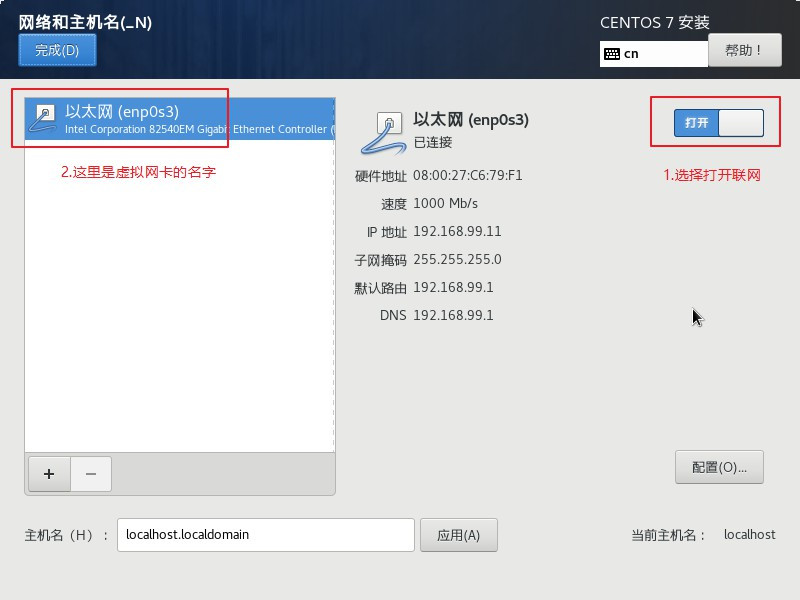
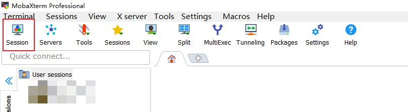
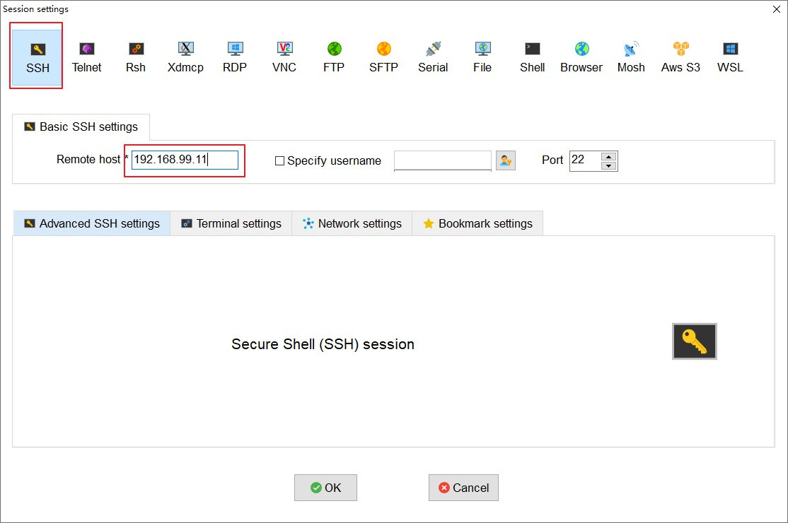
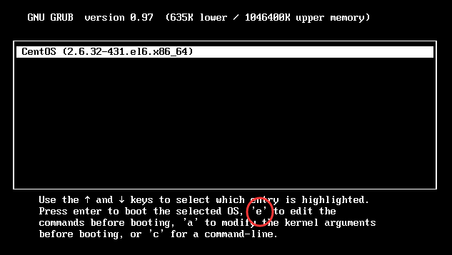

# Linux 入门


## 1.什么是Linux

### 1.1 什么是操作系统

**操作系统（Operating System，OS）**是软件的一部分，它是硬件基础上的第一层软件，是硬件和其它软件沟通的桥梁（或者说接口、中间人、中介等）

并且操作系统具备以下服务：

* 文件系统
* 设备驱动程序
* 用户接口
* 系统服务程序

结构如下：


### 1.2 Linux系统的优缺点

优势如下：

* 大量的可用软件及免费软件
* 良好的可移植性及灵活性
* 优良的稳定性和安全性
* 支持几乎所有网络协议及开发语言

### 1.3 常见的开源协议

* **1)GNU GPL（GNU General Public License，GNU通用公共许可证）**

| 特点     | 说明                                                         |
| -------- | ------------------------------------------------------------ |
| 复制自由 | 允许把软件复制到任何人的电脑中，并且不限制复制的数量。       |
| 传播自由 | 允许软件以各种形式进行传播。                                 |
| 收费传播 | 允许在各种媒介上出售该软件，但必须提前让买家知道这个软件是可以免费获得的；因此，一般来讲，开源软件都是通过为用户提供有偿服务的形式来盈利的。 |
| 修改自由 | 允许开发人员增加或删除软件的功能，但软件修改后必须依然基于GPL许可协议授权。 |

* **2) BSD（Berkeley Software Distribution，伯克利软件发布版）协议**

BSD 协议基本上允许用户“为所欲为”，用户可以使用、修改和重新发布遵循该许可的软件，并且可以将软件作为商业软件发布和销售，前提是需要满足下面三个条件：

> 1.如果再发布的软件中包含源代码，则源代码必须继续遵循 BSD 许可协议。
>
> 2.如果再发布的软件中只有二进制程序，则需要在相关文档或版权文件中声明原始代码遵循了 BSD 协议。
>
> 3.不允许用原始软件的名字、作者名字或机构名称进行市场推广。

BSD 对商业比较友好，很多公司在选用开源产品的时候都首选 BSD 协议，因为可以完全控制这些第三方的代码，甚至在必要的时候可以修改或者二次开发。

* **3) Apache 许可证版本（Apache License Version）协议**

最常见的软件开源协议，程序开发人员在开发遵循该协议的软件时，要严格遵守下面的四个条件：

> 1.该软件及其衍生品必须继续使用 Apache 许可协议。
>
> 2.如果修改了程序源代码，需要在文档中进行声明。
>
> 3.若软件是基于他人的源代码编写而成的，则需要保留原始代码的协议、商标、专利声明及其他原作者声明的内容信息。
>
> 4.如果再发布的软件中有声明文件，则需在此文件中标注 Apache 许可协议及其他许可协议。

* **4）MIT（Massachusetts Institute of Technology）协议**

目前限制最少的开源许可协议之一（比 BSD 和 Apache 的限制都少），只要程序的开发者在修改后的源代码中保留原作者的许可信息即可，因此普遍被商业软件所使用。

* **5）GUN LGPL（GNU Lesser General Public License，GNU 宽通用公共许可证）**

LGPL 是 GPL 的一个衍生版本，也被称为 GPL V2，该协议主要是为类库设计的开源协议。

LGPL 允许商业软件通过类库引用（link）的方式使用 LGPL 类库，而不需要开源商业软件的代码。这使得采用 LGPL 协议的开源代码可以被商业软件作为类库引用并发布和销售。

但是如果修改 LGPL 协议的代码或者衍生品，则所有修改的代码，涉及修改部分的额外代码和衍生的代码都必须采用 LGPL 协议。因此LGPL协议的开源代码很适合作为第三方类库被商业软件引用，但不适合希望以 LGPL 协议代码为基础，通过修改和衍生的方式做二次开发的商业软件采用。

其他协议的信息可以参考：[http://www.gnu.org/licenses/license-list.html](http://www.gnu.org/licenses/license-list.html)

### 1.4 开源与免费的区别

首先是开源和免费的概念区别：

- 开源软件是指公开源代码的软件。开源软件在发行的时候会附上软件的源代码，并授权允许用户更改、传播或者二次开发。
- 免费软件就是免费提供给用户使用的软件，但是在免费的同时，通常也会有一些限制，比如源代码不公开，用户不能随意修改、不能二次发布等。

如支付宝，你可以免费使用，但是如果你将它私自修改，并发布到平台并用以盈利为目的，那么估计阿里能送你一副银手镯

### 1.5 开源软件如何盈利

既然开源软件是公开源代码，并允许其他用户随意更改；但是运营，更新和宣传等活动都是需要花钱，它不可能一直为爱发电还能存活；那么开源软件是如何盈利呢

* **1.双重许可**

有些开源软件不但有一个免费的基础版本，还有一个收费的商业版本。免费版本能够促进传播，让用户爱上该软件；收费版本功能更加丰富，还提供技术支持。这种情况在开源界非常普遍。

例如：日常开发使用比较多的idea开发工具就有社区版和收费版两个版本

* **2.技术支持**

比较经典的就是Mysql数据库了，Mysql是开源免费的软件，但是如果出现了数据库误删，需要找Orcle恢复数据库的时候，那个费用就是按小时计算的（之前论讨里看到的真实案例）

* **3.附加服务**

附加服务就是通过提供技术文档，培训，针对企业级的二次开发支持等服务类型的方式获得收入。

最贴切的例子就是：开源软件出版商 O'Reilly 公司也是这种模式，它不遗余力地联系开源软件的权威人士，组织各种开源软件的会议，虽然知识是免费的，但承载知识的书籍却是收费的。

* **4.应用托管服务**

应用托管是开发者本身不为应用提供服务器，将应用托管给ASP。即由ASP与商务应用外包商合作，为企业提供端到端的托管（即为应用的运行提供主机）服务

比如阿里云和腾讯云，企业可以将自己的服务托管给他们，而自己去专注自己的业务核心；而阿里云和腾讯云通过托管服务获取收益

* **5.软硬件一体化**

比如 IBM、HP 等服务器供应商巨头，通过捆绑免费的 Linux /Winodows 操作系统销售硬件服务器。SUN 公司近期将其 Solaris 操作系统开放源码，以确保服务器硬件的销售收入，也是这种模式的体现。

* **6.部分组件收费**

开源免费的软件可以满足大部分用户的需求，但是也有很多用户需要一些特殊的定制服务，这个时候软件公司就会收取一定的费用。

例如专业版和社区版本的idea，社区版本能满足大部分的开发者需求，但是一些企业需要使用一些专业版的功能，就会申请企业授权码，得到更好的体验。

* **7.版权收费**

虽然代码是开源的，但很多作者会采用一些开源协议来限制自己版权问题，如果用户想要去版权，是需要另外付费的。

这个在论文里面出现得比较多，在自己论文中引用他人的论文是允许得，但是要下载论文全文就需要为版权付费

* **8.赞助捐款**

很多开源软件都有一些捐款渠道，喜爱该软件的用户，或者该软件的受益者都可以进行资金支持。

例如，Python 就有一个软件基金协会，它收到了来自 Facebook、Amazon、Google、Redhat、Microsoft 等巨头的赞助。

这些公司也不傻，他们为什么会赞助 Python 呢？因为这些公司大量使用了 Python 语言，他们是这门语言最大的受益者，他们希望 Python 能够持续发展，如果 Python 倒了，他们也会跟着倒霉。

### 1.6 Linux学习指南

PS：**个人觉得对我比较有用**

* **1.习惯命令行**

因为linux本身并不完全支持图形化界面，而且linux本身是用用在服务器上，若是图形化，进行远程连接会消耗更多的网络带宽。最重要的是命令行是 Linux 系统正常运行的核心，也是专业 Linux 系统工程师必须掌握的技能，所以要习惯使用命令行。

* **2.操作Linux，一定要谨慎**

经常听到的删库跑路，就是犹豫命令行错误，误删了重要文件的情况，如果只是个人学习，还好；若是在企业级开发中，丢失的是公司的核心文件，这就会直接造成惊人的经济损失，其后果非常严重。

所以一定要成勤备份的习惯，这样一旦数据损坏了，还有挽救的余地；饭直，数据五阿发恢复，可能会造成非常严重二代后果

输入命令的速度不要太快，看准了再按回车。另外，对于修改重要的配置文件，一定要养成修改前先备份的习惯，这样一旦出现问题，还可以将文件快速还原。

* **3.远程密码不能太简单**

这个是所有人网络安全必须注意的，就不细讲

## 2.Linux安装教程

Linux的学习环境需要的条件限制要远小于MacOs，因为MacOs只能运行在定制的Mac硬件上（黑苹果的除外，并且黑苹果时间成本也高）；而Linux可以在虚拟机 or Pc上直接部署，所需要的硬件也很容易获得，所以可以有很多种方式体验linux系统

### 2.1 什么是虚拟机

虚拟机是最低成本体验系统的方案，无论是linux还是Windows；那么什么是虚拟机？

* **虚拟机（Virtual Machine）就是允许我们在当前操作系统中运行其他操作系统的软件**

| 虚拟机软件               | 特点及选择建议                                               |
| ------------------------ | ------------------------------------------------------------ |
| VM（VMware Workstation） | 工作站版虚拟化软件，简单、易用，适合用于搭建学习环境。       |
| KVM/Xen Linux 的虚拟化   | 服务器级虚拟化软件，适合企业虚拟化应用，不适合用于搭建学习环境。 |
| Virtual PC               | MAC 平台可以用                                               |
| VirtualBox               | 开源的虚拟机软件                                             |

* **初学者应选择哪款虚拟机软件？**

这个根据需求来说，反正网络资源很多

### 2.2 使用虚拟机（必须会）

首先准备好需要的安装包

>准备工作：
>
>1. 一台可以访问互联网的电脑
>2. 虚拟机软件安装包（这里使用的VirtualBox）
>3. CentOS镜像文件 （这里用的centos8.1）
* 启动虚拟化(不同品牌的电脑配置方式不一样,百度即可，下图分别为AMD和Intel)

  

* 创建虚拟机


定义虚拟机的名字，只要你填写CentOS，下面会自动设置好类型为Linux，版本为RedHat。


虚拟机的内存建议设置成2GB（2048MB）,当然也也根据个人需求来


虚拟磁盘类型使用默认选项


选择动态分配磁盘空间(动态不会持久占用磁盘空间)


磁盘空间上限根据需求设置，这里设置的20G


**修改网络模式为桥接(非常重要)**

>虚拟机默认网络模式为NAT，也就是虚拟机和Windows公用同一个IP地址。由于Windows系统不可以在网卡中设置多个IP地址，所以有时候我们想把部署的程序分配不同的IP和端口就没办法实现，包括搭建Swarm分布式环境的时候，每个虚拟机主机IP必须不同。这么看来，NAT模式不太能满足我们的需求。
>
>我建议大家把网络模式改成桥接，这样虚拟机会使用虚拟的网卡上网，虚拟机会享用一个独立的IP。甚至我们可以在虚拟网卡里面设置多个IP地址，这都是可以的


切记：

> 若是你是用WIFI上网，这里却选择了固定网卡（LAN），那么你在虚拟机中就无法访问外网。所以你用什么方式上网，就选择对应的网卡，这里切记！如果你切换了上网方式，那么也要及时修改虚拟机的网卡才行

到这里完成了虚拟机的配置

### 2.3 在虚拟机上部署Linux（必须会）

在虚拟机设置界面，选择存储


选择创建虚拟光盘文件


点击注册，然后选中CentOS镜像文件


镜像注册完毕，点击Ok确认


然后启动虚拟机


选择第一个任务，开始执行


选择语言（初学建议使用中文）


选择安装位置


自动分区


**打开网络连接(一定要记住ip地址)**



最后完成安装


**最后可以设置root账户的密码（记住哦）**


完成安装

### 2.4 使用U盘安装Linux

前面的操作是可以满足学习的需求，但是现实开发中，需要在Pc上直接安装Linux，这就需要使用到U盘安装了


* **前期准备工作**

>1.大容量的U盘（安装 CentOS 6.x 系统，U 盘容量至少 8 G）；
>
>2.UltraISO 工具，用来制作 U 盘启动盘。除此之外，由于 UltraISO 工具
>
>是 Windows 软件，所以需要一台安装了 Windows 系统的计算机协助；
>
>3.CentOS 6.x 系统的 ISO 映像文件

这里所使用的 UltralISO 只是制作 U 盘启动盘的工具之一，除此之外，还可以选择大白菜、老毛桃等软件，都可实现一键快速制作 U 盘启动盘。(个人喜欢老毛桃和UltraISO)

* **U盘安装Linux系统**

  * 1.在装有 Windows 系统的电脑上下载和安装 UltraISO 软件。（其他软件都一样）
  * 2.用安装好的 UltroISO 制作 U 盘启动盘，具体操作为：
  * 3.将U盘通过USB口插到计算机上（记得要备份，因为制作启动盘要格式化U盘）
    * 启动 UltraISO 软件，依次选择 "文件->打开" 命令，找到已下载的 CentOS 6.x 安装映像文件（iso 文件）；
    * 选择“启动->写入硬盘映像”命令，打开 "写入硬盘映像" 对话框，在 "硬盘驱动器" 下拉列表框中选择你的 U 盘（注意不要选错，因为这一步对 U 盘进行格式化操作）。"写入方式" 选择 "USB-HDD +"，然后单击 "写入" 按钮，等待写入完成，如图所示。

  * 4.插入 U 盘，设定 U 盘为第一个启动设备，重启之后出现安装界面。
  * 5.选择第一项“Install or upgrade an existing system (安装或升级现有系统）”，进入安装语言选择界面，如图所示。

后面选择语言，驱动器模式，傻瓜式完成安装

### 2.5 其他方式安装Linux

#### 2.5.1 使用dd命令安装Linux系统

* 可以理解为直接复制linux的文件目录到新的环境下

* dd 命令的格式如下：

  > [root@localhost ~]# dd if=输入文件 of=输出文件 bs=字节数 count=个数

  选项:

  - if=输入文件：指定源文件或源设备；
  - of=输出文件：指定目标文件或目标设备；
  - bs=字节数：指定一次输入/输出多少字节，即把这些字节看作一个数据块；
  - count=个数：指定输入/输出多少个数据块；

* 使用场景
  * 需要批量复制的服务器硬件配置一致。通常，采购服务器都是批量采购的，服务器的配置都是一样的。
  * 复制硬盘的时候，需要手工更换被复制盘。服务器上一般都是 SCSI 硬盘，SCSI 硬盘支持热插拔，而且不需要拆卸机箱，更换被复制盘非常方便。

#### 2.5.2 使用LiveCD从光盘直接运行Linux，无需安装

没用过，略，需要的百度


### 2.6 Linux 远程SSH登录

远程连接服务使用最多的协议就是SSH，而且市面上提供的这样的工具也是非常多的，如Xshell或者MobaXterm；这里以MobaXterm讲解,其他的原理相同，只是使用方式不同。



首先创建SSH连接，并填写连接地址




完成连接

### 2.7 如何设置静态IP

首先，进入到/etc/sysconfig/network-scripts/目录，查找你网卡对应的文件


用编辑器打开这个文件，添加并设置红色部分的内容，然后保存文件


重启网络服务

> service network restart

## 3.Linux的文件和目录管理系统

### 3.1 Linux 文件目录结构一览表

学习 Linux，不仅限于学习各种命令，了解整个 Linux 文件系统的目录结构以及各个目录的功能同样至关重要。

#### 3.1.1 Linux 根目录（/）


FHS 认为，Linux 系统的根目录（/）最为重要（没有之一），其原因有以下 2 点：

* 1.所有目录都是由根目录衍生出来的；
* 2.根目录与系统的开机、修复、还原密切相关；

因此，根目录必须包含开机软件、核心文件、开机所需文件、函数库。修复系统程序等文件，如下表所示结构

| 一级目录 | 功能（作用）                                                 |
| -------- | ------------------------------------------------------------ |
| /bin/    | 存放系统命令，普通用户和 root 都可以执行。放在 /bin 下的命令在单用户模式下也可以执行 |
| /boot/   | 系统启动目录，保存与系统启动相关的文件，如内核文件和启动引导程序（grub）文件等 |
| /dev/    | 设备文件保存位置                                             |
| /etc/    | 配置文件保存位置。系统内所有采用默认安装方式（rpm 安装）的服务配置文件全部保存在此目录中，如用户信息、服务的启动脚本、常用服务的配置文件等 |
| /home/   | 普通用户的主目录（也称为家目录）。在创建用户时，每个用户要有一个默认登录和保存自己数据的位置，就是用户的主目录，所有普通用户的主目录是在 /home/ 下建立一个和用户名相同的目录。如用户 liming 的主目录就是 /home/liming |
| /lib/    | 系统调用的函数库保存位置                                     |
| /media/  | 挂载目录。系统建议用来挂载媒体设备，如软盘和光盘             |
| /mnt/    | 挂载目录。早期 Linux 中只有这一个挂载目录，并没有细分。系统建议这个目录用来挂载额外的设备，如 U 盘、移动硬盘和其他操作系统的分区 |
| /misc/   | 挂载目录。系统建议用来挂载 NFS 服务的共享目录。虽然系统准备了三个默认挂载目录 /media/、/mnt/、/misc/，但是到底在哪个目录中挂载什么设备可以由管理员自己决定。 |
| /opt/    | 第三方安装的软件保存位置。这个目录是放置和安装其他软件的位置，手工安装的源码包软件都可以安装到这个目录中。不过笔者还是习惯把软件放到 /usr/local/ 目录中，也就是说，/usr/local/ 目录也可以用来安装软件 |
| /root/   | root 的主目录。普通用户主目录在 /home/ 下，root 主目录直接在“/”下 |
| /sbin/   | 保存与系统环境设置相关的命令，只有 root 可以使用这些命令进行系统环境设置，但也有些命令可以允许普通用户查看 |
| /srv/    | 服务数据目录。一些系统服务启动之后，可以在这个目录中保存所需要的数据 |
| /tmp/    | 临时目录。系统存放临时文件的目录，在该目录下，所有用户都可以访问和写入。建议此目录中不能保存重要数据，最好每次开机都把该目录清空 |

除了以上标准目录外，还存在几个特殊的文件目录

| 一级目录     | 功能（作用）                                                 |
| ------------ | ------------------------------------------------------------ |
| /lost+found/ | 当系统意外崩溃或意外关机时，产生的一些文件碎片会存放在这里。在系统启动的过程中，fsck 工具会检查这里，并修复已经损坏的文件系统。这个目录只在每个分区中出现，例如，/lost+found 就是根分区的备份恢复目录，/boot/lost+found 就是 /boot 分区的备份恢复目录 |
| /proc/       | 虚拟文件系统。该目录中的数据并不保存在硬盘上，而是保存到内存中。主要保存系统的内核、进程、外部设备状态和网络状态等。如 /proc/cpuinfo 是保存 CPU 信息的，/proc/devices 是保存设备驱动的列表的，/proc/filesystems 是保存文件系统列表的，/proc/net 是保存网络协议信息的...... |
| /sys/        | 虚拟文件系统。和 /proc/ 目录相似，该目录中的数据都保存在内存中，主要保存与内核相关的信息 |

#### 3.1.2 Linux/usr目录

usr（注意不是 user），全称为 Unix Software Resource，此目录用于存储系统软件资源。FHS 建议所有开发者，应把软件产品的数据合理的放置在 /usr 目录下的各子目录中，而不是为他们的产品创建单独的目录。

/usr 目录类似 Windows 系统中 C:\Windows\ + C:\Program files\ 两个目录的综合体。

| 子目录       | 功能（作用）                                                 |
| ------------ | ------------------------------------------------------------ |
| /usr/bin/    | 存放系统命令，普通用户和超级用户都可以执行。这些命令和系统启动无关，在单用户模式下不能执行 |
| /usr/sbin/   | 存放根文件系统不必要的系统管理命令，如多数服务程序，只有 root 可以使用。 |
| /usr/lib/    | 应用程序调用的函数库保存位置                                 |
| /usr/XllR6/  | 图形界面系统保存位置                                         |
| /usr/local/  | 手工安装的软件保存位置。我们一般建议源码包软件安装在这个位置 |
| /usr/share/  | 应用程序的资源文件保存位置，如帮助文档、说明文档和字体目录   |
| /usr/src/    | 源码包保存位置。我们手工下载的源码包和内核源码包都可以保存到这里。不过笔者更习惯把手工下载的源码包保存到 /usr/local/src/ 目录中，把内核源码保存到 /usr/src/linux/ 目录中 |
| /usr/include | C/C++ 等编程语言头文件的放置目录                             |

#### 3.1.3 Linux /var 目录

`/var` 目录用于存储动态数据，例如缓存、日志文件、软件运行过程中产生的文件等

| /var子目录        | 功能（作用）                                                 |
| ----------------- | ------------------------------------------------------------ |
| /var/lib/         | 程序运行中需要调用或改变的数据保存位置。如 Mysql 的数据库保存在 /var/lib/mysql/ 目录中 |
| /var/log/         | 登陆文件放置的目录，其中所包含比较重要的文件如 /var/log/messages, /var/log/wtmp 等。 |
| /var/run/         | 一些服务和程序运行后，它们的 PID（进程 ID）保存位置          |
| /var/spool/       | 里面主要都是一些临时存放，随时会被用户所调用的数据，例如 /var/spool/mail/ 存放新收到的邮件，/var/spool/cron/ 存放系统定时任务。 |
| /var/www/         | RPM 包安装的 Apache 的网页主目录                             |
| /var/nis和/var/yp | NIS 服务机制所使用的目录，nis 主要记录所有网络中每一个 client 的连接信息；yp 是 linux 的 nis 服务的日志文件存放的目录 |
| /var/tmp          | 一些应用程序在安装或执行时，需要在重启后使用的某些文件，此目录能将该类文件暂时存放起来，完成后再行删除 |

### 3.2 Linux中一切皆文件（非常重要）

Linux系统中将所有的内容都是以文件的形式保存和管理的，即是以切皆文件；Linux系统中的文件可以按类型分为以下几类

#### 3.2.1 普通文件

类似 mp4、pdf、html,text 这样，可直接拿来使用的文件都属于普通文件，Linux 用户根据访问权限的不同可以对这些文件进行查看、删除以及更改操作

#### 3.2.2目录文件

Linux 系统中，目录文件包含了此目录中各个文件的文件名以及指向这些文件的指针，打开目录等同于打开目录文件，只要你有权限，可以随意访问目录中的任何文件。

这里与Window的习惯完全不一样

#### 3.2.3 字符设备文件和块设备文件

这些文件通常隐藏在/dev/目录下，当设备读取或外设交互的时候才会被使用

Linux 系统中的所有设备，要么是块设备文件，要么是字符设备文件。

#### 3.2.4 套接字文件（socket）

套接字文件一般隐藏在 /var/run/ 目录下，用于进程间的网络通信。

#### 3.2.5 符号链接文件（symbolic link）

类似与 Windows 中的快捷方式，是指向另一文件的简介指针（也就是软链接）。

#### 3.2.6 管道文件（pipe）

主要用于进程间通信。例如，使用 mkfifo 命令创建一个 FIFO 文件，与此同时，启用进程 A 从 FIFO文件读数据，启用进程 B 从 FIFO文件中写数据，随写随读。

### 3.2 Linux文件命令规则

* **目录名或文件名都是区分大小写的**

**注意，目录名或文件名都是区分大小写的**，如 dog、DOG 和 Dog 为 3 个不同的目录或文件。完整的目录或文件路径是由一连串的目录名所组成的，其中每一个目录由“/”来分隔。如 cat 的完整路径是 /home/cat。

在文件系统中，有两个特殊的目录，一个是用户所在的工作目录，即当前目录，可用一个点“.”表示；另一个是当前目录的上一层目录，也叫父目录，用两个点“..”表示。

* **隐藏文件**

如果一个目录或文件名是以一个点开始，就表示这个目录或文件是一个隐藏目录或文件。即以默认方式査找（后续会讲查找命令）时，不显示该目录或文件。


### 3.3 相对路径和绝对路径

我们知道Linux的目录结构为树状结构，最顶级的目录为根目录 /。

其他目录通过挂载可以将它们添加到树中，通过解除挂载可以移除它们。

* **绝对路径：**路径的写法，由根目录 **/** 写起，例如： /usr/share/doc 这个目录。
* **相对路径：**路径的写法，不是由 **/** 写起，例如由 /usr/share/doc 要到 /usr/share/man 底下时，可以写成： **cd ../man** 这就是相对路径的写法

### 3.4 处理目录的常用命令（必须掌握）

常见的处理目录的命令：

* ls（英文list files）:列出目录以及文件名（下面的命令可以组合使用，如-al）
  * -a ：全部的文件，连同隐藏文件( 开头为 . 的文件) 一起列出来(常用)
  * -d ：仅列出目录本身，而不是列出目录内的文件数据(常用)
  * -l ：长数据串列出，包含文件的属性与权限等等数据；(常用)
* cd(英文change directory):切换目录
* pwd(英文 print work directory):显示当前目录
  * **-P** ：显示出确实的路径，而非使用连结 (link) 路径。
* mkdir(英文 make directory):创建一个新的目录
  * `mkdir [-mp] 目录名称`
  * -m ：配置文件的权限喔！直接配置，不需要看默认权限 (umask) 的脸色～
  * -p ：帮助你直接将所需要的目录(包含上一级目录)递归创建起来！
* rmdir(英文 remove directory):删除一个空的目录
  * `rmdir [-p] 目录名称`
  * **-p ：**从该目录起，一次删除多级空目录
* cp(英文 copy file):复制文件或目录
  * **-a：**相当於 -pdr 的意思，至於 pdr 请参考下列说明；(常用)
  * **-d：**若来源档为连结档的属性(link file)，则复制连结档属性而非文件本身；
  * **-f：**为强制(force)的意思，若目标文件已经存在且无法开启，则移除后再尝试一次；
  * **-i：**若目标档(destination)已经存在时，在覆盖时会先询问动作的进行(常用)
  * **-l：**进行硬式连结(hard link)的连结档创建，而非复制文件本身；
  * **-p：**连同文件的属性一起复制过去，而非使用默认属性(备份常用)；
  * **-r：**递归持续复制，用於目录的复制行为；(常用)
  * **-s：**复制成为符号连结档 (symbolic link)，亦即『捷径』文件；
  * **-u：**若 destination 比 source 旧才升级 destination ！
* **rm(英文 remove)：请不要轻易尝试**
  * `rm [-fir] 文件或目录`
  * -f ：就是 force 的意思，忽略不存在的文件，不会出现警告信息；
  * -i ：互动模式，在删除前会询问使用者是否动作
  * -r ：递归删除啊！最常用在目录的删除了！这是非常危险的选项！！！
* mv(英文 move file)：移动文件与目录，或者修改文件与目录的名称
  * -f ：force 强制的意思，如果目标文件已经存在，不会询问而直接覆盖；
  * -i ：若目标文件 (destination) 已经存在时，就会询问是否覆盖！
  * -u ：若目标文件已经存在，且 source 比较新，才会升级 (update)
* touch：创建一个新文件或者修改一个原有文件的时间戳
  * `touch [选项] 文件名`5
    * -a：只修改文件的访问时间；
    * -c：仅修改文件的时间参数（3 个时间参数都改变），如果文件不存在，则不建立新文件。
    * -d：后面可以跟欲修订的日期，而不用当前的日期，即把文件的 atime 和 mtime 时间改为指定的时间。
    * -m：只修改文件的数据修改时间。
    * -t：命令后面可以跟欲修订的时间，而不用目前的时间，时间书写格式为 `YYMMDDhhmm`。
  * 一个文件有三个时间参数：
    * 访问时间（Access Time，简称 atime）
    * 数据修改时间（Modify Time，简称 mtime）
    * 状态修改时间（Change Time，简称 ctime）

你可以使用 *man [命令]* 来查看各个命令的使用文档，如 ：man cp。

### 3.5 Linux文件内容查看（必须掌握）

Linux系统中常使用一下命令来查看文件的内容：

* cat 由第一行开始显示文件内容
* tac 从最后一行开始显示，可以看出 tac 是 cat 的倒着写！
* nl  显示的时候，顺道输出行号！
* more 一页一页的显示文件内容
* less 与 more 类似，但是比 more 更好的是，他可以往前翻页！
* head 只看头几行
* tail 只看尾巴几行
* grep 过滤数据
* sed 使用脚本命令处理文件 `sed [选项] [脚本命令] 文件名`

### 3.6 Linux命令行下如何识别文件类型

如果是第一次使用Linux的话，很难搞清楚哪个是文件，哪一个是目录，原因就是Linux文件类型并不一定以后缀名来区分；

#### 3.6.1 颜色区分

但是命令行提供了一个方式来区分，就是颜色（没错，就是通过颜色区分）Linux中使用蓝色代表目录，其他颜色代表文件


不仅如此，Linux 中还可以用不同的颜色来区分不同种类的文件，例如绿色代表可执行文件、红色代表压缩文件、浅绿色代表链接文件、白色代表其他文件、黄色代表设备文件等。

但是，不同的颜色代表的文件类型也是在linux内部文件里定义的，改配置文件在/etc/DIR_COLORS中，可以使用main命令查看：

> man dir_colors

#### 3.6.2 命令行区分

有的linux系统发行版没有使用dir_colors 属性，通过 `ls -l`


 显示的执行结构中，每行代表一个文件或目录，其中第一个字符表示的就是文件的类型，其可能的取值以及表示的文件类型如下

| 第一个字符 | 文件类型                                                     |
| ---------- | ------------------------------------------------------------ |
| -          | 普通文件，包括纯文本文件、二进制文件、各种压缩文件等。       |
| d          | 目录，类似 Windows 系统中的文件夹。                          |
| b          | 块设备文件，就是保存大块数据的设备，比如最常见的硬盘。       |
| c          | 字符设备文件，例如键盘、鼠标等。                             |
| s          | 套接字文件，通常用在网络数据连接，可以启动一个程序开监听用户的要求，用户可以通过套接字进行数据通信。 |
| p          | 管道文件，其主要作用是解决多个程序同时存取一个文件所造成的错误。 |
| l          | 链接文件，类似 Windows 系统中的快捷方式。                    |


## 4.Linux打包和压缩

### 4.1 打包和压缩的区别

**归档，也称为打包**，指的是一个文件或目录的集合，而这个集合被存储在一个文件中。归档文件没有经过压缩，因此，它占用的空间是其中所有文件和目录的总和。

**压缩**是指利用算法将文件进行处理，已达到保留最大文件信息，而让文件体积变小的目的

### 4.2 Linux打包命令详解

#### 4.2.1 tar命令打包

Linux 系统中，最常用的归档（打包）命令就是 tar，该命令可以将许多文件一起保存到一个单独的磁带或磁盘中进行归档。不仅如此，该命令还可以从归档文件中还原所需文件，也就是打包的反过程，称为解打包。

> 使用tar命令归档的包通常称为tar包（tar包文件都是以“.tar”结尾的）

* `tar [选项]  目标文件或目录 源文件或目录`

| 选项    | 含义                                                         |
| ------- | ------------------------------------------------------------ |
| -c      | 将多个文件或目录进行打包。                                   |
| -A      | 追加 tar 文件到归档文件。                                    |
| -f 包名 | 指定包的文件名。包的扩展名是用来给管理员识别格式的，所以一定要正确指定扩展名； |
| -v      | 显示打包文件过程；                                           |

实例

> tar -cvf anaconda-ks.cfg.tar anaconda-ks.cfg
>
> #把anacondehks.cfg打包为 anacondehks.cfg.tar文件

#### 4.2.2 tar命令做解打包操作

* `tar [选项] 压缩包`

当用于解打包时，常用的选项与含义如表

| 选项    | 含义                                                       |
| ------- | ---------------------------------------------------------- |
| -x      | 对 tar 包做解打包操作。                                    |
| -f      | 指定要解压的 tar 包的包名。                                |
| -t      | 只查看 tar 包中有哪些文件或目录，不对 tar 包做解打包操作。 |
| -C 目录 | 指定解打包位置。                                           |
| -v      | 显示解打包的具体过程。                                     |

实例

> tar -xvf test.tar -C /tmp
>
> \#把文件包test.tar解打包到/tmp/目录下

#### 4.2.3 tar命令做打包压缩（解压缩解打包）操作

其实linux也提供了同时打包压缩的操作

* `tar [选项] 压缩包 源文件或目录`

此处常用的选项有以下 2 个，分别是：

- -z：压缩和解压缩 ".tar.gz" 格式；
- -j：压缩和解压缩 ".tar.bz2"格式。

实例

>ar -zcvf tmp.tar.gz /tmp/
>
>\#把/temp/目录直接打包压缩为".tar.gz"格式，通过"-z"来识别格式，"-cvf"和打包选项一致

解压缩也只是在解打包选项 "-xvf" 前面加了一个 "-z" 选项。

* `tar -zxvf tmp.tar.gz`

### 4.3 压缩文件为.zip格式

#### 4.3.1 压缩zip

压缩命令：

* `zip [选项] 压缩包名 源文件或源目录列表`

注意，zip 压缩命令需要手工指定压缩之后的压缩包名，注意写清楚扩展名，以便解压缩时使用。

| 选项      | 含义                                                         |
| --------- | ------------------------------------------------------------ |
| -r        | 递归压缩目录，及将制定目录下的所有文件以及子目录全部压缩。   |
| -m        | 将文件压缩之后，删除原始文件，相当于把文件移到压缩文件中。   |
| -v        | 显示详细的压缩过程信息。                                     |
| -q        | 在压缩的时候不显示命令的执行过程。                           |
| -压缩级别 | 压缩级别是从 1~9 的数字，-1 代表压缩速度更快，-9 代表压缩效果更好。 |
| -u        | 更新压缩文件，即往压缩文件中添加新文件。                     |

实例：

>[root@localhost ~]# zip ana.zip anaconda-ks.cfg
>adding: anaconda-ks.cfg (deflated 37%)
>\#压缩
>[root@localhost ~]# ll ana.zip
>-rw-r--r-- 1 root root 935 6月 1716:00 ana.zip
>\#压缩文件生成

并且压缩命令不仅仅只能针对一个文件，可以对多个文件一起做压缩

>[root@localhost ~]# zip test.zip install.log install.log.syslog
>adding: install.log (deflated 72%)
>adding: install.log.syslog (deflated 85%)
>\#同时压缩多个文件到test.zip压缩包中
>[root@localhost ~]#ll test.zip
>-rw-r--r-- 1 root root 8368 6月 1716:03 test.zip
>\#压缩文件生成

#### 4.3.2 解压命令zip

* `nzip [选项] 压缩包名`

此命令常用的选项以及各自的含义

| 选项        | 含义                                                         |
| ----------- | ------------------------------------------------------------ |
| -d 目录名   | 将压缩文件解压到指定目录下。                                 |
| -n          | 解压时并不覆盖已经存在的文件。                               |
| -o          | 解压时覆盖已经存在的文件，并且无需用户确认。                 |
| -v          | 查看压缩文件的详细信息，包括压缩文件中包含的文件大小、文件名以及压缩比等，但并不做解压操作。 |
| -t          | 测试压缩文件有无损坏，但并不解压。                           |
| -x 文件列表 | 解压文件，但不包含文件列表中指定的文件。                     |

实例1：解压到同名文件下

> [root@localhost ~]# unzip dir1.zip
> Archive: dir1.zip
> creating: dirl/
> \#解压缩

实例2：使用-d指定解压包位置

>[root@localhost ~]# unzip -d /tmp/ ana.zip
>Archive: ana.zip
>inflating: /tmp/anaconda-ks.cfg
>\#把压缩包解压到指定位置

### 4.4 压缩文件为gzip 

#### 4.4.1 压缩gzip

* `gzip [选项] 源文件`

命令中的源文件，当进行压缩操作时，指的是普通文件；当进行解压缩操作时，指的是压缩文件。

| 选项  | 含义                                                         |
| ----- | ------------------------------------------------------------ |
| -c    | 将压缩数据输出到标准输出中，并保留源文件。                   |
| -d    | 对压缩文件进行解压缩。                                       |
| -r    | 递归压缩指定目录下以及子目录下的所有文件。                   |
| -v    | 对于每个压缩和解压缩的文件，显示相应的文件名和压缩比。       |
| -l    | 对每一个压缩文件，显示以下字段：压缩文件的大小；未压缩文件的大小；压缩比；未压缩文件的名称。 |
| -数字 | 用于指定压缩等级，-1 压缩等级最低，压缩比最差；-9 压缩比最高。默认压缩比是 -6。 |

实例1：常用的压缩

>[root@localhost ~]# gzip install.log
>\#压缩instal.log 文件
>[root@localhost ~]# ls
>anaconda-ks.cfg install.log.gz install.log.syslog
>\#压缩文件生成，但是源文件也消失了

实例2：完成压缩并保留源文件

>[root@localhost ~]# gzip -c anaconda-ks.cfg >anaconda-ks.cfg.gz
>\#使用-c选项，但是不让压缩数据输出到屏幕上，而是重定向到压缩文件中，这样可以缩文件的同时不删除源文件

#### 4.4.2 解压gzip

* `gunzip [选项] 文件`

该命令常用的选项及含义如表

| 选项 | 含义                                               |
| ---- | -------------------------------------------------- |
| -r   | 递归处理，解压缩指定目录下以及子目录下的所有文件。 |
| -c   | 把解压缩后的文件输出到标准输出设备。               |
| -f   | 强制解压缩文件，不理会文件是否已存在等情况。       |
| -l   | 列出压缩文件内容。                                 |
| -v   | 显示命令执行过程。                                 |
| -t   | 测试压缩文件是否正常，但不对其做解压缩操作。       |

【例 1】直接解压缩文件。

```
[root@localhost ~]# gunzip install.log.gz
```

当然，"gunzip -r"依然只会解压缩目录下的文件，而不会解打包。要想解压缩".gz"格式，还可以使用 "gzip -d"命令，例如：

```
[root@localhost ~]# gzip -d anaconda-ks.cfg.gz
```

【例 2】要解压缩目录下的内容，则需使用 "-r" 选项，例如：

```
[root@localhost ~]# gunzip -r test/
```

注意，如果我们压缩的是一个纯文本文件，则可以直接使用 zcat 命令在不解压缩的情况下查看这个文本文件中的内容。例如：

```
[root@localhost ~]# zcat anaconda-ks.cfg.gz
```

### 4.3 压缩文件为.bz2

#### 4.3.1 压缩bz2

* `bzip2 [选项] 源文件`

源文件指的要压缩或解压缩的文件，该命令常用的选项及各自的含义如表 

| 选项  | 含义                                                         |
| ----- | ------------------------------------------------------------ |
| -d    | 执行解压缩，此时该选项后的源文件应为标记有 .bz2 后缀的压缩包文件。 |
| -k    | bzip2 在压缩或解压缩任务完成后，会删除原始文件，若要保留原始文件，可使用此选项。 |
| -f    | bzip2 在压缩或解压缩时，若输出文件与现有文件同名，默认不会覆盖现有文件，若使用此选项，则会强制覆盖现有文件。 |
| -t    | 测试压缩包文件的完整性。                                     |
| -v    | 压缩或解压缩文件时，显示详细信息。                           |
| -数字 | 这个参数和 gzip 命令的作用一样，用于指定压缩等级，-1 压缩等级最低，压缩比最差；-9 压缩比最高 |

注意，gzip 只是不会打包目录，但是如果使用“-r”选项，则可以分别压缩目录下的每个文件；而 bzip2 命令则根本不支持压缩目录，也没有“-r”选项。

【例 1】直接压缩文件。

```
[root@localhost ~]# bzip2 anaconda-ks.cfg
\#压缩成".bz2"格式
```

此压缩命令会在压缩的同时删除源文件。

【例 2】压缩的同时保留源文件。

```
[root@localhost ~]# bzip2 -k install.log.syslog
\#压缩
[root@localhost ~]# ls
anaconda-ks.cfg.bz2 install.loginstalLlogsyslog install.logsyslogbz2
\#压缩文件和源文件都存在
```

#### 4.3.2 解压文件bz2

* `bunzip2 [选项] 源文件`

此命令常用的选项以及各自的含义，如表

| 选项 | 含义                                                         |
| ---- | ------------------------------------------------------------ |
| -k   | 解压缩后，默认会删除原来的压缩文件。若要保留压缩文件，需使用此参数。 |
| -f   | 解压缩时，若输出的文件与现有文件同名时，默认不会覆盖现有的文件。若要覆盖，可使用此选项。 |
| -v   | 显示命令执行过程。                                           |
| -L   | 列出压缩文件内容。                                           |

先试试使用 gunzip2 命令来进行解压缩，例如：

```
[root@localhost ~]# bunzip2 anaconda-ks.cfg.bz2
```

".bz2" 格式也可以使用 "bzip2 -d 压缩包" 命令来进行解压缩，例如：

```
[root@localhost ~]# bzip2 -d install.log.syslog.bz2
```

和 ".gz" 格式一样，".bz2" 格式压缩的纯文本文件也可以不解压缩直接查看，使用的命令是 bzcat。例如：

```
[root@localhost ~]# bzcat install.log.syslog.bz2
```

### 4.4 压缩文件为rar

rar为Windows系统自带的压缩包文件格式。

这个压缩比较特殊，因为不是linux系统自带的，需要安装插件

https://cloud.tencent.com/developer/article/1722267

然后根据文档操作。


但是这样的确也算多此一举了，也能理解为何服务器部署的压缩包都尽量使用gz和zip了

## 5.Vim文本编辑器

### 5.1vim安装

大部分的linux系统都是自带vim编辑器的，但是也有特例，使用命令行`vim`查看是否有对应的工具，若是没有，可用`yml install vim`进行安装

### 5.2 vim与vi有什么区别

vi为unix默认的编辑器，可以实现控制台图形化mini文本编辑器，允许查看文件、文件中移动、插入、编辑和替换文本；

然而vi的学习成本很高，而且相比我们常用的文本编辑器，更复杂，但是它大量的特性仍然使它成为unix中最支柱的功能

但是GNU项目中，开发者在引入vi编辑器的时候，也对其做了很多改变，然后开发者在原来Vi的名字上，改为`Vi Improved`,也就是现在linux上最好用的编辑器vim啊

补充知识：

> GNU 项目，英文全称为“GNU is Not Unix”，简单的说，就是一个开发类 Unix 操作系统的项目，GNU 操作系统是由 GNU 软件包及其第三方的免费软件包组成，所以其最大的特点就是免费。

然而，除了Vim，linux本身还有很多其他的文本编辑器，例如emacs，pico。nano。joe等。为何一定是vim？

原因大体如下：（可能不全，但是大部分理由在此）

* 几乎所有的Linux系统发行版都内嵌Vim编辑器，其他编辑器需要额外安装
* linux很多软件编辑都是默认打开vim软件
* vim具备程序编辑能力，会主动利用不同字体颜色辨别语法正确性，方便在线程序设计
* vim为内嵌编辑器，响应速度最快

### 5.3 vim的三种模式（重要）


基本上 vi/vim 共分为三种模式，分别是**命令模式（Command mode）**，**输入模式（Insert mode）**和**底线命令模式（Last line mode）**。 这三种模式的作用分别是：

* ### 命令模式

  - **i** 切换到输入模式，以输入字符。
  - l 当前行首进入输入模式

  - **x** 删除当前光标所在处的字符。
  - o 换行并进入输入模式
  - O 在当前位置上插入一行，并进入输入模式
  - a 从目前光标所在的下一个字符处开始输入
  - A 从光标所在行的最后一个字符处开始输入
  - r 只会取代光标所在的那一个字符一次
  - R 会一直取代光标所在的文字，直到按下 ESC 为止；(常用)

  - **:** 切换到底线命令模式，以在最底一行输入命令。

* ### 输入模式

  * **字符按键以及Shift组合**，输入字符
  * **ENTER**，回车键，换行
  * **BACK SPACE**，退格键，删除光标前一个字符
  * **DEL**，删除键，删除光标后一个字符
  * **方向键**，在文本中移动光标
  * **HOME**/**END**，移动光标到行首/行尾
  * **Page Up**/**Page Down**，上/下翻页
  * **Insert**，切换光标为输入/替换模式，光标将变成竖线/下划线
  * **ESC**，退出输入模式，切换到命令模式

* ### 底线命令模式

  * q 退出程序
  * w 保存文件

  简单而言三个命令模式使用状态如下：

  

使用实例：

```bash
# 创建一个runnoob.txt文件（如果没有），并进入vim命令模式
$ vim runoob.txt
```


然后使用i进入输入模式


编辑完毕后按ESC退回到一般模式，输入：wq则课保存文件并退出

### 5.4 Vim不常用的按键（理解即可）

除了上面简易范例的 i, Esc, :wq 之外，其实 vim 还有非常多的按键可以使用。

##### 5.4.1 一般模式可用的光标移动、复制粘贴、所搜替换等

| 移动光标的方法                                               |                                                              |
| :----------------------------------------------------------- | ------------------------------------------------------------ |
| h 或 向左箭头键(←)                                           | 光标向左移动一个字符                                         |
| j 或 向下箭头键(↓)                                           | 光标向下移动一个字符                                         |
| k 或 向上箭头键(↑)                                           | 光标向上移动一个字符                                         |
| l 或 向右箭头键(→)                                           | 光标向右移动一个字符                                         |
| 如果你将右手放在键盘上的话，你会发现 hjkl 是排列在一起的，因此可以使用这四个按钮来移动光标。 如果想要进行多次移动的话，例如向下移动 30 行，可以使用 "30j" 或 "30↓" 的组合按键， 亦即加上想要进行的次数(数字)后，按下动作即可！ |                                                              |
| [Ctrl] + [f]                                                 | 屏幕『向下』移动一页，相当于 [Page Down]按键 (常用)          |
| [Ctrl] + [b]                                                 | 屏幕『向上』移动一页，相当于 [Page Up] 按键 (常用)           |
| [Ctrl] + [d]                                                 | 屏幕『向下』移动半页                                         |
| [Ctrl] + [u]                                                 | 屏幕『向上』移动半页                                         |
| +                                                            | 光标移动到非空格符的下一行                                   |
| -                                                            | 光标移动到非空格符的上一行                                   |
| n<space>                                                     | 那个 n 表示『数字』，例如 20 。按下数字后再按空格键，光标会向右移动这一行的 n 个字符。例如 20<space> 则光标会向后面移动 20 个字符距离。 |
| 0 或功能键[Home]                                             | 这是数字『 0 』：移动到这一行的最前面字符处 (常用)           |
| $ 或功能键[End]                                              | 移动到这一行的最后面字符处(常用)                             |
| H                                                            | 光标移动到这个屏幕的最上方那一行的第一个字符                 |
| M                                                            | 光标移动到这个屏幕的中央那一行的第一个字符                   |
| L                                                            | 光标移动到这个屏幕的最下方那一行的第一个字符                 |
| G                                                            | 移动到这个档案的最后一行(常用)                               |
| nG                                                           | n 为数字。移动到这个档案的第 n 行。例如 20G 则会移动到这个档案的第 20 行(可配合 :set nu) |
| gg                                                           | 移动到这个档案的第一行，相当于 1G 啊！ (常用)                |
| n<Enter>                                                     | n 为数字。光标向下移动 n 行(常用)                            |
| 搜索替换                                                     |                                                              |
| /word                                                        | 向光标之下寻找一个名称为 word 的字符串。例如要在档案内搜寻 vbird 这个字符串，就输入 /vbird 即可！ (常用) |
| ?word                                                        | 向光标之上寻找一个字符串名称为 word 的字符串。               |
| n                                                            | 这个 n 是英文按键。代表重复前一个搜寻的动作。举例来说， 如果刚刚我们执行 /vbird 去向下搜寻 vbird 这个字符串，则按下 n 后，会向下继续搜寻下一个名称为 vbird 的字符串。如果是执行 ?vbird 的话，那么按下 n 则会向上继续搜寻名称为 vbird 的字符串！ |
| N                                                            | 这个 N 是英文按键。与 n 刚好相反，为『反向』进行前一个搜寻动作。 例如 /vbird 后，按下 N 则表示『向上』搜寻 vbird 。 |
| 使用 /word 配合 n 及 N 是非常有帮助的！可以让你重复的找到一些你搜寻的关键词！ |                                                              |
| :n1,n2s/word1/word2/g                                        | n1 与 n2 为数字。在第 n1 与 n2 行之间寻找 word1 这个字符串，并将该字符串取代为 word2 ！举例来说，在 100 到 200 行之间搜寻 vbird 并取代为 VBIRD 则： 『:100,200s/vbird/VBIRD/g』。(常用) |
| **:1,$s/word1/word2/g** 或 **:%s/word1/word2/g**             | 从第一行到最后一行寻找 word1 字符串，并将该字符串取代为 word2 ！(常用) |
| **:1,$s/word1/word2/gc** 或 **:%s/word1/word2/gc**           | 从第一行到最后一行寻找 word1 字符串，并将该字符串取代为 word2 ！且在取代前显示提示字符给用户确认 (confirm) 是否需要取代！(常用) |
| 删除、复制与贴上                                             |                                                              |
| x, X                                                         | 在一行字当中，x 为向后删除一个字符 (相当于 [del] 按键)， X 为向前删除一个字符(相当于 [backspace] 亦即是退格键) (常用) |
| nx                                                           | n 为数字，连续向后删除 n 个字符。举例来说，我要连续删除 10 个字符， 『10x』。 |
| dd                                                           | 剪切游标所在的那一整行(常用)，用 p/P 可以粘贴。              |
| ndd                                                          | n 为数字。剪切光标所在的向下 n 行，例如 20dd 则是剪切 20 行(常用)，用 p/P 可以粘贴。 |
| d1G                                                          | 删除光标所在到第一行的所有数据                               |
| dG                                                           | 删除光标所在到最后一行的所有数据                             |
| d$                                                           | 删除游标所在处，到该行的最后一个字符                         |
| d0                                                           | 那个是数字的 0 ，删除游标所在处，到该行的最前面一个字符      |
| yy                                                           | 复制游标所在的那一行(常用)                                   |
| nyy                                                          | n 为数字。复制光标所在的向下 n 行，例如 20yy 则是复制 20 行(常用) |
| y1G                                                          | 复制游标所在行到第一行的所有数据                             |
| yG                                                           | 复制游标所在行到最后一行的所有数据                           |
| y0                                                           | 复制光标所在的那个字符到该行行首的所有数据                   |
| y$                                                           | 复制光标所在的那个字符到该行行尾的所有数据                   |
| p, P                                                         | p 为将已复制的数据在光标下一行贴上，P 则为贴在游标上一行！ 举例来说，我目前光标在第 20 行，且已经复制了 10 行数据。则按下 p 后， 那 10 行数据会贴在原本的 20 行之后，亦即由 21 行开始贴。但如果是按下 P 呢？ 那么原本的第 20 行会被推到变成 30 行。 (常用) |
| J                                                            | 将光标所在行与下一行的数据结合成同一行                       |
| c                                                            | 重复删除多个数据，例如向下删除 10 行，[ 10cj ]               |
| u                                                            | 复原前一个动作。(常用)                                       |
| [Ctrl]+r                                                     | 重做上一个动作。(常用)                                       |
| 这个 u 与 [Ctrl]+r 是很常用的指令！一个是复原，另一个则是重做一次～ 利用这两个功能按键，你的编辑，嘿嘿！很快乐的啦！ |                                                              |
| .                                                            | 不要怀疑！这就是小数点！意思是重复前一个动作的意思。 如果你想要重复删除、重复贴上等等动作，按下小数点『.』就好了！ (常用) |

#### 5.4.2 一般模式切换到编辑模式的按键

| 进入输入或取代的编辑模式                                     |                                                              |
| :----------------------------------------------------------- | ------------------------------------------------------------ |
| i, I                                                         | 进入输入模式(Insert mode)： i 为『从目前光标所在处输入』， I 为『在目前所在行的第一个非空格符处开始输入』。 (常用) |
| a, A                                                         | 进入输入模式(Insert mode)： a 为『从目前光标所在的下一个字符处开始输入』， A 为『从光标所在行的最后一个字符处开始输入』。(常用) |
| o, O                                                         | 进入输入模式(Insert mode)： 这是英文字母 o 的大小写。o 为在目前光标所在的下一行处输入新的一行； O 为在目前光标所在的上一行处输入新的一行！(常用) |
| r, R                                                         | 进入取代模式(Replace mode)： r 只会取代光标所在的那一个字符一次；R会一直取代光标所在的文字，直到按下 ESC 为止；(常用) |
| 上面这些按键中，在 vi 画面的左下角处会出现『--INSERT--』或『--REPLACE--』的字样。 由名称就知道该动作了吧！！特别注意的是，我们上面也提过了，你想要在档案里面输入字符时， 一定要在左下角处看到 INSERT 或 REPLACE 才能输入喔！ |                                                              |
| [Esc]                                                        | 退出编辑模式，回到一般模式中(常用)                           |

#### 5.4.3 一般模式切换到指令行模式的按键

| 指令行的储存、离开等指令                                     |                                                              |
| :----------------------------------------------------------- | ------------------------------------------------------------ |
| :w                                                           | 将编辑的数据写入硬盘档案中(常用)                             |
| :w!                                                          | 若文件属性为『只读』时，强制写入该档案。不过，到底能不能写入， 还是跟你对该档案的档案权限有关啊！ |
| :q                                                           | 离开 vi (常用)                                               |
| :q!                                                          | 若曾修改过档案，又不想储存，使用 ! 为强制离开不储存档案。    |
| 注意一下啊，那个惊叹号 (!) 在 vi 当中，常常具有『强制』的意思～ |                                                              |
| :wq                                                          | 储存后离开，若为 :wq! 则为强制储存后离开 (常用)              |
| ZZ                                                           | 这是大写的 Z 喔！如果修改过，保存当前文件，然后退出！效果等同于(保存并退出) |
| ZQ                                                           | 不保存，强制退出。效果等同于 **:q!**。                       |
| :w [filename]                                                | 将编辑的数据储存成另一个档案（类似另存新档）                 |
| :r [filename]                                                | 在编辑的数据中，读入另一个档案的数据。亦即将 『filename』 这个档案内容加到游标所在行后面 |
| :n1,n2 w [filename]                                          | 将 n1 到 n2 的内容储存成 filename 这个档案。                 |
| :! command                                                   | 暂时离开 vi 到指令行模式下执行 command 的显示结果！例如 『:! ls /home』即可在 vi 当中察看 /home 底下以 ls 输出的档案信息！ |
| vim 环境的变更                                               |                                                              |
| :set nu                                                      | 显示行号，设定之后，会在每一行的前缀显示该行的行号           |
| :set nonu                                                    | 与 set nu 相反，为取消行号！                                 |

### 5.5Vim复制粘贴

| 快捷键    | 功能描述                                                   |
| --------- | ---------------------------------------------------------- |
| p         | 将剪贴板中的内容粘贴到光标后                               |
| P（大写） | 将剪贴板中的内容粘贴到光标前                               |
| y         | 复制已选中的文本到剪贴板                                   |
| yy        | 将光标所在行复制到剪贴板，此命令前可以加数字 n，可复制多行 |
| yw        | 将光标位置的单词复制到剪贴板                               |

### 5.5 撤销修改和恢复

使用 Vim 编辑文件内容时，经常会有如下 2 种需求：

- 对文件内容做了修改之后，却发现整个修改过程是错误或者没有必要的，想将文件恢复到修改之前的样子。
- 将文件内容恢复之后，经过仔细考虑，又感觉还是刚才修改过的内容更好，想撤销之前做的恢复操作。

基于这 2 种需求，Vim 编辑器提供了撤销和恢复撤销的命令

| 快捷键    | 功能                                                         |
| --------- | ------------------------------------------------------------ |
| u（小写） | undo 的第 1 个字母，功能是撤销最近一次对文本做的修改操作。   |
| Ctrl+R    | Redo 的第 1 个字母，功能是恢复最近一次所做的撤销操作。       |
| U（大写） | 第一次会撤销对一行文本（光标所在行）做过的全部操作，第二次使用该命令会恢复对该行文本做过的所有操作。 |

**注意，以上这 3 种命令都必须在 Vim 编辑器处于命令模式时才能使用**

### 5.6 Vim可视化模式

以下命令只能在命令模式下使用

| 命令             | 功能                                                         |
| ---------------- | ------------------------------------------------------------ |
| v（小写）        | 又称字符可视化模式，此模式下目标文本的选择是以字符为单位的，也就是说，该模式下要一个字符一个字符的选中要操作的文本。 |
| V（大写）        | 又称行可视化模式，此模式化目标文本的选择是以行为单位的，也就是说，该模式化可以一行一行的选中要操作的文本。 |
| Ctrl+v（组合键） | 又称块可视化模式，该模式下可以选中文本中的一个矩形区域作为目标文本，以按下 Ctrl+v 位置作为矩形的一角，光标移动的终点位置作为它的对角。 |

### 5.7 批量注释和自定义注释

* 根据行号批量注释

```bash
:1,10s/^/#/g
```

表示在第 1~10 行行首加"#"注释。"^"意为行首；"g"表示执行替换时不询问确认。如果希望每行交互询问是否执行，则可将 "g" 改为 "c"。

* 取消注释

```bash
:1,10s/^#//g
```

意为将行首的"#"替换为空，即删除。

### 5.8 显示行号

在命令模式下输入`":set nu"`即可显示每一行的行号，如图


如果想要取消行 号，则再次输入`":set nonu"`即可。

### 5.9 vim配置文件（.vimrc）

Vim 配置文件分为系统配置文件和用户配置文件：

- 系统配置文件位于 Vim 的安装目录（默认路径为 /etc/.vimrc）；
- 用户配置文件位于主目录 ~/.vimrc，即通过执行 `vim ~/.vimrc` 命令即可对此配置文件进行合理修改。通常情况下，Vim 用户配置文件需要自己手动创建。

其中用户配置>系统配置；

* `“：set all”`可以查看所有配置

| 设置参数                                                     | 功能描述                                                     |
| ------------------------------------------------------------ | ------------------------------------------------------------ |
| set fileencodings=utf-8,ucs-bom,gb18030,gbk,gb2312,cp936 set termencoding=utf-8 set encoding=utf-8 | 设置编码格式，encoding 选项用于缓存的文本、寄存器、Vim 脚本文件等；fileencoding 选项是 Vim 写入文件时采用的编码类型；termencoding 选项表示输出到终端时采用的编码类型。 |
| set nu set number                                            | nu 是 number 的缩写，所以上面两个配置命令是完全等效的，二选一即可。取消行号可使用 set nonu。 |
| set cursorline                                               | 突出显示当前行。                                             |
| set mouse=a set selection=exclusive set selectmode=mouse,key | Vim 编辑器里默认是不启用鼠标的，通过此设置即可启动鼠标。     |
| set autoindent                                               | 设置自动缩进，即每行的缩进同上一节相同。                     |
| set tabstop=4                                                | 设置 Tab 键宽度为 4 个空格。                                 |

## 6.Linux文本处理


## 7.Linux系统软件安装


## 8.Linux用户和用户组管理


## 9.Linux权限管理


## 10.Linux文件系统管理


## 11.Linux高级文件系统管理


## 12.Linux系统管理


## 13.Linux数据备份与恢复


## 14.Linux系统服务管理


## 15.Linux系统日志管理


## 16.Linux系统启动管理


## 17.LAMP环境搭建和LNMP环境搭建


## 18.SELinux管理


## 19.补充知识（运维知识）

### 19.1 新手Linux服务器管理和维护注意事项

#### 19.1.1 Linux服务器关机和重启注意事项

远程服务器关机一般是不允许操作，因为远程服务器并没有放置在本地，关机后没有人能帮你进行重启，这样非常不方便

远程服务器进行重启也要充分考虑以下情况

* **1.远程服务器在重启前，要中止正在执行的服务**

重启服务器前，先断开所有的服务，再重启；避免计算机的硬盘在高速存储时断电，从而导致硬盘损坏的情况

* **2.重启命令的选用**

Linux 可以识别的重启命令有很多条，但是建议大家使用 "shutdown-r now" 命令重启。这条命令在重启时会正常保存和中止服务器中正在运行的程序，是安全命令。

最好在重启前执行几次 "sync" 命令，这条命令是数据同步命令，可以让暂时保存在内存中的数据同步到硬盘上。

#### 19.1.2 不要再服务器访问高峰期运行高负载命令

在服务器访问高峰，如果使用一些对服务器压力较大的命令，有可能会造成服务器响应缓慢甚至死机。

什么是高负载命令，可以理解为给服务器带来较大的运算压力的操作，例如：复制大量的数据，解压和压缩大文件，全盘搜索文件等

那如果有这种需求该怎么办？建议利用linux的计划任务，让服务器在空闲时间执行高负载命令。

#### 19.1.3 远程防火墙一定不能把自己踢出连接

防火墙是指将内网和外网分开，并依照数据包的 IP 地址、端口号和数据包中的数据来判断是否允许数据包通过的网络设备。

防火墙可以是硬件防火墙设备，也可以是服务器上安装的防火墙软件。

简单来讲，防火墙就是根据数据包自身的参数来判断是否允许数据包通过的网络设备。我们的服务器要想在公网中安全地使用，就需要使用防火墙过滤有害的数据包。

但在配置防火墙时，如果管理员对防火墙不是很熟悉，就有可能把自己的正常访问数据包和有害数据包全部过滤掉，导致自己也无法正常登录服务器。比如说，防火墙关闭了远程连接的 SSH 服务的端口。

防火墙配置完全是靠手工命令完成的，配置规则和配置命令相对也比较复杂，万一设置的时候心不在焉，悲剧就发生了。如何避免这种趟尬的情况发生呢？

最好的方法当然是在服务器本地配置防火墙，这样就算不小视自己的远程登录给过滤了，还可以通过本机登录来进行恢复。如果服务器已经在远程登录了，要配置防火墙，那么最好在本地测试完善后再进行上传，这样会把发生故障的概率降到最低。

甚至可以（网上资料）设置定时任务，定时清楚一次防火墙规则，这样就是操作失误，也还有反悔的机会；等所有防火墙规则无误后暂停这个系统定时任务即可

### 19.1.4 指定合理的密码规范并定期更新

密码也一定要周期性更换，并且保证密码的安全度

#### 19.1.5 合理分配权限

管理服务器要遵守一个最基本的原则，“给予用户最小的权限”。

在实际的工作中，越是重要的服务器，对权限的管理越严格。原则上，在能够完成工作的前提下，分配的权限越小越安全。当然，权限越小，你需要做的规划和权限分配任务就越多，但是服务器也越可靠。

因为root账户权限太高了，会存在误操作或者密码流失从而导致更可怕的结果。

#### 19.1.6 定期备份重要数据和日志

没有备份的服务器，就是在作死!

### 19.2 忘记了root密码如何处理

在Linux中提供了一个单用户模式，这个模式类似于WIndows中的安全模式，仅仅需要启动最少的程序用于系统修复和安装，单用户模式下（运行级别为1），linux引导进入跟shell，网络将会被禁用（与Windows类似），仅仅少数进程会被运行

#### 19.2.1 如何进入单用户模式

首先在重启Linux后，进入GRUB下（不同版本的Linux不一样，尽量百度）



这个有点类似WIndows的BIOS模式，然后点击‘e’键，就会进入GRUB编辑界面，如图所示


在 GRUB 编辑界面中，移动光标到第二行 kernel 行，然后继续按"e"键，进入行编辑界面。在此行最后输入"空格 single"，代表启动进入单用户模式（注意：空格必须存在）,如图所示


然后按回车键，就会回到上一个界面，如图 2 所示。再按"b"键（启动），就会启动进入单用户模式。单用户模式是不需要输入用户名和密码就能直接进入提示符界面的，


#### 19.2.2 单用户模式下能修复的错误

* #### 遗忘root密码

```bash
[root@localhost /]# passwd root
```

* 修改系统默认运行级别

```bash
[root@localhost /]# vi /etc/inittab
id:3:initdefault:
\#把默认运行级别修改为3或5。注意：系统的默认运行级别只能使用3或5
```

