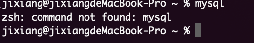
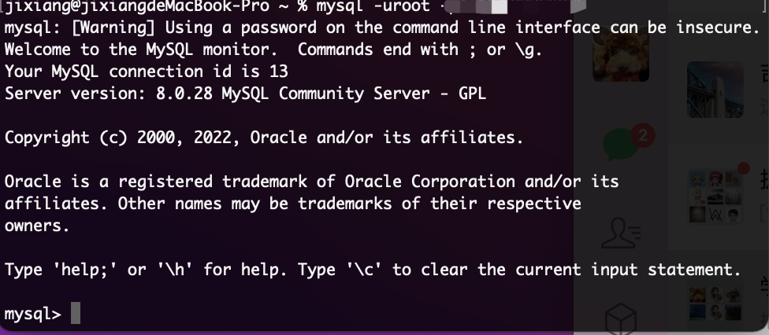
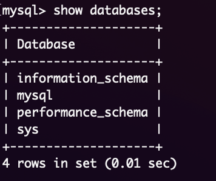
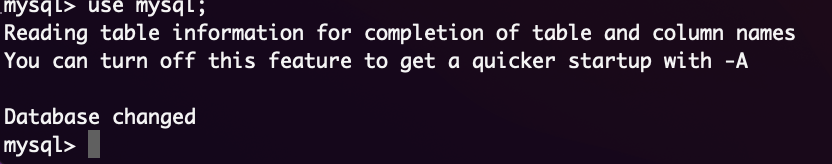
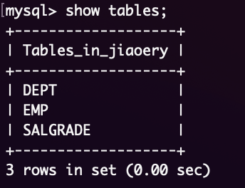
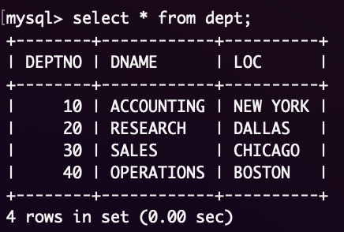
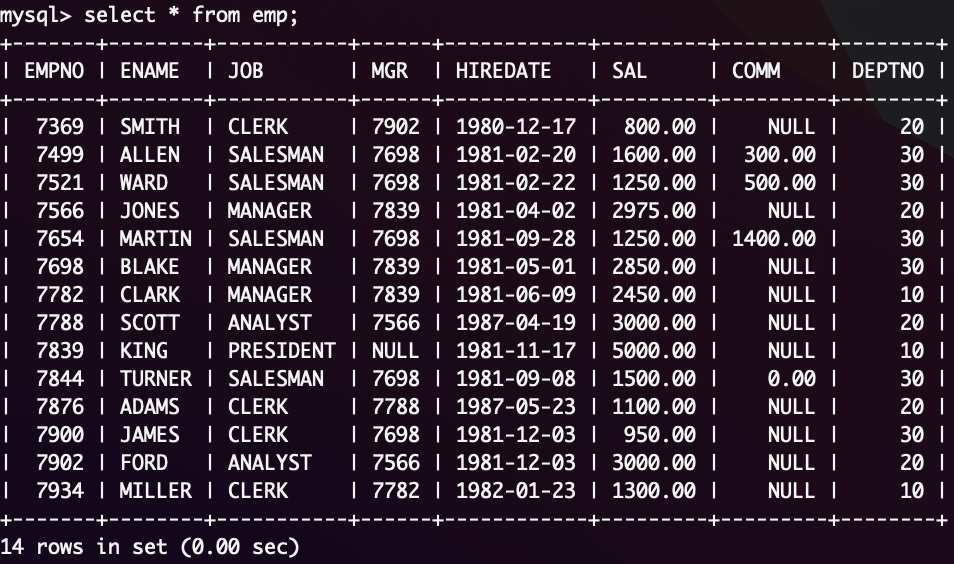
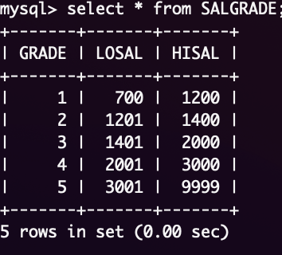
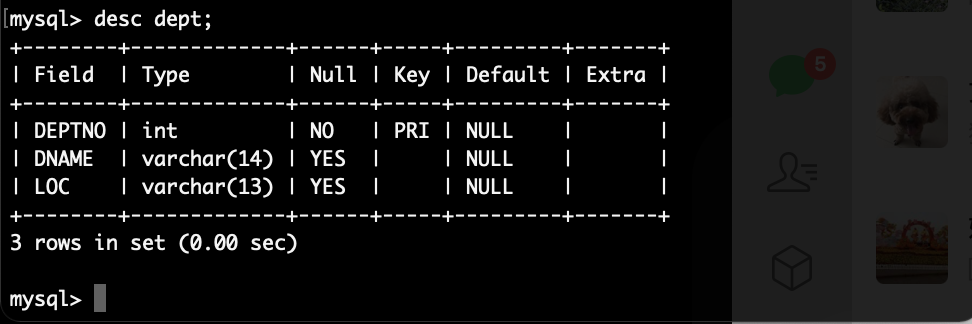

# MySQl(老杜)

## 1.初识MySQL

Q：什么是数据库？什么是数据库管理系统？什么是SQL？

* 数据库：
  * 英文单词：database，简称DB。按照一定格式存储数据的一些文件组合。顾名思义，存储数据的仓库，实际上就是一堆文件，这些文件存储了具有特定格式的数据

* 数据库管理
  * DataBaseManagement:简称DMBMS
  * 数据库管理系统术专门用来管理数据库汇总的数据的，数据库管理系统可以对数据库中的数据进行增删改查
  * 常见的数据库管理系统：Mysql、Orcle、Ms SqlServer、DB2等
* SQL:结构化查询语言
  * 程序员需要学习SQL语句，实现增删改查

三者关系：DMBMS->执行->SQL->操作->DB

## 2.安装Mysql

网路教程即可，傻瓜式安装

### 2.1 配置环境变量

Windows配置方式与Java环境配置相同；


mac 配置环境变量

未配置时的状态



切换到zsh命令（新的mac系统大部分是这个命令行）

```bash
chsh -s /bin/zsh
```

首先配置环境变量文件

```bash
vim ~/.zshrc
```

在打开的文件里追加以下内容

```text
export PATH=$PATH:/usr/local/mysql/bin
alias mysqlstart='sudo /usr/local/mysql/support-files/mysql.server start'
alias mysqlstop='sudo /usr/local/mysql/support-files/mysql.server stop'
```

之后，按`esc`退出插入模式，并输入`:wq` ( 有`:`哦 ) 

使用vim命令保存文件内容

```bash
source ~/.zshrc
```

查看是否成功

```bash
echo $PATH
```

如果添加成功，会出现`/usr/local/mysql/bin`这一句，就说明配置成功了

需要注意端口不可以冲突


## 3.数据库常用命令行

* 登录数据库

```bash
mysql -uroot -p [密码]
```




* 退出数据库

  ```bash
  exit
  ```

* 查看mysql中有哪些数据库

```bash
show databases;
```



这四个是默认数据库

* 打开指定的数据库

```bash
use [数据库名字];
```



* 创建数据库

```bash
create database [数据库名];
```

## 4.表常用命令行

**表**：数据中最基本的单位table，数据库中是以表格的形式来表示数据的，任何一张表都有**行**和**列**

行：row，被称为数据或记录

列：column，被称为字段

`ps：每一个字段都有：字段名、数据类型、约束等属性`

字段名：见名知意

数据类型：字符串，数字，日期等

约束：被约束的字段具备唯一性


* 查看表

```bash
show tables;
```

* 查看mysql数据库的版本号

```bash
select verison();
```

* 查看当前使用的是哪个数据库

```bash
select database();
```

**注意：\c用来终止一条命令的输入。**

 ## 5.常用SQL语句的分类

* DQL：数据查询语言 (DQL-Data Query Language)
  * 凡是带有select关键字的都是查询语句

* DML：数据操作语言 (DML-Data Manipulation Language)

  * 凡是对表当中的数据进行增删改的都是DML

     insert 增

     delete 删

     update 改

 **注意：这个主要是操作表中的数据data。**

* DDL：数据定义语言 (DDL-Data Definition Language)

  * DDL主要操作的是表的结构，不是表中的数据。

    create：新建，等同于增
    drop：删除
    alter：修改

**注意：这个增删改和DML不同，这个主要是对表结构进行操作。**

* TCL：事务控制语言 (TCL-Transactional Control Language)

  ​	事务提交：commit;

  ​    事务回滚：rollback,

* DCL：是数据控制语言 (DCL-Data Control Language)

   授权：grant

   撤销权限：revoke

## 6.导入准备的表

* 导入sql文件

```mysql
resource [sql路径名]
```

**注意：路径中不要有中文！！！！**这里使用到的资源https://pan.baidu.com/share/init?surl=kW7V3yLaxDJxCaZ2yp019g 密码：y346

最终表如下



其中：DEPT 部门表 EMP员工表 SALGRADE 工资等级表

* 删除表（这里不建议测试）

```mysql
drop database [表名]
```

* 查看表中所有数据

```mysql
select * from 表名;
```







* 不看表中的数据，只看表的结构

```mysql
desc 表名;
```

效果如下：



## 7.查询操作

### 7.1 普通查询方式

* 查询表中某几个字段

```mysql
select [字段，中间用“,”隔开] from 【表名】

mysql> select deptno,dname from dept;
+--------+------------+
| deptno | dname      |
+--------+------------+
|     10 | ACCOUNTING |
|     20 | RESEARCH   |
|     30 | SALES      |
|     40 | OPERATIONS |
+--------+------------+
4 rows in set (0.00 sec)
```

* 查询全部字段

```mysql
#第一种方式：可以把每个字段都写上
select a,b,c,d,e,f… from tablename;
#第二种方式：可以使用*
select * from tablename;
```

**注意：**这种方式的缺点：
 1、效率低
 2、可读性差。
 在实际开发中不建议，可以自己玩没问题。
 你可以在DOS命令窗口中想快速的看一看全表数据可以采用这种方式。

* 给查询的类起别名

```mysql
select deptno,dname as deptname from dept;

+--------+------------+
| deptno | deptname   |
+--------+------------+
|     10 | ACCOUNTING |
|     20 | RESEARCH   |
|     30 | SALES      |
|     40 | OPERATIONS |
+--------+------------+
4 rows in set (0.00 sec)
```

其中as 为起别名的关键字

**注意：只是将显示的查询结果列名显示为deptname，原表列名还是叫：dname**
**记住：select语句是永远都不会进行修改操作的。（因为只负责查询）**

并且，as关键字是可以被省略的

```mysql
mysql> select deptno,dname deptname from dept;
+--------+------------+
| deptno | deptname   |
+--------+------------+
|     10 | ACCOUNTING |
|     20 | RESEARCH   |
|     30 | SALES      |
|     40 | OPERATIONS |
+--------+------------+
4 rows in set (0.00 sec)
```

**Q:如果别名里面有空格该如何处理？**

```mysql
select deptno,dname 'dept name' from dept; //加单引号
select deptno,dname "dept name" from dept; //加双引号
+--------+------------+
| deptno | dept name  |
+--------+------------+
|     10 | ACCOUNTING |
|     20 | RESEARCH   |
|     30 | SALES      |
|     40 | OPERATIONS |
+--------+------------+

```

**注意：**

**在所有的数据库当中，字符串统一使用单引号括起来，**
**单引号是标准，双引号在oracle数据库中用不了。但是在mysql中可以使用。**

* 查询中带公式

```mysql
mysql> select ename,sal*12 as yearsal from emp;
+--------+----------+
| ename  | yearsal  |
+--------+----------+
| SMITH  |  9600.00 |
| ALLEN  | 19200.00 |
| WARD   | 15000.00 |
| JONES  | 35700.00 |
| MARTIN | 15000.00 |
| BLAKE  | 34200.00 |
| CLARK  | 29400.00 |
| SCOTT  | 36000.00 |
| KING   | 60000.00 |
| TURNER | 18000.00 |
| ADAMS  | 13200.00 |
| JAMES  | 11400.00 |
| FORD   | 36000.00 |
| MILLER | 15600.00 |
+--------+----------+
14 rows in set (0.00 sec)
## 别名为中文，需要带 ‘’
+--------+----------+
| ename  | 年薪     |
+--------+----------+
| SMITH  |  9600.00 |
| ALLEN  | 19200.00 |
| WARD   | 15000.00 |
| JONES  | 35700.00 |
| MARTIN | 15000.00 |
| BLAKE  | 34200.00 |
| CLARK  | 29400.00 |
| SCOTT  | 36000.00 |
| KING   | 60000.00 |
| TURNER | 18000.00 |
| ADAMS  | 13200.00 |
| JAMES  | 11400.00 |
| FORD   | 36000.00 |
| MILLER | 15600.00 |
+--------+----------+
14 rows in set (0.00 sec)
```

### 7.2条件查询

|       运算符        |                            说明                             |
| :-----------------: | :---------------------------------------------------------: |
|          =          |                            等于                             |
|     <>或者!=bu      |                           不等于                            |
|          <          |                            小于                             |
|         <=          |                          小于等于                           |
|          >          |                            大于                             |
|         >=          |                          大于等于                           |
| between ... and ... |                        在两个值之间                         |
|       is null       |                            为空                             |
|         and         |                            并且                             |
|         or          |                            或者                             |
|         in          |                            包含                             |
|         not         |                             非                              |
|        like         | 模糊查询支持%或\_,其中%匹配任意长的字符，一个\_匹配一个字符 |

关键字where具体的语法格式如下

> select
> 字段1,字段2,字段3…
> from
> 表名
> where
> 条件;

* =等于

查询薪资等于800的员工姓名和编号：

```MYSQL
mysql> select empno,ename from emp where sal = 800;
+-------+-------+
| empno | ename |
+-------+-------+
|  7369 | SMITH |
+-------+-------+
1 row in set (0.00 sec)
```

查询SMITH的编号和薪资

```mysql
mysql> select empno,sal from emp where ename = 'SMITH' ;
+-------+--------+
| empno | sal    |
+-------+--------+
|  7369 | 800.00 |
+-------+--------+
1 row in set (0.00 sec)
```

* <>!=不等于

薪资不是800的员工编号和姓名

```mysql
mysql> select empno,ename from emp where sal !=800;
+-------+--------+
| empno | ename  |
+-------+--------+
|  7499 | ALLEN  |
|  7521 | WARD   |
|  7566 | JONES  |
|  7654 | MARTIN |
|  7698 | BLAKE  |
|  7782 | CLARK  |
|  7788 | SCOTT  |
|  7839 | KING   |
|  7844 | TURNER |
|  7876 | ADAMS  |
|  7900 | JAMES  |
|  7902 | FORD   |
|  7934 | MILLER |
+-------+--------+
13 rows in set (0.00 sec)
# 与上面效果一样
mysql> select empno,ename from emp where sal <>800;
+-------+--------+
| empno | ename  |
+-------+--------+
|  7499 | ALLEN  |
|  7521 | WARD   |
|  7566 | JONES  |
|  7654 | MARTIN |
|  7698 | BLAKE  |
|  7782 | CLARK  |
|  7788 | SCOTT  |
|  7839 | KING   |
|  7844 | TURNER |
|  7876 | ADAMS  |
|  7900 | JAMES  |
|  7902 | FORD   |
|  7934 | MILLER |
+-------+--------+
13 rows in set (0.00 sec)
```


* between ... and ... 两个值之间，等于 >= and <=

查询薪资在2450和3000之间的员工信息，包括2450和3000

```mysql
mysql> select empno,ename,sal from emp where sal>=2450 and sal <=3000;
+-------+-------+---------+
| empno | ename | sal     |
+-------+-------+---------+
|  7566 | JONES | 2975.00 |
|  7698 | BLAKE | 2850.00 |
|  7782 | CLARK | 2450.00 |
|  7788 | SCOTT | 3000.00 |
|  7902 | FORD  | 3000.00 |
+-------+-------+---------+
5 rows in set (0.00 sec)

#下面与上面信息相同
mysql> select empno,ename,sal from emp where sal between 2450 and 3000;
+-------+-------+---------+
| empno | ename | sal     |
+-------+-------+---------+
|  7566 | JONES | 2975.00 |
|  7698 | BLAKE | 2850.00 |
|  7782 | CLARK | 2450.00 |
|  7788 | SCOTT | 3000.00 |
|  7902 | FORD  | 3000.00 |
+-------+-------+---------+
5 rows in set (0.00 sec)
```

**注意：betwwen and 必须遵循左小右大，between and 是闭区间，包括两端的值。**

* is null 为 null（is not null 不为空）

查询补助为null的员工

```mysql
mysql> select empno,ename,sal,comm from emp where comm is null;
+-------+--------+---------+------+
| empno | ename  | sal     | comm |
+-------+--------+---------+------+
|  7369 | SMITH  |  800.00 | NULL |
|  7566 | JONES  | 2975.00 | NULL |
|  7698 | BLAKE  | 2850.00 | NULL |
|  7782 | CLARK  | 2450.00 | NULL |
|  7788 | SCOTT  | 3000.00 | NULL |
|  7839 | KING   | 5000.00 | NULL |
|  7876 | ADAMS  | 1100.00 | NULL |
|  7900 | JAMES  |  950.00 | NULL |
|  7902 | FORD   | 3000.00 | NULL |
|  7934 | MILLER | 1300.00 | NULL |
+-------+--------+---------+------+
10 rows in set (0.00 sec)
```

查询补助不为null的员工

```mysql
mysql> select empno,ename,sal,comm from emp where comm is not null;
+-------+--------+---------+---------+
| empno | ename  | sal     | comm    |
+-------+--------+---------+---------+
|  7499 | ALLEN  | 1600.00 |  300.00 |
|  7521 | WARD   | 1250.00 |  500.00 |
|  7654 | MARTIN | 1250.00 | 1400.00 |
|  7844 | TURNER | 1500.00 |    0.00 |
+-------+--------+---------+---------+
4 rows in set (0.00 sec)
```

* and 并且（多条件结合）

查询工作岗位是MANAGER 并且工资大于2500的员工

```mysql
mysql> select empno,job from emp where job = 'MANAGER' and sal>2500;
+-------+---------+
| empno | job     |
+-------+---------+
|  7566 | MANAGER |
|  7698 | MANAGER |
+-------+---------+
2 rows in set (0.00 sec)
```

* or 或者（两者满足其一即可）

查询工作岗位是MANAGER或SALESMAN的员工

```mysql
mysql> select empno,job from emp where job = 'MANAGER' or job='SALESMAN';
+-------+----------+
| empno | job      |
+-------+----------+
|  7499 | SALESMAN |
|  7521 | SALESMAN |
|  7566 | MANAGER  |
|  7654 | SALESMAN |
|  7698 | MANAGER  |
|  7782 | MANAGER  |
|  7844 | SALESMAN |
+-------+----------+
7 rows in set (0.00 sec)
```

* and和or同时出现，要考虑优先级到的问题

查询工资大于2500，并且部门编号为10或20部门的员工

```mysql
mysql> select * from emp where sal > 2500 and (deptno = 10 or deptno = 20);
+-------+-------+-----------+------+------------+---------+------+--------+
| EMPNO | ENAME | JOB       | MGR  | HIREDATE   | SAL     | COMM | DEPTNO |
+-------+-------+-----------+------+------------+---------+------+--------+
|  7566 | JONES | MANAGER   | 7839 | 1981-04-02 | 2975.00 | NULL |     20 |
|  7788 | SCOTT | ANALYST   | 7566 | 1987-04-19 | 3000.00 | NULL |     20 |
|  7839 | KING  | PRESIDENT | NULL | 1981-11-17 | 5000.00 | NULL |     10 |
|  7902 | FORD  | ANALYST   | 7566 | 1981-12-03 | 3000.00 | NULL |     20 |
+-------+-------+-----------+------+------------+---------+------+--------+
4 rows in set (0.00 sec)
```

**注意：and 和or同时出现，and优先级高。如果想让or先执行，需要加括号。以后开发中，如果不确定优先级，就加括号。**

* in 包含，相当于多个 or（not in 不在这个范围中）

查询工作岗位是MANAGER和SALESMAN的员工：

> select empno,ename,job from emp where job = 'MANAGER' or job = 'SALESMAN';
>
> select empno,ename,job from emp where job in('MANAGER', 'SALESMAN');

上面两个查询语句是一样的效果

**注意：in不是一个区间，in后面跟的是具体的值。**

查询薪资是800和5000的员工信息：

```mysql
mysql> select ename,sal from emp where sal in(800,5000);
+-------+---------+
| ename | sal     |
+-------+---------+
| SMITH |  800.00 |
| KING  | 5000.00 |
+-------+---------+
2 rows in set (0.00 sec)
```

* not 可以取非，主要用在is或in中

is null、is not null、in、not in

```mysql
mysql> select ename,sal from emp where sal not in(800,5000,3000);
+--------+---------+
| ename  | sal     |
+--------+---------+
| ALLEN  | 1600.00 |
| WARD   | 1250.00 |
| JONES  | 2975.00 |
| MARTIN | 1250.00 |
| BLAKE  | 2850.00 |
| CLARK  | 2450.00 |
| TURNER | 1500.00 |
| ADAMS  | 1100.00 |
| JAMES  |  950.00 |
| MILLER | 1300.00 |
+--------+---------+
10 rows in set (0.00 sec)
```

* like 为模糊查询，支持%或下划线匹配
  * %匹配任意个字符
  * 下划线，一个下划线只匹配一个字符

找出名字里含有O字符的员工

```mysql
mysql> select ename from emp where ename like '%o%';
+-------+
| ename |
+-------+
| JONES |
| SCOTT |
| FORD  |
+-------+
3 rows in set (0.00 sec)
```

找出第二个字母是A的

```mysql
mysql> select ename from emp where ename like '_A%';
+--------+
| ename  |
+--------+
| WARD   |
| MARTIN |
| JAMES  |
+--------+
3 rows in set (0.00 sec)
```

### 7.3 排序

* 默认排序方式是升序

```mysql
mysql> select ename,sal from emp order by sal;
+--------+---------+
| ename  | sal     |
+--------+---------+
| SMITH  |  800.00 |
| JAMES  |  950.00 |
| ADAMS  | 1100.00 |
| WARD   | 1250.00 |
| MARTIN | 1250.00 |
| MILLER | 1300.00 |
| TURNER | 1500.00 |
| ALLEN  | 1600.00 |
| CLARK  | 2450.00 |
| BLAKE  | 2850.00 |
| JONES  | 2975.00 |
| SCOTT  | 3000.00 |
| FORD   | 3000.00 |
| KING   | 5000.00 |
+--------+---------+
14 rows in set (0.00 sec)
```

* 指定为降序

```mysql
mysql> select ename,sal from emp order by sal desc;
+--------+---------+
| ename  | sal     |
+--------+---------+
| KING   | 5000.00 |
| SCOTT  | 3000.00 |
| FORD   | 3000.00 |
| JONES  | 2975.00 |
| BLAKE  | 2850.00 |
| CLARK  | 2450.00 |
| ALLEN  | 1600.00 |
| TURNER | 1500.00 |
| MILLER | 1300.00 |
| WARD   | 1250.00 |
| MARTIN | 1250.00 |
| ADAMS  | 1100.00 |
| JAMES  |  950.00 |
| SMITH  |  800.00 |
+--------+---------+
14 rows in set (0.00 sec)
```


* 指定为升序

```mysql
mysql> select ename,sal from emp order by sal asc;
+--------+---------+
| ename  | sal     |
+--------+---------+
| SMITH  |  800.00 |
| JAMES  |  950.00 |
| ADAMS  | 1100.00 |
| WARD   | 1250.00 |
| MARTIN | 1250.00 |
| MILLER | 1300.00 |
| TURNER | 1500.00 |
| ALLEN  | 1600.00 |
| CLARK  | 2450.00 |
| BLAKE  | 2850.00 |
| JONES  | 2975.00 |
| SCOTT  | 3000.00 |
| FORD   | 3000.00 |
| KING   | 5000.00 |
+--------+---------+
14 rows in set (0.00 sec)
```

* 多字段排序

查询员工名字和薪资，要求按照薪资升序，如果薪资一样的话，再按照名字升序排列。

```mysql
mysql> select ename,sal from emp order by sal asc,ename asc;
+--------+---------+
| ename  | sal     |
+--------+---------+
| SMITH  |  800.00 |
| JAMES  |  950.00 |
| ADAMS  | 1100.00 |
| MARTIN | 1250.00 |
| WARD   | 1250.00 |
| MILLER | 1300.00 |
| TURNER | 1500.00 |
| ALLEN  | 1600.00 |
| CLARK  | 2450.00 |
| BLAKE  | 2850.00 |
| JONES  | 2975.00 |
| FORD   | 3000.00 |
| SCOTT  | 3000.00 |
| KING   | 5000.00 |
+--------+---------+
14 rows in set (0.00 sec)
```

* 综合一点的案例

```mysql
mysql> select ename,sal from emp where sal between 1250 and 3000 order by sal desc;
+--------+---------+
| ename  | sal     |
+--------+---------+
| SCOTT  | 3000.00 |
| FORD   | 3000.00 |
| JONES  | 2975.00 |
| BLAKE  | 2850.00 |
| CLARK  | 2450.00 |
| ALLEN  | 1600.00 |
| TURNER | 1500.00 |
| MILLER | 1300.00 |
| WARD   | 1250.00 |
| MARTIN | 1250.00 |
+--------+---------+
10 rows in set (0.00 sec)
```

**注意：关键字的顺序移动不能改变**

>select … from … where … order by …（排序总是在最后执行）

### 7.4 分组查询

在实际的应用中，可能有这样的需求，需要先进行分组，然后对每一组的数据进行操作，这个时候我们需要使用分组查询，将他们之间的关键字全部组合在一起：

>select … from … where … group by … order by…
>执行顺序：from、where、group by、select、order by

**注意：分组函数不能直接在where后使用**

* **注意：分组函数不能直接使用在where后面**

```mysql
mysql> select ename,sal from emp where sal > min(sal);
ERROR 1111 (HY000): Invalid use of group function
```

`select ename,sal from emp where sal > min(sal);` 错误写法，因为分组函数在使用的时候必须先分组之后才能使用。where执行的时候，还没有分组。所以where后面不能出现分组函数。

```mysql
mysql> select sum(sal) from emp;
+----------+
| sum(sal) |
+----------+
| 29025.00 |
+----------+
1 row in set (0.00 sec)
```


`select sum(sal) from emp;` 可以使用，因为select在 group by 之后执行，group by 默认整张表是一组。**（要充分理解SQL的执行顺序）**

* group 关键字

找出每个工作岗位的工资和

思路：按照工作岗位分组，然后对工资求和。

```mysql
mysql> select job,sum(sal) from emp group by job;
+-----------+----------+
| job       | sum(sal) |
+-----------+----------+
| CLERK     |  4150.00 |
| SALESMAN  |  5600.00 |
| MANAGER   |  8275.00 |
| ANALYST   |  6000.00 |
| PRESIDENT |  5000.00 |
+-----------+----------+
5 rows in set (0.00 sec)
```

分析一下以上语句的执行顺序：先从emp表中查询数据，根据job字段进行分组，然后对每一组的数据进行sum（sal）

* **注意：以下情况的sql语句是错误的**

`select ename,job,sum(sal) from emp group by job;`，不要这样写，没有意义。在mysql中可以执行，其他数据库就报错了。因为ename有14条记录，而job只有5条。

**重要结论：在一条select语句中，如果有group by语句的话，select后面只能跟：参加分组的字段，以及分组函数。其他的一律不能跟！！！**

* 练习：找出每个部门的最高薪资

实现思路：按照部门编号分组，求每一组的最大值。

```mysql
mysql> select deptno,max(sal) from emp group by deptno;
+--------+----------+
| deptno | max(sal) |
+--------+----------+
|     20 |  3000.00 |
|     30 |  2850.00 |
|     10 |  5000.00 |
+--------+----------+
3 rows in set (0.00 sec)
```

* 两个字段联合分组

Q:找出“每个部门，不同工作岗位”的最高薪资：

```mysql
mysql> select deptno,job,max(sal) from emp group by deptno,job;
+--------+-----------+----------+
| deptno | job       | max(sal) |
+--------+-----------+----------+
|     20 | CLERK     |  1100.00 |
|     30 | SALESMAN  |  1600.00 |
|     20 | MANAGER   |  2975.00 |
|     30 | MANAGER   |  2850.00 |
|     10 | MANAGER   |  2450.00 |
|     20 | ANALYST   |  3000.00 |
|     10 | PRESIDENT |  5000.00 |
|     30 | CLERK     |   950.00 |
|     10 | CLERK     |  1300.00 |
+--------+-----------+----------+
9 rows in set (0.00 sec)
```

* 找出每个部门最高薪资，要求显示最高薪资大于3000的

方法一：找出每个部门最高薪资，然后显示最高薪资大于3000的

```mysql
mysql> select deptno,max(sal) from emp group by deptno having max(sal)>3000;
+--------+----------+
| deptno | max(sal) |
+--------+----------+
|     10 |  5000.00 |
+--------+----------+
1 row in set (0.00 sec)
```

**注意：使用having可以对分完组之后的数据进一步过滤，注意having不能单独使用，having不能代替where，having必须和group by联合使用。**

方法二：先将大于3000的都找出来，然后进行分组。

```mysql
mysql> select deptno,max(sal) from emp where sal>3000 group by deptno;
+--------+----------+
| deptno | max(sal) |
+--------+----------+
|     10 |  5000.00 |
+--------+----------+
1 row in set (0.00 sec)
```

**优化策略where和having，优先选择where，where实在完成不了了，再选择having。**


* 找出每个部门的平均薪资，要求显示平均薪资高于2500的

```mysql
mysql> select deptno,avg(sal) from emp group by deptno having avg(sal)>2500;
+--------+-------------+
| deptno | avg(sal)    |
+--------+-------------+
|     10 | 2916.666667 |
+--------+-------------+
1 row in set (0.00 sec)
```

### 7.5 总结

> select
>
> ... 
>
> from 
>
>  ... 
>
> where 
>
> ... 
>
> group by
>
>  ... 
>
> having
>
>  ... 
>
> order by 
>
> ...				
>
> 以上关键字只能按照这个顺序来，不能颠倒。

执行顺序：1. from 2. where 3. group by 4. having 5. select 6. order by

## 8.函数

### 8.1 单行处理函数

特点：一个输入对应一个输出

#### 8.1.1字符串函数(JAVA String函数类似)

* upper、lower函数改变大小写

`select lower(ename) from emp;` 变成小写

```mysql
mysql> select lower(ename) from emp;
+--------------+
| lower(ename) |
+--------------+
| smith        |
| allen        |
| ward         |
| jones        |
| martin       |
| blake        |
| clark        |
| scott        |
| king         |
| turner       |
| adams        |
| james        |
| ford         |
| miller       |
+--------------+
14 rows in set (0.00 sec)
```

* substr,substring函数截取，索引从1开始**（没有0）**

```mysql
mysql> select substr(ename,1,1) from emp;
+-------------------+
| substr(ename,1,1) |
+-------------------+
| S                 |
| A                 |
| W                 |
| J                 |
| M                 |
| B                 |
| C                 |
| S                 |
| K                 |
| T                 |
| A                 |
| J                 |
| F                 |
| M                 |
+-------------------+
14 rows in set (0.00 sec)
```

* 练习：找到第一个字母以A开头的员工信息：

```mysql
# 方法1：模糊查询1
mysql> select ename from emp where ename like 'A%';
+-------+
| ename |
+-------+
| ALLEN |
| ADAMS |
+-------+
2 rows in set (0.00 sec)

# 方法2：substr函数
mysql> select ename from emp where substr(ename,1,1) = 'A';
+-------+
| ename |
+-------+
| ALLEN |
| ADAMS |
+-------+
2 rows in set (0.00 sec)
```

* concat函数：拼接字符串
* length函数用于获取参数值的字节个数

```mysql
# 获取对应字段的长度
mysql> select length(ename) enamelength from emp;
+-------------+
| enamelength |
+-------------+
|           5 |
|           5 |
|           4 |
|           5 |
|           6 |
|           5 |
|           5 |
|           5 |
|           4 |
|           6 |
|           5 |
|           5 |
|           4 |
|           6 |
+-------------+
14 rows in set (0.00 sec)

# 首字母大写，其他字母小写
mysql> select concat(upper(substr(ename,1,1)),lower(substr(ename,2,length(ename) - 1 ))) as result from emp;
+--------+
| result |
+--------+
| Smith  |
| Allen  |
| Ward   |
| Jones  |
| Martin |
| Blake  |
| Clark  |
| Scott  |
| King   |
| Turner |
| Adams  |
| James  |
| Ford   |
| Miller |
+--------+
14 rows in set (0.00 sec)
```

* **instr**函数返回字符串第一次出现的索引，若找不到，则返回0
* trim函数去前后空格

```mysql
mysql> select * from emp where ename = trim(' KING');
+-------+-------+-----------+------+------------+---------+------+--------+
| EMPNO | ENAME | JOB       | MGR  | HIREDATE   | SAL     | COMM | DEPTNO |
+-------+-------+-----------+------+------------+---------+------+--------+
|  7839 | KING  | PRESIDENT | NULL | 1981-11-17 | 5000.00 | NULL |     10 |
+-------+-------+-----------+------+------------+---------+------+--------+
1 row in set (0.00 sec)
```

* lpad函数用指定字符实现左填充指定长度
* rpad函数同上
* replace函数替换

#### 8.1.2 数学函数

* round()函数四舍五入（前一个参数为输入值，后一个参数为保留小数点位数，负数代表正数位数）

如：

`select round(1236.567, -1) as result from emp;` 1240，保留到十位
`select round(1236.567, -2) as result from emp;` 1200，保留到百位

* rand()生成随机数

```mysql
#生成100以内的随机数
mysql> select round(rand()*100,0) from emp;
+---------------------+
| round(rand()*100,0) |
+---------------------+
|                  31 |
|                  16 |
|                  88 |
|                  93 |
|                 100 |
|                  20 |
|                   2 |
|                  51 |
|                  46 |
|                  77 |
|                  47 |
|                   3 |
|                  77 |
|                  75 |
+---------------------+
14 rows in set (0.00 sec)
```

* ifnull标记null的使用取代值

```mysql
# 求解年度工资
mysql> select ename,(sal+comm)*12 as yearsal from emp;
+--------+----------+
| ename  | yearsal  |
+--------+----------+
| SMITH  |     NULL |
| ALLEN  | 22800.00 |
| WARD   | 21000.00 |
| JONES  |     NULL |
| MARTIN | 31800.00 |
| BLAKE  |     NULL |
| CLARK  |     NULL |
| SCOTT  |     NULL |
| KING   |     NULL |
| TURNER | 18000.00 |
| ADAMS  |     NULL |
| JAMES  |     NULL |
| FORD   |     NULL |
| MILLER |     NULL |
+--------+----------+
14 rows in set (0.00 sec)

# 防止null出现
mysql> select ename,(sal+ifnull(comm,0))*12 as yearsal from emp;
+--------+----------+
| ename  | yearsal  |
+--------+----------+
| SMITH  |  9600.00 |
| ALLEN  | 22800.00 |
| WARD   | 21000.00 |
| JONES  | 35700.00 |
| MARTIN | 31800.00 |
| BLAKE  | 34200.00 |
| CLARK  | 29400.00 |
| SCOTT  | 36000.00 |
| KING   | 60000.00 |
| TURNER | 18000.00 |
| ADAMS  | 13200.00 |
| JAMES  | 11400.00 |
| FORD   | 36000.00 |
| MILLER | 15600.00 |
+--------+----------+
14 rows in set (0.00 sec)
```


**注意：Null只要参与了运算，结果为Null。为了避免这个想象，需要使用ifnull函数。用法：ifnull(数据，被当做哪个值)**

`select ename, (sal+ifnull(comm,0)) * 12 as yearsal from emp;` comm如果为null，当做0处理。

- ceil函数向上取整
- floor函数向下取整
- truncate函数截断
- mod函数取余

#### 8.1.3 日期函数

* **now函数**

获取当前时间，获取的时间带有：时分秒信息！是datetime类型的。

* curdate函数返回当前日期，不包含时间
* curtime函数返回当前时间，不包含日期
* **str_to_date函数**

**将字符串转化成日期类型**

**语法格式**：str_to_date(‘字符串日期’, ‘日期格式’)。

**str_to_date函数**可以把字符串**varchar转换成日期date**类型数据，通常使用在插入insert方面，因为插入的时候需要一个日期类型的数据，需要通过该函数将字符串转换成date。

* **date_format函数**
  * 1.**将日期类型转换成特定格式的字符串。**
    * `date_format(birth, '%Y/%d/%m')`
      mysql默认格式：%Y-%d-%m。
  * 2. **将日期转化为字符串格式**
* **timestampdiff(interval，datetime1，datetime2)函数**

比较的单位interval可以为以下数值
FRAC_SECOND。表示间隔是毫秒

#### 8.1.4 其他函数

* case … when … then … when … then … else … end

例如：当员工的工作岗位是MANAGER的时候，工资上调10%，当工作岗位是SALESMAN的时候，工资上调50%，其他正常。（不是修改数据库，只是查询结果显示为工资上调）

```mysql
mysql> select
    -> ename,
    -> job,
    -> sal as oldsal,
    -> (case job when 'MANAGER' then sal*1.1 when 'SALESMAN' then sal*1.5 else sal end) as newsal
    -> from
    -> emp;
+--------+-----------+---------+---------+
| ename  | job       | oldsal  | newsal  |
+--------+-----------+---------+---------+
| SMITH  | CLERK     |  800.00 |  800.00 |
| ALLEN  | SALESMAN  | 1600.00 | 2400.00 |
| WARD   | SALESMAN  | 1250.00 | 1875.00 |
| JONES  | MANAGER   | 2975.00 | 3272.50 |
| MARTIN | SALESMAN  | 1250.00 | 1875.00 |
| BLAKE  | MANAGER   | 2850.00 | 3135.00 |
| CLARK  | MANAGER   | 2450.00 | 2695.00 |
| SCOTT  | ANALYST   | 3000.00 | 3000.00 |
| KING   | PRESIDENT | 5000.00 | 5000.00 |
| TURNER | SALESMAN  | 1500.00 | 2250.00 |
| ADAMS  | CLERK     | 1100.00 | 1100.00 |
| JAMES  | CLERK     |  950.00 |  950.00 |
| FORD   | ANALYST   | 3000.00 | 3000.00 |
| MILLER | CLERK     | 1300.00 | 1300.00 |
+--------+-----------+---------+---------+
14 rows in set (0.00 sec)
```


- version()
- database()
- user()
- format()

### 8.2 分组函数

也叫多行处理函数，多个输入对应一个输出

