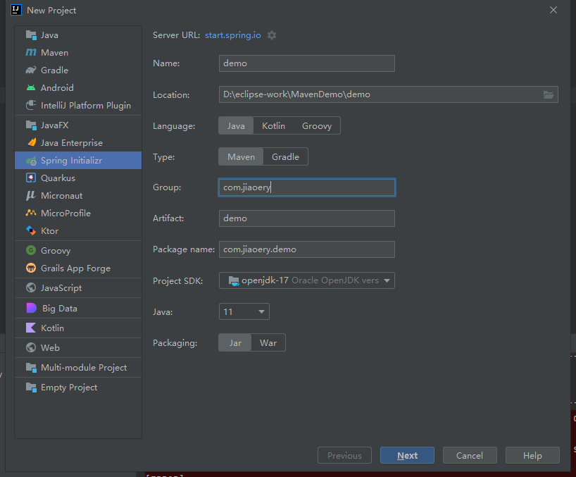
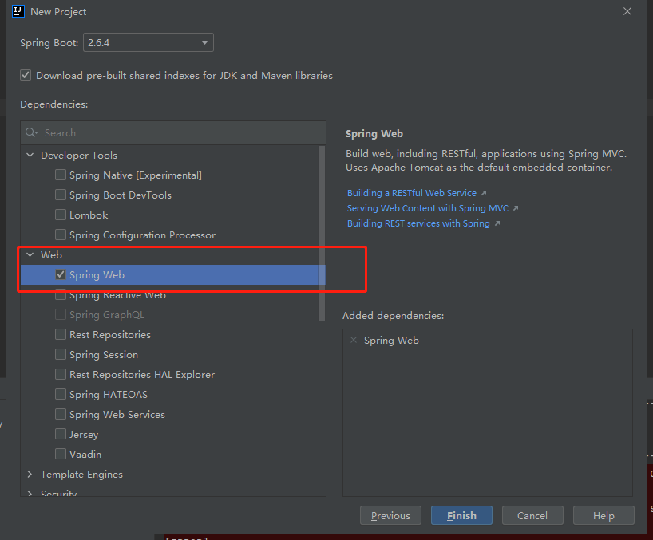
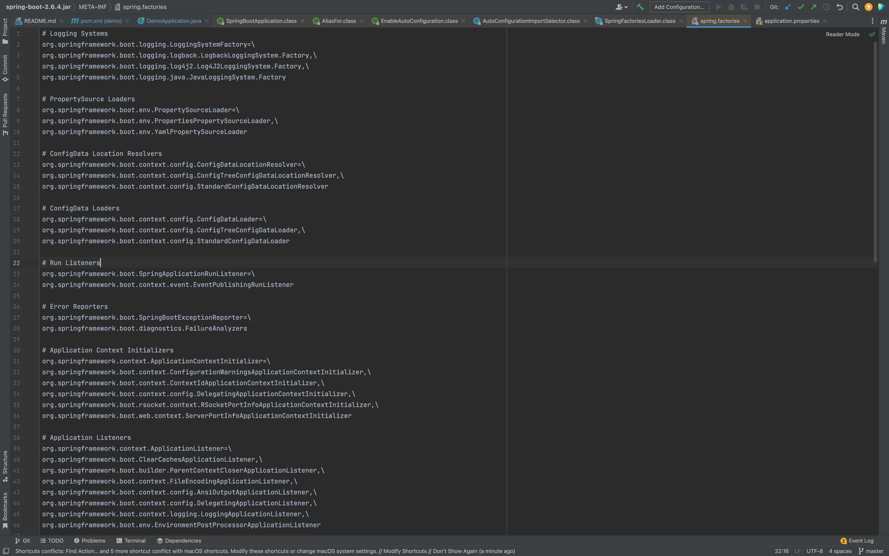
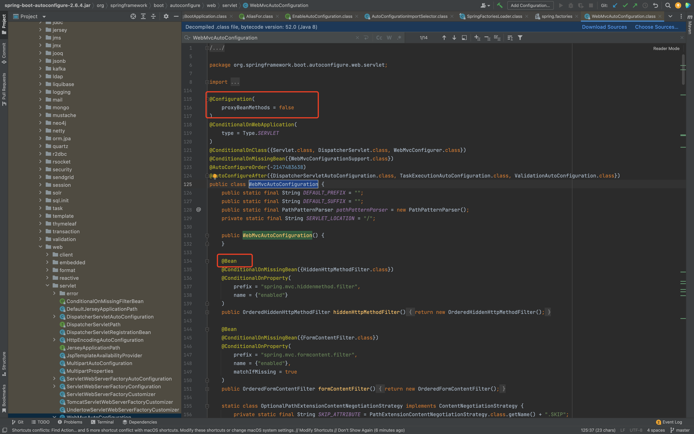
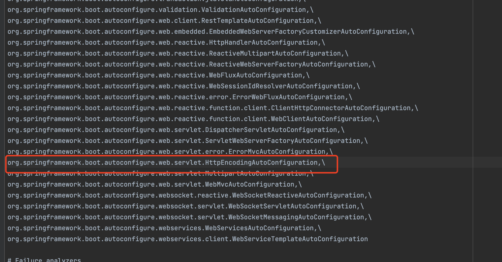
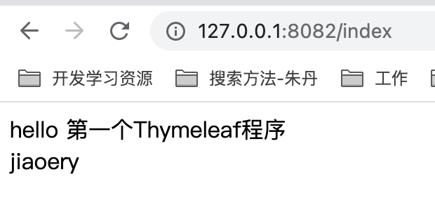
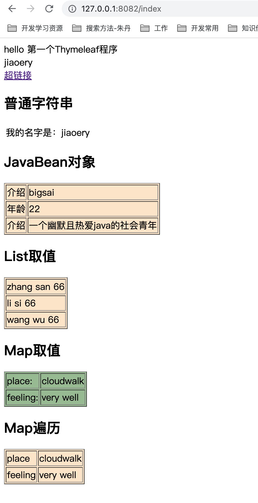
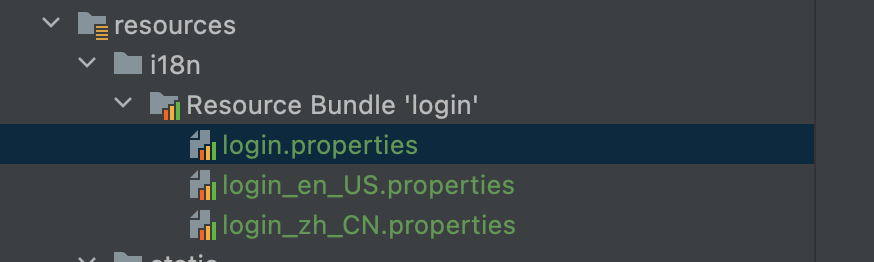
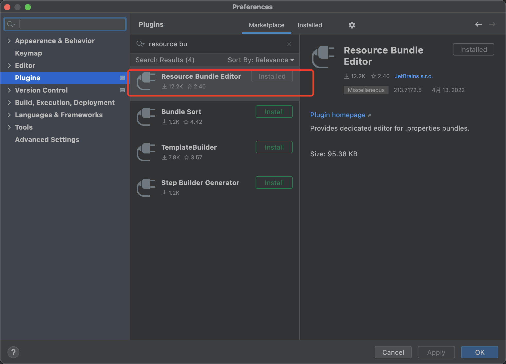

# SpringBoot学习(kuangshen)

## 1.微服务阶段学习

javase：OOP

mysql：数据持久化

html+css+js+jquery+框架：视图，框架不熟练，css不好用

javaweb：独立开发MVC三层架构的网站（原始框架）

ssm：（**Spring+SpringMVC+MyBatis**）框架：简化了我们的开发流程，配置开始也比较复杂

war：tomcat的运行

spring简化：SpringBoot -jar 内嵌tomcat，微服务架构

服务会越来越多：如springcloud

### 1.1 学习路径

springboot

* 什么是springboot
* 配置如何编写 yaml
* `自动装配原理（非常重要）`
* 集成web开发
* 集成数据库
* 分布式开发：DUbbo+zookeeper
* swagger接口文档
* 任务调度
* SpringSerurty:Shiro

linux学习

springcloud

* 微服务
* springcloud入门
* Restful
* Eureka
* Ngnix
* Ribbon
* Feign
* Hystrix
* Zuul:路由网关
* SpringCloud config：git

JVM机制


## 2.什么是SpringBoot

**Spring Boot的主要优点：**

- 为所有Spring开发者更快的入门
- **开箱即用**，提供各种默认配置来简化项目配置
- 内嵌式容器简化Web项目
- 没有冗余代码生成和XML配置的要求

重点思想：Spring Boot 以**约定大于配置的核心思想**，默认帮我们进行了很多设置，多数 Spring Boot 应用只需要很少的 Spring 配置

## 3.什么是微服务

MVC 三层架构 MVVM 微服务架构

DUbbo：https://dubbo.apache.org/zh/docs/

原文文章地址：https://martinfowler.com/articles/microservices.html （作者：[Martin Fowler](https://martinfowler.com/)）

翻译版本：https://www.cnblogs.com/liuning8023/p/4493156.html


## 4.新手上路

环境：

* jdk 1.8
* maven
* springboot
* idea

官方：提供一个快速生产的网站，但是IDEA本身自带

### 4.1 网站初始化

网址：https://start.spring.io/


### 4.2 IDEA创建



选择依赖环境



如果想更改banner，可以在resource创建一个banner.txt文件https://www.bootschool.net/ascii

如佛祖效果如下：

```assic
////////////////////////////////////////////////////////////////////
//                          _ooOoo_                               //
//                         o8888888o                              //
//                         88" . "88                              //
//                         (| ^_^ |)                              //
//                         O\  =  /O                              //
//                      ____/`---'\____                           //
//                    .'  \\|     |//  `.                         //
//                   /  \\|||  :  |||//  \                        //
//                  /  _||||| -:- |||||-  \                       //
//                  |   | \\\  -  /// |   |                       //
//                  | \_|  ''\---/''  |   |                       //
//                  \  .-\__  `-`  ___/-. /                       //
//                ___`. .'  /--.--\  `. . ___                     //
//              ."" '<  `.___\_<|>_/___.'  >'"".                  //
//            | | :  `- \`.;`\ _ /`;.`/ - ` : | |                 //
//            \  \ `-.   \_ __\ /__ _/   .-` /  /                 //
//      ========`-.____`-.___\_____/___.-`____.-'========         //
//                           `=---='                              //
//      ^^^^^^^^^^^^^^^^^^^^^^^^^^^^^^^^^^^^^^^^^^^^^^^^^^        //
//            佛祖保佑       永不宕机     永无BUG                    //
////////////////////////////////////////////////////////////////////
```

## 5.自动装配原理初探

### 5.1 porm.xml文件

* spring-boot-dependences：核心依赖在父工程中
* springboot引入时无需引入版本，原因在于父工程已经引入版本

```xml
<parent>
        <groupId>org.springframework.boot</groupId>
        <artifactId>spring-boot-starter-parent</artifactId>
        <version>2.6.4</version>
        <relativePath/> <!-- lookup parent from repository -->
    </parent>
```

其中具备一个父级依赖

```xml
<parent>
  <groupId>org.springframework.boot</groupId>
  <artifactId>spring-boot-dependencies</artifactId>
  <version>2.6.4</version>
</parent>
```

这里才是真正管理SpringBoot应用里面所有依赖版本的地方，SpringBoot的版本控制中心；

**以后我们导入依赖默认是不需要写版本；但是如果导入的包没有在依赖中管理着就需要手动配置版本了；**

启动器

* 可以理解为springboot的一个场景
* spring-boot-starters 可以引入所有的依赖
* springboot的作用在于把场景变成启动器

```xml
<dependency>
	<groupId>org.springframework.boot</groupId>
	<artifactId>spring-boot-starters</artifactId>
</dependency>
```

**springboot-boot-starter-xxx**：就是spring-boot的场景启动器

**spring-boot-starter-web**：帮我们导入了web模块正常运行所依赖的组件；

```xml
<!--web场景启动器-->
<dependency>
    <groupId>org.springframework.boot</groupId>
    <artifactId>spring-boot-starter-web</artifactId>
</dependency>
```

### 5.2主启动文件

#### 5.2.1 默认主启动文件

```java
/程序主入口
//@SpringBootApplication 用来标注
@SpringBootApplication
public class DemoApplication {

    public static void main(String[] args) {
      //以为是启动了一个方法，其实是启动了一个服务
        SpringApplication.run(DemoApplication.class, args);
    }

}
```

 #### 5.2.2 @SpringBootApplication

作用：标注在某个类上说明这个类是SpringBoot的主配置类 ， SpringBoot就应该运行这个类的main方法来启动SpringBoot应用；

```java

@SpringBootConfiguration
@EnableAutoConfiguration
@ComponentScan(
    excludeFilters = {@Filter(
    type = FilterType.CUSTOM,
    classes = {TypeExcludeFilter.class}
), @Filter(
    type = FilterType.CUSTOM,
    classes = {AutoConfigurationExcludeFilter.class}
)}
)
public @interface SpringBootApplication {
  ...
}
```

* @ComponentScan:
  * 这个注解在Spring中很重要 ,它对应XML配置中的元素
  * 作用：自动扫描并加载符合条件的组件或者bean ， 将这个bean定义加载到IOC容器中
* @SpringBootConfiguration
  * 作用：SpringBoot的配置类 ，标注在某个类上 ， 表示这是一个SpringBoot的配置类；
* @EnableAutoConfiguration
  * **@EnableAutoConfiguration ：开启自动配置功能**
  * @EnableAutoConfiguration告诉SpringBoot开启自动配置功能，这样自动配置才能生效；

```java

@Import({AutoConfigurationImportSelector.class})
public @interface EnableAutoConfiguration {
    ...
}
```

* **@import** ：Spring底层注解@import ， 给容器中导入一个组件

* **@Import({AutoConfigurationImportSelector.class}) ：给容器导入组件 ；**

  AutoConfigurationImportSelector ：自动配置导入选择器，那么它会导入哪些组件的选择器呢？我们点击去这个类看源码：

```java
protected List<String> getCandidateConfigurations(AnnotationMetadata metadata, AnnotationAttributes attributes) {
        List<String> configurations = SpringFactoriesLoader.loadFactoryNames(this.getSpringFactoriesLoaderFactoryClass(), this.getBeanClassLoader());
        Assert.notEmpty(configurations, "No auto configuration classes found in META-INF/spring.factories. If you are using a custom packaging, make sure that file is correct.");
        return configurations;
    }
```

这个方法又调用了  SpringFactoriesLoader 类的静态方法！我们进入SpringFactoriesLoader类loadFactoryNames() 方法

```java
 public static List<String> loadFactoryNames(Class<?> factoryType, @Nullable ClassLoader classLoader) {
        ClassLoader classLoaderToUse = classLoader;
        if (classLoader == null) {
            classLoaderToUse = SpringFactoriesLoader.class.getClassLoader();
        }

        String factoryTypeName = factoryType.getName();
   //这里它又调用了 loadSpringFactories 方法
        return (List)loadSpringFactories(classLoaderToUse).getOrDefault(factoryTypeName, Collections.emptyList());
    }
```

我们继续点击查看 loadSpringFactories 方法

```java
 private static Map<String, List<String>> loadSpringFactories(ClassLoader classLoader) {
        Map<String, List<String>> result = (Map)cache.get(classLoader);
        if (result != null) {
            return result;
        } else {
            HashMap result = new HashMap();

            try {
                Enumeration urls = classLoader.getResources("META-INF/spring.factories");

                while(urls.hasMoreElements()) {
                    URL url = (URL)urls.nextElement();
                    UrlResource resource = new UrlResource(url);
                    Properties properties = PropertiesLoaderUtils.loadProperties(resource);
                    Iterator var6 = properties.entrySet().iterator();

                    while(var6.hasNext()) {
                        Entry<?, ?> entry = (Entry)var6.next();
                        String factoryTypeName = ((String)entry.getKey()).trim();
                        String[] factoryImplementationNames = StringUtils.commaDelimitedListToStringArray((String)entry.getValue());
                        String[] var10 = factoryImplementationNames;
                        int var11 = factoryImplementationNames.length;

                        for(int var12 = 0; var12 < var11; ++var12) {
                            String factoryImplementationName = var10[var12];
                            ((List)result.computeIfAbsent(factoryTypeName, (key) -> {
                                return new ArrayList();
                            })).add(factoryImplementationName.trim());
                        }
                    }
                }

                result.replaceAll((factoryType, implementations) -> {
                    return (List)implementations.stream().distinct().collect(Collectors.collectingAndThen(Collectors.toList(), Collections::unmodifiableList));
                });
                cache.put(classLoader, result);
                return result;
            } catch (IOException var14) {
                throw new IllegalArgumentException("Unable to load factories from location [META-INF/spring.factories]", var14);
            }
        }
    }
```

其中**META-INF/spring.factories**这个文件多次出现

找到这个文件




**WebMvcAutoConfiguration**结构



所以，自动配置真正实现是从classpath中搜寻所有的META-INF/spring.factories配置文件 ，并将其中对应的 org.springframework.boot.autoconfigure. 包下的配置项，通过反射实例化为对应标注了 @Configuration的JavaConfig形式的IOC容器配置类 ， 然后将这些都汇总成为一个实例并加载到IOC容器中。

#### 5.2.3 SpringApplication

我最初以为就是运行了一个main方法，没想到却开启了一个服务；

```java

@SpringBootApplication
public class SpringbootApplication {
    public static void main(String[] args) {
        SpringApplication.run(SpringbootApplication.class, args);
    }
}
```

**SpringApplication.run分析**

分析该方法主要分两部分，一部分是SpringApplication的实例化，二是run方法的执行；

**这个类主要做了以下四件事情：**

* 断定应用是普通应用还是web应用
* 查找并加载所有可用初始化器 ， 设置到initializers属性中
* 找出所有的应用程序监听器，设置到listeners属性中
* 推断并设置main方法的定义类，找到运行的主类

查看构造器：

```java

public SpringApplication(ResourceLoader resourceLoader, Class... primarySources) {
    // ......
    this.webApplicationType = WebApplicationType.deduceFromClasspath();
    this.setInitializers(this.getSpringFactoriesInstances();
    this.setListeners(this.getSpringFactoriesInstances(ApplicationListener.class));
    this.mainApplicationClass = this.deduceMainApplicationClass();
}
```

run方法核心流程


核心代码部分

```java
 public ConfigurableApplicationContext run(String... args) {
        long startTime = System.nanoTime();
        DefaultBootstrapContext bootstrapContext = this.createBootstrapContext();
        ConfigurableApplicationContext context = null;
        this.configureHeadlessProperty();
        SpringApplicationRunListeners listeners = this.getRunListeners(args);
        listeners.starting(bootstrapContext, this.mainApplicationClass);

        try {
            ApplicationArguments applicationArguments = new DefaultApplicationArguments(args);
            ConfigurableEnvironment environment = this.prepareEnvironment(listeners, bootstrapContext, applicationArguments);
            this.configureIgnoreBeanInfo(environment);
            Banner printedBanner = this.printBanner(environment);
            context = this.createApplicationContext();
            context.setApplicationStartup(this.applicationStartup);
            this.prepareContext(bootstrapContext, context, environment, listeners, applicationArguments, printedBanner);
            this.refreshContext(context);
            this.afterRefresh(context, applicationArguments);
            Duration timeTakenToStartup = Duration.ofNanos(System.nanoTime() - startTime);
            if (this.logStartupInfo) {
                (new StartupInfoLogger(this.mainApplicationClass)).logStarted(this.getApplicationLog(), timeTakenToStartup);
            }

            listeners.started(context, timeTakenToStartup);
            this.callRunners(context, applicationArguments);
        } catch (Throwable var12) {
            this.handleRunFailure(context, var12, listeners);
            throw new IllegalStateException(var12);
        }

        try {
            Duration timeTakenToReady = Duration.ofNanos(System.nanoTime() - startTime);
            listeners.ready(context, timeTakenToReady);
            return context;
        } catch (Throwable var11) {
            this.handleRunFailure(context, var11, (SpringApplicationRunListeners)null);
            throw new IllegalStateException(var11);
        }
    }
```

## 6.yaml配置注入

SpringBoot使用一个全局的配置文件 ， 配置文件名称是固定的

- application.properties

- - 语法结构 ：key=value

- application.yaml

- - 语法结构 ：key：空格 value

- **配置文件的作用 ：**修改SpringBoot自动配置的默认值，因为SpringBoot在底层都给我们自动配置好了；

- 例如：`server.port=8081`

### 6.1 yaml概述

YAML是 "YAML Ain't a Markup Language" （YAML不是一种标记语言）的递归缩写。在开发的这种语言时，YAML 的意思其实是："Yet Another Markup Language"（仍是一种标记语言）

**这种语言以数据作为中心，而不是以标记语言为重点！**

以前的配置文件，大多数都是使用xml来配置；比如一个简单的端口配置，我们来对比下yaml和xml

传统xml配置：

```xml
<server>
    <port>8081<port>
</server>
```

yaml配置：

```yaml
server:
  port: 8081(注意中间一定要有空格a)
```

### 6.2 基本语法

说明：语法要求严格！

* 1、空格不能省略

* 2、以缩进来控制层级关系，只要是左边对齐的一列数据都是同一个层级的。

* 3、属性和值的大小写都是十分敏感的。

> 字面量：普通的值  [ 数字，布尔值，字符串  ]
>
> k: v

注意：

- “ ” 双引号，不会转义字符串里面的特殊字符 ， 特殊字符会作为本身想表示的意思；

  比如 ：name: "kuang \n shen"  输出 ：kuang  换行  shen

- '' 单引号，会转义特殊字符 ， 特殊字符最终会变成和普通字符一样输出

  比如 ：name: ‘kuang \n shen’  输出 ：kuang  \n  shen

#### 6.2.1 对象、Map（键值对)

```text
#对象、Map格式
k: 
    v1:
```

如

```yaml
student:
    name: qinjiang
    age: 3
```

其行内写法

```yaml
student: {name: qinjiang,age: 3}
```

#### 6.2.2 数组

```yaml
pets:
  - cat
  - dog
  - snake
  - pig

pets1: [dog,cat,pig,snake]
```

#### 6.2.3 修改SpringBoot的默认端口号

```yaml
server:
  port: 8081
```

### 6.3注入配置文件

#### 6.3.1 原有的方法

```java
@Component  //注册bean到容器中
public class Dog {
    private String name;
    private Integer age;
    
    //有参无参构造、get、set方法、toString()方法  
}
```

加入注解@Vaulue后：

```java
@Component //注册bean
public class Dog {
    @Value("阿黄")
    private String name;
    @Value("18")
    private Integer age;
  ...
}
```

在SpringBoot的测试类下注入狗狗输出一下；

```java
@SpringBootTest
class DemoApplicationTests {

    @Autowired //将狗狗自动注入进来
    Dog dog;

    @Test
    public void contextLoads() {
        System.out.println(dog); //打印看下狗狗对象
    }

}
```

运行测试：

```text
Dog{name='阿黄', age=18}
```

#### 6.3.2 yaml注入配置

Person类文件

```java

@Component //注册bean到容器中
@ConfigurationProperties(prefix = "person")
public class Person {
    private String name;
    private Integer age;
    private Boolean happy;
    private Date birth;
    private Map<String,Object> maps;
    private List<Object> lists;
    private Dog dog;
  ...
}
```

yaml配置文件

```yaml
person:
  name: qinjiang
  age: 3
  happy: false
  birth: 2000/01/01
  maps: {k1: v1,k2: v2}
  lists:
    - code
    - girl
    - music
  dog:
    name: 旺财
    age: 1
```

在测试文件添加配置

```java
@SpringBootTest
class DemoApplicationTests {

    @Autowired
    Person person; //将person自动注入进来

    @Test
    public void contextLoads() {
        System.out.println(person); //打印person信息
    }

}
```

运行结果

```text
Person{name='qinjiang', age=3, happy=false, birth=Sat Jan 01 00:00:00 CST 2000, maps={k1=v1, k2=v2}, lists=[code, girl, music], dog=Dog{name='旺财', age=1}}
```

#### 6.3.3 如何指定配置文件

**@PropertySource ：**加载指定的配置文件；

**@configurationProperties**：默认从全局配置文件中获取值；

实例

```java

@PropertySource(value = "classpath:person.properties")
@Component //注册bean
public class Person {

    @Value("${name}")
    private String name;

    ......  
}
```

运行结果：

```text
Person{name='jiaoery', age=null, happy=null, birth=null, maps=null, lists=null, dog=null}
```

#### 6.3.4 使用占位符

甚至部分元素可用占位符生成随机数

```yaml
person:
    name: qinjiang${random.uuid} # 随机uuid
    age: ${random.int}  # 随机int
    happy: false
    birth: 2000/01/01
    maps: {k1: v1,k2: v2}
    lists:
      - code
      - girl
      - music
    dog:
      name: ${person.hello:other}_旺财
      age: 1
```

运行结果

```text
Person{name='qinjiang2d991a32-8626-4455-b277-38a1ffce25d2', age=1576338666, happy=false, birth=Sat Jan 01 00:00:00 CST 2000, maps={k1=v1, k2=v2}, lists=[code, girl, music], dog=Dog{name='other_旺财', age=1}}
```

#### 6.3.5回顾properties配置

【注意】properties配置文件在写中文的时候，会有乱码 ， 我们需要去IDEA中设置编码格式为UTF-8；

settings-->FileEncodings 中配置；


除了yaml文件，其实properties文件也可实现对应的效果

实例

* 1.新建编辑配置文件 user.properties
* 2.配置文件

```properties
user1.name=kuangshen
user1.age=18
user1.sex=男
```

* 3.我们在User类上使用@Value来进行注入

```java
@Component //注册bean
@PropertySource(value = "classpath:user.properties")
public class User {
    //直接使用@value
    @Value("${user.name}") //从配置文件中取值
    private String name;
    @Value("#{9*2}")  // #{SPEL} Spring表达式
    private int age;
    @Value("男")  // 字面量
    private String sex;
}
```

* 4.Springboot测试

```java

@SpringBootTest
class DemoApplicationTests {

    @Autowired
    User user;

    @Test
    public void contextLoads() {
        System.out.println(user);
    }

}
```

运行结果

```text
User{name='jixiang', age=18, sex='男'}
```

#### 6.3.6 对比@Value 和@ConfigurationProperties


* 1.@ConfigurationProperties只需要写一次即可 ， @Value则需要每个字段都添加
* 2.松散绑定：这个什么意思呢? 比如我的yml中写的last-name，这个和lastName是一样的， - 后面跟着的字母默认是大写的。这就是松散绑定。可以测试一下
* 3.JSR303数据校验 ， 这个就是我们可以在字段是增加一层过滤器验证 ， 可以保证数据的合法性
* 4.复杂类型封装，yml中可以封装对象 ， 使用value就不支持


**总结**

* 配置yml和配置properties都可以获取到值 ， 强烈推荐 yml；

* 如果我们在某个业务中，只需要获取配置文件中的某个值，可以使用一下 @value；

* 如果说，我们专门编写了一个JavaBean来和配置文件进行一一映射，就直接@configurationProperties，不要犹豫！

## 7.JSR303数据校验及多环境切换

### 7.1 如何使用

```java

@Component //注册bean
@ConfigurationProperties(prefix = "person")
@Validated  //数据校验
public class Person {

    @Email(message="邮箱格式错误") //name必须是邮箱格式
    private String name;
}
```

**使用数据校验，可以保证数据的正确性；** 

`Ps:前后端都需要做校验`

### 7.2 常见参数

```text
@NotNull(message="名字不能为空")
private String userName;
@Max(value=120,message="年龄最大不能查过120")
private int age;
@Email(message="邮箱格式错误")
private String email;

空检查
@Null       验证对象是否为null
@NotNull    验证对象是否不为null, 无法查检长度为0的字符串
@NotBlank   检查约束字符串是不是Null还有被Trim的长度是否大于0,只对字符串,且会去掉前后空格.
@NotEmpty   检查约束元素是否为NULL或者是EMPTY.
    
Booelan检查
@AssertTrue     验证 Boolean 对象是否为 true  
@AssertFalse    验证 Boolean 对象是否为 false  
    
长度检查
@Size(min=, max=) 验证对象（Array,Collection,Map,String）长度是否在给定的范围之内  
@Length(min=, max=) string is between min and max included.

日期检查
@Past       验证 Date 和 Calendar 对象是否在当前时间之前  
@Future     验证 Date 和 Calendar 对象是否在当前时间之后  
@Pattern    验证 String 对象是否符合正则表达式的规则

.......等等
除此以外，我们还可以自定义一些数据校验规则
```

### 7.3 多环境切换

profile是Spring对不同环境提供不同配置功能的支持，可以通过激活不同的环境版本，实现快速切换环境；

#### 7.3.1 多配置文件(properties)

我们在主配置文件编写的时候，文件名可以是 application-{profile}.properties/yml , 用来指定多个环境版本；

**例如：**

* application-test.properties 代表测试环境配置

* application-dev.properties 代表开发环境配置

但是Springboot并不会直接启动这些配置文件，它**默认使用application.properties主配置文件**；

我们需要通过一个配置来选择需要激活的环境：

```text

#比如在配置文件中指定使用dev环境，我们可以通过设置不同的端口号进行测试；
#我们启动SpringBoot，就可以看到已经切换到dev下的配置了；
spring.profiles.active=dev
```

#### 7.3.2 多配置文件(yaml)

和properties配置文件中一样，但是使用yml去实现不需要创建多个配置文件，更加方便了 !

```yaml
server:
  port: 8081
#选择要激活那个环境块
spring:
  profiles:
    active: prod

---
server:
  port: 8083
spring:
  profiles: dev #配置环境的名称


---

server:
  port: 8084
spring:
  profiles: prod  #配置环境的名称
```

**注意：如果yml和properties同时都配置了端口，并且没有激活其他环境 ， 默认会使用properties配置文件的！**

#### 7.3.3 配置文件加载位置

[原文链接](https://docs.spring.io/spring-boot/docs/2.6.6/reference/htmlsingle/#features.external-config)


- 

- springboot 启动会扫描以下位置的application.properties或者application.yml文件作为Spring boot的默认配置文件：

- ```text
  优先级1：项目路径下的config文件夹配置文件
  优先级2：项目路径下配置文件
  优先级3：资源路径下的config文件夹配置文件
  优先级4：资源路径下配置文件
  ```

- **SpringBoot会从这四个位置全部加载主配置文件；互补配置；**

- Ps:具体可以参考demo

#### 7.3.4 拓展，运维小技巧

我们还可以通过spring.config.location来改变默认的配置文件位置

项目打包好以后，我们可以使用命令行参数的形式，启动项目的时候来指定配置文件的新位置；这种情况，一般是后期运维做的多，相同配置，外部指定的配置文件优先级最高

```shell
java -jar spring-boot-config.jar --spring.config.location=F:/application.properties
```

## 8.自动装配原理再理解

### 8.1 分析自动配置原理

以**HttpEncodingAutoConfiguration（Http编码自动配置）**为例解释自动配置原理；

```java
//表示这是一个配置类，和以前编写的配置文件一样，也可以给容器中添加组件；
@Configuration 

//启动指定类的ConfigurationProperties功能；
  //进入这个HttpProperties查看，将配置文件中对应的值和HttpProperties绑定起来；
  //并把HttpProperties加入到ioc容器中
@EnableConfigurationProperties({HttpProperties.class}) 

//Spring底层@Conditional注解
  //根据不同的条件判断，如果满足指定的条件，整个配置类里面的配置就会生效；
  //这里的意思就是判断当前应用是否是web应用，如果是，当前配置类生效
@ConditionalOnWebApplication(
    type = Type.SERVLET
)

//判断当前项目有没有这个类CharacterEncodingFilter；SpringMVC中进行乱码解决的过滤器；
@ConditionalOnClass({CharacterEncodingFilter.class})

//判断配置文件中是否存在某个配置：spring.http.encoding.enabled；
  //如果不存在，判断也是成立的
  //即使我们配置文件中不配置pring.http.encoding.enabled=true，也是默认生效的；
@ConditionalOnProperty(
    prefix = "spring.http.encoding",
    value = {"enabled"},
    matchIfMissing = true
)

public class HttpEncodingAutoConfiguration {
    //他已经和SpringBoot的配置文件映射了
    private final Encoding properties;
    //只有一个有参构造器的情况下，参数的值就会从容器中拿
    public HttpEncodingAutoConfiguration(HttpProperties properties) {
        this.properties = properties.getEncoding();
    }
    
    //给容器中添加一个组件，这个组件的某些值需要从properties中获取
    @Bean
    @ConditionalOnMissingBean //判断容器没有这个组件？
    public CharacterEncodingFilter characterEncodingFilter() {
        CharacterEncodingFilter filter = new OrderedCharacterEncodingFilter();
        filter.setEncoding(this.properties.getCharset().name());
        filter.setForceRequestEncoding(this.properties.shouldForce(org.springframework.boot.autoconfigure.http.HttpProperties.Encoding.Type.REQUEST));
        filter.setForceResponseEncoding(this.properties.shouldForce(org.springframework.boot.autoconfigure.http.HttpProperties.Encoding.Type.RESPONSE));
        return filter;
    }
    //。。。。。。。
}
```

**一句话总结 ：根据当前不同的条件判断，决定这个配置类是否生效！**

- 一但这个配置类生效；这个配置类就会给容器中添加各种组件；
- 这些组件的属性是从对应的properties类中获取的，这些类里面的每一个属性又是和配置文件绑定的；
- 所有在配置文件中能配置的属性都是在xxxxProperties类中封装着；
- 配置文件能配置什么就可以参照某个功能对应的这个属性类

```java
@ConditionalOnProperty(
    prefix = "server.servlet.encoding",
    value = {"enabled"},
    matchIfMissing = true
)
public class HttpEncodingAutoConfiguration {
  	...
}
```



**这就是自动装配的原理！**

### 8.2 精髓

* 1、SpringBoot启动会加载大量的自动配置类

* 2、我们看我们需要的功能有没有在SpringBoot默认写好的自动配置类当中；

* 3、我们再来看这个自动配置类中到底配置了哪些组件；（只要我们要用的组件存在在其中，我们就不需要再手动配置了）

* 4、给容器中自动配置类添加组件的时候，会从properties类中获取某些属性。我们只需要在配置文件中指定这些属性的值即可；

**xxxxAutoConfigurartion：自动配置类；**给容器中添加组件

**xxxxProperties:封装配置文件中相关属性；**

### 8.3 了解：@Conditional

**自动配置类必须在一定的条件下才能生效；**

**@Conditional派生注解（Spring注解版原生的@Conditional作用）**

作用：必须是@Conditional指定的条件成立，才给容器中添加组件，配置配里面的所有内容才生效；


**那么多的自动配置类，必须在一定的条件下才能生效；也就是说，我们加载了这么多的配置类，但不是所有的都生效了。**

**我们可以通过启用 debug=true属性；来让控制台打印自动配置报告，这样我们就可以很方便的知道哪些自动配置类生效；**

```yaml
#开启springboot的调试类
debug=true
```

**Positive matches:（自动配置类启用的：正匹配）**

**Negative matches:（没有启动，没有匹配成功的自动配置类：负匹配）**

**Unconditional classes: （没有条件的类）**

## 9.SpringBoot Web开发

jar：webapp

自动装配

springboot配置了什么？

* xxxxAutoConfigurartion：自动配置类；给容器中添加组件
* xxxxProperties:封装配置文件中相关属性；

**需要解决的问题：**

* 导入静态资源
* 首页
* jsp，模版引擎Thymeleaf
* 装配拓展SpringMvc
* 增删改查
* 拦截器
* 国际化

### 9.1 静态资源

新建项目resource下的结构


* static存储静态变量，比如说，图片，文件，html（不使用thymeleaf这类动态配置库）
* templates存储模版，也就是动态配置库，一般这里结合thymeleaf框架使用

#### 9.1.1 默认静态资源路径

* classpath:/static,
* classpath:/public,
* classpath:/resources,
* classpath:/META-INF/resources

**classpath 在项目中就相当于src/main/resources文件夹.**

#### 9.1.2 自定义静态资源路径

```yaml
spring:
  web:
    resources:
      static-locations: classpath:templates/
```


我们配置了静态资源路径映射之后，**我们只能访问这个路径下面的资源**，也就是相当于自定义了静态资源路径，**就是说默认的静态资源路径都会失效。**

### 9.2 首页和图标定制

图标修改需要先关闭默认图标

> #关闭默认图标
> spring.mvc.favicon.enabled=false

较新版本中，不需要关闭默认图标，只需要把图标名称和格式写为：favicon.ico，放到静态资源目录下就可以了


## 10.thymeleaf模版引擎

**Q：什么是模版引擎？**


Thymeleaf 官网：https://www.thymeleaf.org/

Thymeleaf 在Github 的主页：https://github.com/thymeleaf/thymeleaf

定义：Thymeleaf 是一款用于渲染 XML/XHTML/HTML5 内容的模板引擎。它与 JSP，Velocity，FreeMaker 等模板引擎类似，也可以轻易地与 Spring MVC 等 Web 框架集成。与其它模板引擎相比，Thymeleaf 最大的特点是，即使不启动 Web 应用，也可以直接在浏览器中打开并正确显示模板页面 。

### 10.1 引入Thymeleaf

maven引入依赖包

```xml

<!--thymeleaf-->
<dependency>
    <groupId>org.springframework.boot</groupId>
    <artifactId>spring-boot-starter-thymeleaf</artifactId>
</dependency>
```

maven下载的包


**注意：（版本有不同）**

### 10.2 如何使用Thymeleaf

项目结构


首先是controller

```java
package com.Thymeleaf.controller;

import org.springframework.stereotype.Controller;
import org.springframework.ui.Model;
import org.springframework.web.bind.annotation.GetMapping;

@Controller
public class urlController {
    @GetMapping("index")//页面的url地址
    public String getindex(Model model)//对应函数
    {
        model.addAttribute("name","jiaoery");
        return "index";//与templates中index.html对应
    }
}
```

上述代码就是一个完整的controller。部分含义如下：

- **@controller** 注解的意思就是声明这个java文件为一个controller控制器。
- **@GetMapping("index")** 其中@GetMapping的意思是请求的方式为get方式(即可通过浏览器直接请求)，而里面的index表示这个页面(接口)的url地址(路径)。即在浏览器对项目网页访问的地址。
- **getindex()** 是@GetMapping("index")注解对应的函数，其类型为String类型返回一个字符串，参数Model类型即用来储存数据供我们Thymeleaf页面使用。
- **model.addAttribute("name","bigsai")** 就是Model存入数据的书写方式，Model是一个特殊的类，相当于维护一个Map一样，而Model中的数据通过controller层的关联绑定在view层(即Thymeleaf中)可以直接使用。
- **return "index"**：这个index就是在templates目录下对应模板(本次为Thymeleaf模板)的名称，即应该对应hello.html这个Thymeleaf文件(与页面关联默认规则为：templates目录下`返回字符串.html`)。

其次是index.html中的网页数据

```html
<!DOCTYPE html>
<html  xmlns:th="http://www.thymeleaf.org">
<head>
    <meta charset="UTF-8">
    <title>title</title>
</head>
<body>
hello 第一个Thymeleaf程序
<div th:text="${name}">name是jiaery(我是离线数据)</div>
</body>
</html>
```

运行结果：

**不使用thymeleaf**


**使用thymeleaf**



基本到这里算入门了


### 10.3 Thymeleaf规则

Thymeleaf 模板引擎具有以下特点：

- 动静结合：Thymeleaf 既可以直接使用浏览器打开，查看页面的静态效果，也可以通过 Web 应用程序进行访问，查看动态页面效果。
- 开箱即用：Thymeleaf 提供了 Spring 标准方言以及一个与 SpringMVC 完美集成的可选模块，可以快速的实现表单绑定、属性编辑器、国际化等功能。
- 多方言支持：它提供了 Thymeleaf 标准和 Spring 标准两种方言，可以直接套用模板实现 JSTL、 OGNL 表达式；必要时，开发人员也可以扩展和创建自定义的方言。
- 与 SpringBoot 完美整合：SpringBoot 为 Thymeleaf 提供了的默认配置，并且还为 T

### 10.4 Thymeleaf 语法

Springboot官方提供的配置内容有以下：

```properties
# THYMELEAF (ThymeleafAutoConfiguration)
spring.thymeleaf.cache=true # Whether to enable template caching.
spring.thymeleaf.check-template=true # Whether to check that the template exists before rendering it.
spring.thymeleaf.check-template-location=true # Whether to check that the templates location exists.
spring.thymeleaf.enabled=true # Whether to enable Thymeleaf view resolution for Web frameworks.
spring.thymeleaf.enable-spring-el-compiler=false # Enable the SpringEL compiler in SpringEL expressions.
spring.thymeleaf.encoding=UTF-8 # Template files encoding.
spring.thymeleaf.excluded-view-names= # Comma-separated list of view names (patterns allowed) that should be excluded from resolution.
spring.thymeleaf.mode=HTML # Template mode to be applied to templates. See also Thymeleaf's TemplateMode enum.
spring.thymeleaf.prefix=classpath:/templates/ # Prefix that gets prepended to view names when building a URL.
spring.thymeleaf.reactive.chunked-mode-view-names= # Comma-separated list of view names (patterns allowed) that should be the only ones executed in CHUNKED mode when a max chunk size is set.
spring.thymeleaf.reactive.full-mode-view-names= # Comma-separated list of view names (patterns allowed) that should be executed in FULL mode even if a max chunk size is set.
spring.thymeleaf.reactive.max-chunk-size=0 # Maximum size of data buffers used for writing to the response, in bytes.
spring.thymeleaf.reactive.media-types= # Media types supported by the view technology.
spring.thymeleaf.servlet.content-type=text/html # Content-Type value written to HTTP responses.
spring.thymeleaf.suffix=.html # Suffix that gets appended to view names when building a URL.
spring.thymeleaf.template-resolver-order= # Order of the template resolver in the chain.
spring.thymeleaf.view-names= # Comma-separated list of view names (patterns allowed) that can be resolved.
```

上面的配置有些我们可能不常使用，因为Springboot官方做了默认配置大部分能够满足我们的使用需求，但如果你的项目有特殊需求也需要妥善使用这些配置

**几个特别配置**

比如`spring.thymeleaf.cache=false`是否允许页面缓存的配置，我们在开发时候要确保页面是最新的所以需要禁用缓存；而在上线运营时可能页面不常改动为了减少服务端压力以及提升客户端响应速度会允许页面缓存的使用。

再比如在开发虽然我们大部分使用UTF-8多一些，我们可以使用`spring.thymeleaf.encoding=UTF-8`来确定页面的编码，但如果你的项目是GBK编码就需要将它改成GBK。

另外Springboot默认模板引擎文件是放在templates目录下：`spring.thymeleaf.prefix=classpath:/templates/`,如果你有需求将模板引擎也可修改配置，将templates改为自己需要的目录。同理其他的配置如果需要自定义化也可参照上面配置进行修改。

#### 10.4.1 标签

常用的标签

| 标签      | 作用               | 示例                                                         |
| :-------- | :----------------- | :----------------------------------------------------------- |
| th:id     | 替换id             | `<input th:id="${user.id}"/>`                                |
| th:text   | 文本替换           | `<p text:="${user.name}">bigsai</p>`                         |
| th:utext  | 支持html的文本替换 | `<p utext:="${htmlcontent}">content</p>`                     |
| th:object | 替换对象           | `<div th:object="${user}"></div>`                            |
| th:value  | 替换值             | `<input th:value="${user.name}" >`                           |
| th:each   | 迭代               | `<tr th:each="student:${user}" >`                            |
| th:href   | 替换超链接         | `<a th:href="@{index.html}">超链接</a>`                      |
| th:src    | 替换资源           | `<script type="text/javascript" th:src="@{index.js}"></script>` |

#### 10.4.2 链式表达@{…}


上面我们已经学习到Thymeleaf是一个基于html的模板引擎，但是我们还是需要加入特定标签来声明和使用Thymeleaf的语法。我们需要在Thymeleaf的头部加Thymeleaf标识：

```html
<html xmlns:th="http://www.thymeleaf.org">
```

在Thymeleaf 中，如果想引入链接比如link，href，src，需要使用`@{资源地址}`引入资源。其中资源地址可以static目录下的静态资源，也可以是互联网中的绝对资源。

**引入css**

```html
 <link rel="stylesheet" th:href="@{index.css}">
```

**引入JavaScript：**

```html
 <script type="text/javascript" th:src="@{index.js}"></script>
```

**超链接：**

```html
<a th:href="@{index.html}">超链接</a>
```

最终效果


#### 10.4.3 变量表达式: ${...}

在Thymeleaf中可以通过${…}进行取值，这点和ONGL表达式语法一致。

首先引入一个bean类Child

```java
public class Child {
    private String name;
    private  int age;
    private  String detail;

    public Child(String name, int age, String detail) {
        this.name = name;
        this.age = age;
        this.detail = detail;
    }
    public String getName() {
        return name;
    }
    public void setName(String name) {
        this.name = name;
    }
    public int getAge() {
        return age;
    }
    public void setAge(int age) {
        this.age = age;
    }
    public String getDetail() {
        return detail;
    }
    public void setDetail(String detail) {
        this.detail = detail;
    }
}
```

然后在Model中添加一些数据

```java
@GetMapping("index")
public String getIndex(Model model){
    Child user1=new Child("bigsai",22,"一个幽默且热爱java的社会青年");
    List<String> userList=new ArrayList<>();
    userList.add("zhang san 66");
    userList.add("li si 66");
    userList.add("wang wu 66");
    Map<String ,String> map=new HashMap<>();
    map.put("place","cloudwalk");
    map.put("feeling","very well");
    //数据添加到model中
    model.addAttribute("name","jiaoery");//普通字符串
    model.addAttribute("user",user1);//储存javabean
    model.addAttribute("userlist",userList);//储存List
    model.addAttribute("map",map);//储存Map
    model.addAttribute("name","jiaoery");
    return "index";//与templates中index.html对应
}
```

然后在index.html文件下使用数据

```html
<!DOCTYPE html>
<html  xmlns:th="http://www.thymeleaf.org">
<head>
    <meta charset="UTF-8">
    <title>title</title>
    <link rel="stylesheet" th:href="@{index.css}">
    <script type="text/javascript" th:src="@{index.js}"></script>
</head>
<body>
hello 第一个Thymeleaf程序
<div th:text="${name}">name是jiaoery(我是离线数据)</div>
<a th:href="@{index.html}">超链接</a>
<h2>普通字符串</h2>
<table border="0">
    <tr>
        <td th:text="'我的名字是：'+${name}"></td>
    </tr>
</table>

<h2>JavaBean对象</h2>
<table bgcolor="#ffe4c4" border="1">
    <tr>
        <td>介绍</td>
        <td th:text="${user.name}"></td>
    </tr>
    <tr>
        <td>年龄</td>
        <td th:text="${user['age']}"></td>
    </tr>
    <tr>
        <td>介绍</td>
        <td th:text="${user.getDetail()}"></td>
    </tr>
</table>

<h2>List取值</h2>
<table bgcolor="#ffe4c4" border="1">
    <tr th:each="item:${userlist}">
        <td th:text="${item}"></td>
    </tr>
</table>

<h2>Map取值</h2>
<table bgcolor="#8fbc8f" border="1">
    <tr>
        <td>place:</td>
        <td th:text="${map.get('place')}"></td>
    </tr>
    <tr>
        <td>feeling:</td>
        <td th:text="${map['feeling']}"></td>
    </tr>
</table>

<h2>Map遍历</h2>
<table bgcolor="#ffe4c4" border="1">
    <tr th:each="item:${map}">
        <td th:text="${item.key}"></td>
        <td th:text="${item.value}"></td>
    </tr>
</table>

</body>
</html>
```

运行结果



#### 10.4.4 选择变量表达式: *{...}

变量表达式不仅可以写成${...}，而且还可以写成*{...}。`（可以理解为两者相等）`

#### 10.4.5 消息表达: #{...}

这里是使用配置参数的方式实现，如yaml或propriety文件配置；通俗易懂的来说`#{…}`语法就是用来**读取配置文件中数据**的。在Thymeleaf你可以使用`#{...}`语法获取消息，

首先在templates目录下建立`home.properties`中写入以下内容：

```properties
jiaoery.name=jiaoery
jiaoery.age=22
province=chongqing
```

在`application.properties`中加入以下内容：

```properties
spring.messages.basename=templates/home
```

或者使用yaml文件下添加**(注意是三行，也注意空格)**

```yaml
 
 messages:
   basename: templates/home
```

然后H5中添加对应的配置文件

```html
<h2>消息表达</h2>
<table bgcolor="#ffe4c4" border="1">
    <tr>
    <td>name</td>
    <td th:text="#{bigsai.name}"></td>
    </tr>
    <tr>
    <td>年龄</td>
    <td th:text="#{bigsai.age}"></td>
    </tr>
    <tr>
    <td>province</td>
    <td th:text="#{province}"></td>
    </tr>
</table>
```

最终结果


## 11.装配SpringMVC

Spring Boot通过WebMvcAutoConfiguration来提供一些默认配置；大多数时候使用默认的配置即可满足要求。但有时可能需要做一些个性化定制，此时就需要使用以下方式来进行。

### 11.1 使用EnableWebMvc注解

```java
//只是泗洪Configuration的情况下，可以对某些mvc配置做个性化设置
@Configuration
//注解不能轻易使用，一旦使用这个注解，就必须把所有mvc的配置都实现
@EnableWebMvc
public class MyMvcConfig implements WebMvcConfigurer {
  /**
     * 配置RequestMapping注解中指定的路径模式与实际访问路径之间映射的处理规则
     * @param configurer
     */
    @Override
    public void configurePathMatch(PathMatchConfigurer configurer) {


        /**
         * 设置路径后是否包含/
         * 假设RequestMapping注解中指定的路径是/test
         * 设置成True时，会同时处理/test/和/test的请求
         * 设置成False时，只会处理/test的请求
         * 默认是True
         */
        configurer.setUseTrailingSlashMatch(false);

        /**
         * 配置后置模式匹配是否仅在配置内容协商中明确指定的路径扩展名称时生效
         * 举个例子：假设WebMvcConfigurer中覆盖了configureContentNegotiation方法进行以下处理：
         * @Override
         * public void configureContentNegotiation(ContentNegotiationConfigurer configurer) {
         *     configurer.mediaType("pdf", MediaType.APPLICATION_PDF);
         *}
         * 当setUseRegisteredSuffixPatternMatch配置成TRUE时，即使setUseSuffixPatternMatch设置成True，
         * 在访问/test.do时也不会命中被RequestMapping注解值为/test的Controller；
         * 只有在访问/test.pdf时才能正常访问，其它任何的/test.txt或者/test.doc等均会报404；
         * 默认情况下该值是False
         */
        configurer.setUseRegisteredSuffixPatternMatch(true);
    }

    /**
     * 配置路径后缀与访问的内容类型的映射关系
     * @param configurer
     */
    @Override
    public void configureContentNegotiation(ContentNegotiationConfigurer configurer) {
        /**
         * 设置后缀与访问的内容类型的映射关系；
         * 如以下示例，默认情况下.txt表明是TXT类型，现在将其指定为PDF类型；
         * 那么在访问http://localhost/test.txt时将会将其当成PDF文件类型使用PDF阅读工具打开。
         */
        configurer.mediaType("txt", MediaType.APPLICATION_PDF);

        /**
         * 是否忽略请求报文头中的内容类型
         * 默认情况下是False，即以请求报文头中的类型为准
         */
        configurer.ignoreAcceptHeader(true);

        /**
         * 是否通过传入的参数（默认名称是format）来决定内容类型
         * 需要结合mediaType方法一起使用；
         * 如通过mediaType指定txt为PDF类型；则访问路径http://localhost/test?format=txt时会当成PDF类型处理
         * 默认为False
         */
        configurer.favorParameter(true);

        /**
         * 是否优先使用后缀为决定内容类型
         * 为False时优先使用Header中的类型
         * 为True时优先使用.后面指定的类型
         * 默认为True
         */
        configurer.favorPathExtension(false);

        /**
         * 是否仅处理明确通过mediaType注册的类型请求
         */
        configurer.useRegisteredExtensionsOnly(true);
    }

    /**
     * 配置当通过DispatcherServlet没有查找到对应的Handler处理时，是否使用默认的DefaultServletHttpRequestHandler来进行处理
     * @param configurer
     */
    @Override
    public void configureDefaultServletHandling(DefaultServletHandlerConfigurer configurer) {
        configurer.enable();
    }

    /**
     * 增加对象转换方法和格式化方法
     *
     * @param registry
     */
    @Override
    public void addFormatters(FormatterRegistry registry) {
        /**
         * 处理前台传入类型为String且Controller中接入参数也是String的参数转换
         * 将前台传入参数值附加[converted]后在调用Controller时使用；
         * 如前台通过访问http://localhost/test?a=b调用Controller，在Controller获取到a的值时将会是a[converted]
         */
        registry.addConverter(new Converter<String, String>() {
            @Nullable
            @Override
            public String convert(String source) {
                return null == source? null : source + "[converted]";
            }
        });

        /**
         * 处理当前台传入是String类型而后台Controller接收的参数是Integer类型时的转换规则
         */
        registry.addConverter(new Converter<String, Integer>() {
            @Nullable
            @Override
            public Integer convert(String source) {
                return null == source? null : Integer.valueOf(source) + 100;
            }
        });

    }

    /**
     * 配置静态资源访问的路径规则以及查找静态资源的路径
     * @param registry
     */
    @Override
    public void addResourceHandlers(ResourceHandlerRegistry registry) {
        /**
         * 处理所有HTML的请求，到static目录下查找对应的资源
         */
        registry.addResourceHandler("/**.html") //处理的路径规则
                .addResourceLocations("classpath:/static/")  //到哪些目录下去查找静态资源
        ;
    }

    /**
     * 进行跨域访问相关配置
     * @param registry
     */
    @Override
    public void addCorsMappings(CorsRegistry registry) {
        registry.addMapping("/test1/**") //可以跨域访问的URL路规则
                .allowedOrigins("http://localhost:8080/")  //可以跨域访问的访问者
                .allowedMethods("GET", "POST", "PUT", "DELETE") //可以跨域访问的方法
                .allowedHeaders("")     //可以跨域访问的Headers
        ;
    }

    @Override
    public void addViewControllers(ViewControllerRegistry registry) {
        /**
         * 配置路径跳转；将某个路径的请求映射到另外一个路径
         * 如将所有http://localhost/b/**的请求全部跳转到http://localhost/test上去
         */
        registry.addRedirectViewController("/b/**", "/test");

        /**
         * 将路径映射到某个名称为指定值的视图上
         * 访问/c会返回a.html的视图
         * 一般与ViewResolver结合使用
         */
        registry.addViewController("/c").setViewName("a");

        /**
         * 指定某个请求的状态码，而不返回任何的内容
         * 如下面将/badRequest请求返回状态码为400，而没有返回其它内容
         */
        registry.addStatusController("/badRequest", HttpStatus.BAD_REQUEST);
    }

    @Override
    public void configureViewResolvers(ViewResolverRegistry registry) {
        /**
         * 添加HTML的视图解析器
         * 本示例完成以下功能：将Controller返回的String类型的视图名称添加前缀及后缀；
         * 如返回的是a，那么处理后对应的视图将会是/a.html
         */
        registry.viewResolver(new InternalResourceViewResolver("/", ".html"));
    }
}
```


## 12.页面国际化

### 12.1 配置准备工作

 首先，需要配置文件编译格式全部为：UTF_8


然后创建资源文件



若是没有这个窗口，可以去下载一个插件plugin ：**Resource Bundle Editor**



最后编辑增加相应的配置


到这里已经完成全部配置

### 12.2 使用配置

其中，源码中的核心代码如下：

```java

// 获取 properties 传递过来的值进行判断
@Bean
	public MessageSource messageSource(MessageSourceProperties properties) {
		ResourceBundleMessageSource messageSource = new ResourceBundleMessageSource();
		if (StringUtils.hasText(properties.getBasename())) {
      // 设置国际化文件的基础名（去掉语言国家代码的）
			messageSource.setBasenames(StringUtils
					.commaDelimitedListToStringArray(StringUtils.trimAllWhitespace(properties.getBasename())));
		}
		if (properties.getEncoding() != null) {
			messageSource.setDefaultEncoding(properties.getEncoding().name());
		}
		messageSource.setFallbackToSystemLocale(properties.isFallbackToSystemLocale());
		Duration cacheDuration = properties.getCacheDuration();
		if (cacheDuration != null) {
			messageSource.setCacheMillis(cacheDuration.toMillis());
		}
		messageSource.setAlwaysUseMessageFormat(properties.isAlwaysUseMessageFormat());
		messageSource.setUseCodeAsDefaultMessage(properties.isUseCodeAsDefaultMessage());
		return messageSource;
	}
```

首先需要在配置文件 application.yaml下添加配置

properties文件

> spring.messages.basename=i18n.login

yaml文件（注意空格）

>spring:
>
>​	messages:
>
>​		basename: i18n.login

网页部分修改效果如下：


运行就是中文界面了


然后实现中英文切换

在Spring中有一个国际化的Locale （区域信息对象）；里面有一个叫做LocaleResolver （获取区域信息对象）的解析器！

我们去我们webmvc自动配置文件，寻找一下！看到SpringBoot默认配置：

```java
    @Override
		@Bean
		@ConditionalOnMissingBean(name = DispatcherServlet.LOCALE_RESOLVER_BEAN_NAME)
		public LocaleResolver localeResolver() {
      // 容器中没有就自己配，有的话就用用户配置的
			if (this.webProperties.getLocaleResolver() == WebProperties.LocaleResolver.FIXED) {
				return new FixedLocaleResolver(this.webProperties.getLocale());
			}
			AcceptHeaderLocaleResolver localeResolver = new AcceptHeaderLocaleResolver();
			localeResolver.setDefaultLocale(this.webProperties.getLocale());
			return localeResolver;
		}
```

这里再看一下**AcceptHeaderLocaleResolver**这个类的内部实现

```java
public Locale resolveLocale(HttpServletRequest request) {
        Locale defaultLocale = this.getDefaultLocale();
  // 默认的就是根据请求头带来的区域信息获取Locale进行国际化
        if (defaultLocale != null && request.getHeader("Accept-Language") == null) {
            return defaultLocale;
        } else {
            Locale requestLocale = request.getLocale();
            List<Locale> supportedLocales = this.getSupportedLocales();
            if (!supportedLocales.isEmpty() && !supportedLocales.contains(requestLocale)) {
                Locale supportedLocale = this.findSupportedLocale(request, supportedLocales);
                if (supportedLocale != null) {
                    return supportedLocale;
                } else {
                    return defaultLocale != null ? defaultLocale : requestLocale;
                }
            } else {
                return requestLocale;
            }
        }
    }
```


也就是说，这里需要我们自己配置一个localeResolver

```java
//可以在链接上携带区域信息
public class MyLocaleResolver implements LocaleResolver {
    @Override
    public Locale resolveLocale(HttpServletRequest request) {
        String language = request.getParameter("l");
        Locale locale = Locale.getDefault(); // 如果没有获取到就使用系统默认的
        //如果请求链接不为空
        if (!StringUtils.isEmpty(language)){
            //分割请求参数
            String[] split = language.split("_");
            //国家，地区
            locale = new Locale(split[0],split[1]);
        }
        return locale;
    }

    @Override
    public void setLocale(HttpServletRequest request, HttpServletResponse response, Locale locale) {

    }
}
```

然后在mvcconfig让它生效

```java
@Configuration
public class MyMvcConfig implements WebMvcConfigurer {

    @Override
    public void addViewControllers(ViewControllerRegistry registry) {
        registry.addViewController("/").setViewName("index");
        registry.addViewController("/index.html").setViewName("index");
    }

    @Bean
    public LocaleResolver localeResolver(){
        return new MyLocaleResolver();
    }
}
```

在网页中添加配置

```html

<!-- 这里传入参数不需要使用 ？使用 （key=value）-->
<a class="btn btn-sm" th:href="@{/index.html(l='zh_CN')}">中文</a>
<a class="btn btn-sm" th:href="@{/index.html(l='en_US')}">English</a>
```


验证生效了
