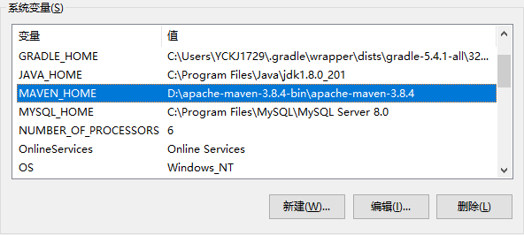
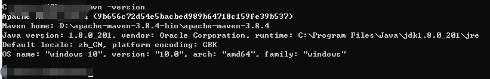
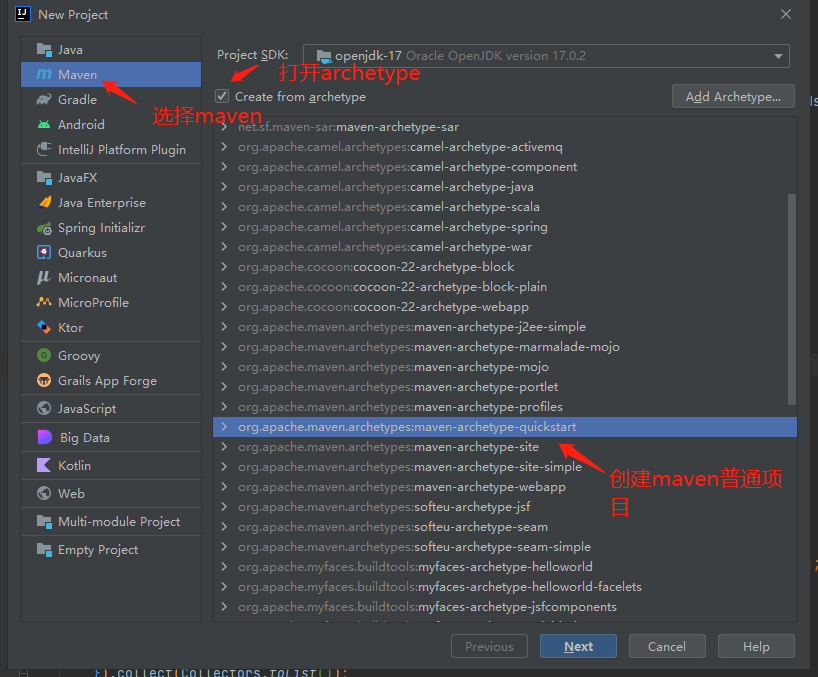
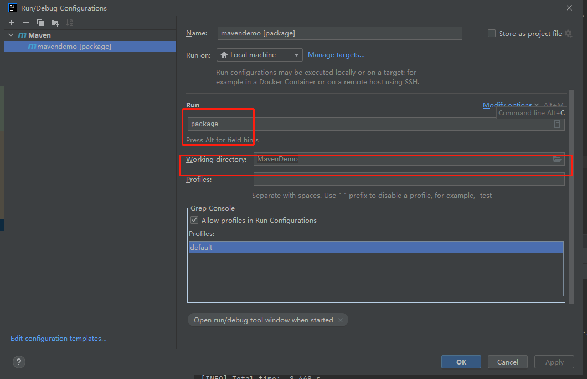

# Maven


## 1、maven相关主要内容

* maven的简介
* maven的安装配置和目录结构
* idea编辑器集成Maven环境
* maven项目的创建
* maven仓库的基本概念
* maven环境下构建多模块项目
* maven的打包操作
* maven依赖的基本概念

## 2.Maven的简介

Maven是一个Java项目管理和构建工具，它可以定义项目结构、项目依赖，并使用统一的方式进行自动化构建，是Java项目不可缺少的工具。

### 2.1项目构建工具

**Ant构建**

**Maven（java）**

**Gradle**：Android御用的，结合了ant和Maven的特点，采取了DSL格式

### 2.2Maven的四大特性

* 依赖管理系统


## 3.Maven的结构目录

```textascii
a-maven-project
├── pom.xml
├── src
│   ├── main
│   │   ├── java
│   │   └── resources
│   └── test
│       ├── java
│       └── resources
└── target
```

解释一下：`a-maven-project`为项目名；`pom.xml`为项目描述文件,`ser/main/java` 为源码目录，`src/main/resources` 为资源目录，`src/test/java`存放测试源码目录，`src/test/resources`存放测试资源，最终所有的编译、打包生成文件都放在`target`目录里。这些就是一个maven项目标准的目录结构

`porm.xml `文件格式

```xml
<project ...>
	<modelVersion>4.0.0</modelVersion>
	<groupId>com.itranswarp.learnjava</groupId>
	<artifactId>hello</artifactId>
	<version>1.0</version>
	<packaging>jar</packaging>
	<properties>
        ...
	</properties>
	<dependencies>
        <dependency>
            <groupId>commons-logging</groupId>
            <artifactId>commons-logging</artifactId>
            <version>1.2</version>
        </dependency>
	</dependencies>
</project>
```

* `modelversion` 指定当前的pom模型的版本，对于Maven3来说只能是4.0.0
* `groupId`类似于Java的包名，通常是公司或组织名称，指定了项目属于哪一个组织
* `artifactId`类似于Java的类名，通常是项目名称，定义了项目在组织中的唯一的ID
*  `version`指定当前包的版本号，x.x.x-里程碑；如1.0.0-SNAPSHOT；其中第一个x 为大版本，在有大变动时升级；第二个x小版本 修复bug，增加功能时使用；第三个x 为开发更新版本

**总结**：一个Maven工程就是由`groupId`，`artifactId`和`version`作为唯一标识。

一个标准的`dependency`标准

```xml
<dependency>
    <groupId>commons-logging</groupId>
    <artifactId>commons-logging</artifactId>
    <version>1.2</version>
</dependency>
```

## 4.安装Maven

### 4.1 下载maven并完成环境变量配置

* 1.在[官网](https://maven.apache.org/)下载对应的maven版本

* 2.配置环境变量 MAVEN_HOME ,path 

  

* 3.命令行检测是否配置成功

> mvn -version



### 4.2 修改本地仓库配置

这里还需要更改一下`setting.xml`下的配置，用来提升使用效率

>Question：为什么需要修改本地maven仓库呢？
>
>answer;因为 Maven 默认的本地仓库在C/用户/.m2 文件夹里，随着下载的 jar 包越来越多，系统盘会越来越满，电脑会越来越卡，所以建议在 C 盘之外建一个本地仓库。

* 1.新建一个目录
* 2.打开maven下setting.xml文件修改核心配置文件
* 3.需要添加的标签如下：
  * respository 地址

> <localRepository>你的repository目录</localRepository>
>
> 例如：<localRepository>D:\CodeSoftware\Maven\repository</localRepository>

* 4.配置阿里云镜像下载地址
  * 在 setting.xml 文件里面添加：

```xml
 <mirror>  
    <id>alimaven</id>  
    <name>aliyun maven</name>  
    <url>http://maven.aliyun.com/nexus/content/groups/public/</url>;  
    <mirrorOf>central</mirrorOf>          
  </mirror>

```


因为国外远程仓库下载 jar 包速度慢，国内阿里云下载速度快


最后贴一下完整的setting.xml

```xml
<?xml version="1.0" encoding="UTF-8"?>
<settings xmlns="http://maven.apache.org/SETTINGS/1.0.0"
          xmlns:xsi="http://www.w3.org/2001/XMLSchema-instance"
          xsi:schemaLocation="http://maven.apache.org/SETTINGS/1.0.0 http://maven.apache.org/xsd/settings-1.0.0.xsd">
  
<localRepository>D:\CodeSoftware\maven\repository</localRepository>

<mirrors>
    <mirror>
        <id>alimaven</id>
        <name>aliyun maven</name>
        <url>http://maven.aliyun.com/nexus/content/groups/public/</url>
        <mirrorOf>central</mirrorOf>
    </mirror>
</mirrors>
</settings>

```


## 5.依赖管理

```ascii
┌──────────────┐
│Sample Project│
└──────────────┘
        │
        ▼
┌──────────────┐
│     abc      │
└──────────────┘
        │
        ▼
┌──────────────┐
│     xyz      │
└──────────────┘
```

**Q**：如上面所描述的，如果项目依赖了abc库，而`abc`库又依赖了`xyz`库，那么是否在项目中需要在申请`abc`库的同时又申请`xyz`库吗？

answer：在`maven`环境下不需要，当已经配置`abc`的依赖时，`xyz`会一起被依赖

### 5.1依赖关系

Maven定义了几种依赖关系，分别是`compile`、`test`、`runtime`和`provided`：

| scope    | 说明                                          | 示例            |
| :------- | :-------------------------------------------- | :-------------- |
| compile  | 编译时需要用到该jar包（默认）                 | commons-logging |
| test     | 编译Test时需要用到该jar包                     | junit           |
| runtime  | 编译时不需要，但运行时需要用到                | mysql           |
| provided | 编译时需要用到，但运行时由JDK或某个服务器提供 | servlet-api     |

`compile`是最常用的，Maven会把这种类型的依赖直接放入`classpath`中

`test`依赖表示仅在测试时使用，正常运行时并不需要

`runtime`依赖表示编译时不需要，但运行时需要

`provided`依赖表示编译时需要，但运行时不需要。

*Q*:maven从哪里下载所需依赖？

Answer：https://repo1.maven.org/ 这个是maven的中心仓库，然后将所有的第三发库和自身的jar库托管在中央仓库，本地仓库（前面配置的地址，若没有，就在用户目录的 .m目录下）只要下载一次，下次使用可直接使用本地仓库。

### 5.2唯一ID

那么是如何定位一个依赖的

- groupId：属于组织的名称，类似Java的包名；

- artifactId：该jar包自身的名称，类似Java的类名；

- version：该jar包的版本。

  Maven通过对jar包进行PGP签名确保任何一个jar包一经发布就无法修改。修改已发布jar包的唯一方法是发布一个新版本。

### 5.3镜像仓库

由于maven中央仓库在外网上，所以下载速度会很慢，我们还可以配置镜像仓库加速依赖构建

```ascii
          slow    ┌───────────────────┐
    ┌─────────────>│Maven Central Repo.│
    │              └───────────────────┘
    │                        │
    │                        │sync
    │                        ▼
┌───────┐  fast    ┌───────────────────┐
│ User  │─────────>│Maven Mirror Repo. │
└───────┘          └───────────────────┘
```

上面为配置镜像后的依赖路径

```xml
<settings>
    <mirrors>
        <mirror>
            <id>aliyun</id>
            <name>aliyun</name>
            <mirrorOf>central</mirrorOf>
            <!-- 国内推荐阿里云的Maven镜像 -->
            <url>https://maven.aliyun.com/repository/central</url>
        </mirror>
    </mirrors>
</settings>
```

上面为阿里云的镜像maven仓库

### 5.4 如何寻找第三方库

* 1.https://search.maven.org/ 好用就是每次都需要人机校验
* 2、https://u.tools/ utools 一个工具非常好用，加载maven插件很好用
* 其他工具

### 5.5 常用命令行

* 本地发布

  * > mvn clean install -DskipTests

* 平台发布

  * > mvn clean deploy -Dmaven.test.skip

* 命令行编译

  * > mvn clean package

其中`-D` 传入属性参数

> 例如：mvn package -Dmaven.test.skip=true
>
> 其中maven.test.skip代表跳过是否跳过单元测试

其中-P使用指定的Profile配置

## 6.maven构建流程

Maven的生命周期(lifecycle）由一系列阶段（phase）构成，以内置的生命周期`default`为例，它具备以下phase：

- validate
- initialize
- generate-sources
- process-sources
- generate-resources
- process-resources
- compile
- process-classes
- generate-test-sources
- process-test-sources
- generate-test-resources
- process-test-resources
- test-compile
- process-test-classes
- test
- prepare-package
- package
- pre-integration-test
- integration-test
- post-integration-test
- verify
- install
- deploy

例如，运行 `mvn package`,maven执行顺序如下

- validate
- ...
- package

运行`mvn compile`,maven执行顺序如下

- validate
- ...
- compile


maven另一个声明周期是`clean`

- pre-clean
- clean （注意这个clean不是lifecycle而是phase）
- post-clean


更高级的例子是同时使用多个phase，例如：`mvn clean package`;

* Maven先执行`clean`生命周期并运行到`clean`这个phase，然后执行`default`生命周期并运行到`package`这个phase，实际执行的phase如下：
  * pre-clean
  * clean （注意这个clean是phase）
  * validate
  * ...
  * package


### 6.1常用的命令

* `mvn clean`：清理所有生成的class和jar；
* `mvn clean compile`：先清理，再执行到`compile`；
* `mvn clean test`：先清理，再执行到`test`，因为执行`test`前必须执行`compile`，所以这里不必指定`compile`；
* `mvn clean package`：先清理，再执行到`package`。

### 6.2 Goal

执行一个phase又会触发一个或多个goal：

| 执行的Phase | 对应执行的Goal                     |
| :---------- | :--------------------------------- |
| compile     | compiler:compile                   |
| test        | compiler:testCompile surefire:test |

goal的命名总是`abc:xyz`这种形式。

**总结**

- lifecycle相当于Java的package，它包含一个或多个phase；
- phase相当于Java的class，它包含一个或多个goal；
- goal相当于class的method，它其实才是真正干活的。

## 7.Maven插件

自定义插件

```xml
<project>
    ...
	<build>
		<plugins>
			<plugin>
				<groupId>org.apache.maven.plugins</groupId>
				<artifactId>maven-shade-plugin</artifactId>
                <version>3.2.1</version>
				<executions>
					<execution>
						<phase>package</phase>
						<goals>
							<goal>shade</goal>
						</goals>
						<configuration>
                            ...
						</configuration>
					</execution>
				</executions>
			</plugin>
		</plugins>
	</build>
</project>
```

自定义插件往往需要一些配置，例如，`maven-shade-plugin`需要指定Java程序的入口，它的配置是：

```xml
<configuration>
    <transformers>
        <transformer implementation="org.apache.maven.plugins.shade.resource.ManifestResourceTransformer">
            <mainClass>com.itranswarp.learnjava.Main</mainClass>
        </transformer>
    </transformers>
</configuration>
```

**tips:Maven自带的标准插件例如`compiler`是无需声明的，只有引入其它的插件才需要声明**

常用的插件：

- maven-shade-plugin：打包所有依赖包并生成可执行jar；
- cobertura-maven-plugin：生成单元测试覆盖率报告；
- findbugs-maven-plugin：对Java源码进行静态分析以找出潜在问题。

## 8.模块管理

在软件开发中，经常把一个较大项目拆分成多个模块，用来降低软件的复杂度

```text
                          ┌─────────┐
                        │ │Module A │ │
                          └─────────┘
┌──────────────┐ split  │ ┌─────────┐ │
│Single Project│───────>  │Module B │
└──────────────┘        │ └─────────┘ │
                          ┌─────────┐
                        │ │Module C │ │
                          └─────────┘
                        └ ─ ─ ─ ─ ─ ─ ┘
```

上面这个结构的项目就可以被拆分成一下结构：

**原始结构**

```ascii
single-project
├── pom.xml
└── src
```

**拆分后的结构**

```ascii
mutiple-project
├── module-a
│   ├── pom.xml
│   └── src
├── module-b
│   ├── pom.xml
│   └── src
└── module-c
    ├── pom.xml
    └── src
```

这里可以使用Maven管理多个模块，我们只需要把每个模块当做一个独立的Maven项目，它们有各自独立的`pom.xml`。例如module A：

```xml
<project xmlns="http://maven.apache.org/POM/4.0.0"
    xmlns:xsi="http://www.w3.org/2001/XMLSchema-instance"
    xsi:schemaLocation="http://maven.apache.org/POM/4.0.0 http://maven.apache.org/xsd/maven-4.0.0.xsd">
    <modelVersion>4.0.0</modelVersion>

    <groupId>com.itranswarp.learnjava</groupId>
    <artifactId>module-a</artifactId>
    <version>1.0</version>
    <packaging>jar</packaging>

    <name>module-a</name>

    <properties>
        <project.build.sourceEncoding>UTF-8</project.build.sourceEncoding>
        <project.reporting.outputEncoding>UTF-8</project.reporting.outputEncoding>
        <maven.compiler.source>11</maven.compiler.source>
        <maven.compiler.target>11</maven.compiler.target>
        <java.version>11</java.version>
    </properties>

    <dependencies>
        <dependency>
            <groupId>org.slf4j</groupId>
            <artifactId>slf4j-api</artifactId>
            <version>1.7.28</version>
        </dependency>
        <dependency>
            <groupId>ch.qos.logback</groupId>
            <artifactId>logback-classic</artifactId>
            <version>1.2.3</version>
            <scope>runtime</scope>
        </dependency>
        <dependency>
            <groupId>org.junit.jupiter</groupId>
            <artifactId>junit-jupiter-engine</artifactId>
            <version>5.5.2</version>
            <scope>test</scope>
        </dependency>
    </dependencies>
</project>
```

module B的

```xml
<project xmlns="http://maven.apache.org/POM/4.0.0"
    xmlns:xsi="http://www.w3.org/2001/XMLSchema-instance"
    xsi:schemaLocation="http://maven.apache.org/POM/4.0.0 http://maven.apache.org/xsd/maven-4.0.0.xsd">
    <modelVersion>4.0.0</modelVersion>

    <groupId>com.itranswarp.learnjava</groupId>
    <artifactId>module-b</artifactId>
    <version>1.0</version>
    <packaging>jar</packaging>

    <name>module-b</name>

    <properties>
        <project.build.sourceEncoding>UTF-8</project.build.sourceEncoding>
        <project.reporting.outputEncoding>UTF-8</project.reporting.outputEncoding>
        <maven.compiler.source>11</maven.compiler.source>
        <maven.compiler.target>11</maven.compiler.target>
        <java.version>11</java.version>
    </properties>

    <dependencies>
        <dependency>
            <groupId>org.slf4j</groupId>
            <artifactId>slf4j-api</artifactId>
            <version>1.7.28</version>
        </dependency>
        <dependency>
            <groupId>ch.qos.logback</groupId>
            <artifactId>logback-classic</artifactId>
            <version>1.2.3</version>
            <scope>runtime</scope>
        </dependency>
        <dependency>
            <groupId>org.junit.jupiter</groupId>
            <artifactId>junit-jupiter-engine</artifactId>
            <version>5.5.2</version>
            <scope>test</scope>
        </dependency>
    </dependencies>
</project>
```

如果在A和B中存在共同的部分作为`parent`

```xml
<project xmlns="http://maven.apache.org/POM/4.0.0"
    xmlns:xsi="http://www.w3.org/2001/XMLSchema-instance"
    xsi:schemaLocation="http://maven.apache.org/POM/4.0.0 http://maven.apache.org/xsd/maven-4.0.0.xsd">
    <modelVersion>4.0.0</modelVersion>

    <groupId>com.itranswarp.learnjava</groupId>
    <artifactId>parent</artifactId>
    <version>1.0</version>
    <packaging>pom</packaging>

    <name>parent</name>

    <properties>
        <project.build.sourceEncoding>UTF-8</project.build.sourceEncoding>
        <project.reporting.outputEncoding>UTF-8</project.reporting.outputEncoding>
        <maven.compiler.source>11</maven.compiler.source>
        <maven.compiler.target>11</maven.compiler.target>
        <java.version>11</java.version>
    </properties>

    <dependencies>
        <dependency>
            <groupId>org.slf4j</groupId>
            <artifactId>slf4j-api</artifactId>
            <version>1.7.28</version>
        </dependency>
        <dependency>
            <groupId>ch.qos.logback</groupId>
            <artifactId>logback-classic</artifactId>
            <version>1.2.3</version>
            <scope>runtime</scope>
        </dependency>
        <dependency>
            <groupId>org.junit.jupiter</groupId>
            <artifactId>junit-jupiter-engine</artifactId>
            <version>5.5.2</version>
            <scope>test</scope>
        </dependency>
    </dependencies>
</project>
```

这样修改后的项目结构为

```ascii
multiple-project
├── pom.xml
├── parent
│   └── pom.xml
├── module-a
│   ├── pom.xml
│   └── src
├── module-b
│   ├── pom.xml
│   └── src
└── module-c
    ├── pom.xml
    └── src
```

这样module A可以简化为

```xml
<project xmlns="http://maven.apache.org/POM/4.0.0"
    xmlns:xsi="http://www.w3.org/2001/XMLSchema-instance"
    xsi:schemaLocation="http://maven.apache.org/POM/4.0.0 http://maven.apache.org/xsd/maven-4.0.0.xsd">
    <modelVersion>4.0.0</modelVersion>

    <parent>
        <groupId>com.itranswarp.learnjava</groupId>
        <artifactId>parent</artifactId>
        <version>1.0</version>
        <relativePath>../parent/pom.xml</relativePath>
    </parent>

    <artifactId>module-a</artifactId>
    <packaging>jar</packaging>
    <name>module-a</name>
</project>
```

如果module A 依赖module B，那么module A需要module B的jar包才能正常编译，我们需要在module A中引入 module B

```xml
 ...
    <dependencies>
        <dependency>
            <groupId>com.itranswarp.learnjava</groupId>
            <artifactId>module-b</artifactId>
            <version>1.0</version>
        </dependency>
    </dependencies>
```

在根目录创建一个`pom.xml`统一编译

```xml
<project xmlns="http://maven.apache.org/POM/4.0.0"
    xmlns:xsi="http://www.w3.org/2001/XMLSchema-instance"
    xsi:schemaLocation="http://maven.apache.org/POM/4.0.0 http://maven.apache.org/maven-v4_0_0.xsd">

    <modelVersion>4.0.0</modelVersion>
    <groupId>com.itranswarp.learnjava</groupId>
    <artifactId>build</artifactId>
    <version>1.0</version>
    <packaging>pom</packaging>
    <name>build</name>

    <modules>
        <module>parent</module>
        <module>module-a</module>
        <module>module-b</module>
        <module>module-c</module>
    </modules>
</project>
```

这样，在根目录执行`mvn clean package`时，Maven根据根目录的`pom.xml`找到包括`parent`在内的共4个`<module>`，一次性全部编译。

### 8.1 中央仓库

其实我们使用的大多数第三方模块都是这个用法，例如，我们使用commons logging、log4j这些第三方模块，就是第三方模块的开发者自己把编译好的jar包发布到Maven的中央仓库中。

### 8.2 私有仓库

私有仓库是指公司内部如果不希望把源码和jar包放到公网上，那么可以搭建私有仓库。私有仓库总是在公司内部使用，它只需要在本地的`~/.m2/settings.xml`中配置好，使用方式和中央仓位没有任何区别。

### 8.3 本地仓库

本地仓库是指把本地开发的项目“发布”在本地，这样其他项目可以通过本地仓库引用它。但是我们不推荐把自己的模块安装到Maven的本地仓库，因为每次修改某个模块的源码，都需要重新安装，非常容易出现版本不一致的情况。更好的方法是使用模块化编译，在编译的时候，告诉Maven几个模块之间存在依赖关系，需要一块编译，Maven就会自动按依赖顺序编译这些模块。

## 9.使用mvnw

一般情况maven使用`mvn`这一个命令。但是其实还有一个命令行`mvnw`

`mvnw`是Maven Wrapper的缩写。因为我们安装maven时，默认情况下，系统所有项目都会使用全局安装的这个Maven版本。但是，对于某些项目来说，它可能必须使用某个特定的Maven版本，这个时候，就可以使用Maven Wrapper，它可以负责给这个特定的项目安装指定版本的Maven，而其他项目不受影响。

简单地说，Maven Wrapper就是给一个项目提供一个独立的，指定版本的Maven给它使用。

### 9.1 安装Maven Wrapper

安装Maven Wrapper最简单的方式是在项目的根目录（即`pom.xml`所在的目录）下运行安装命令：

> mvn -N io.takari:maven:0.7.6:wrapper

果要指定使用的Maven版本，使用下面的安装命令指定版本，例如`3.3.3`：

> mvn -N io.takari:maven:0.7.6:wrapper -Dmaven=3.3.3

安装后，查看项目结构：

```ascii
my-project
├── .mvn
│   └── wrapper
│       ├── MavenWrapperDownloader.java
│       ├── maven-wrapper.jar
│       └── maven-wrapper.properties
├── mvnw
├── mvnw.cmd
├── pom.xml
└── src
    ├── main
    │   ├── java
    │   └── resources
    └── test
        ├── java
        └── resources
```

发现多了`mvnw`、`mvnw.cmd`和`.mvn`目录，我们只需要把`mvn`命令改成`mvnw`就可以使用跟项目关联的Maven。例如：

> mvnw clean package

在Linux或macOs下运行时需要加上`./`

> ./mvnw clean package

Maven Wrapper的另一个作用是把项目的`mvnw`、`mvnw.cmd`和`.mvn`提交到版本库中，可以使所有开发人员使用统一的Maven版本。

## 10.发布自己Artifact

这一章解决了一个问题;那么问题来了：当我们自己写了一个牛逼的开源库时，非常希望别人也能使用，总不能直接放个jar包的链接让别人下载吧？(也不知道有木有)

把自己的库发布到Maven的repo中有好几种方法，我们介绍3种最常用的方法。

### 10.1 以静态文件发布

实例：开源项目[how-to-become-rich](https://github.com/michaelliao/how-to-become-rich)

**工程目录**

```ascii
how-to-become-rich
├── maven-repo        <-- Maven本地文件仓库
├── pom.xml           <-- 项目文件
├── src
│   ├── main
│   │   ├── java      <-- 源码目录
│   │   └── resources <-- 资源目录
│   └── test
│       ├── java      <-- 测试源码目录
│       └── resources <-- 测试资源目录
└── target            <-- 编译输出目录
```

`pom.xml`中添加如下内容：

```xml
<project ...>
    ...
    <distributionManagement>
        <repository>
            <id>local-repo-release</id>
            <name>GitHub Release</name>
            <url>file://${project.basedir}/maven-repo</url>
        </repository>
    </distributionManagement>

    <build>
        <plugins>
            <plugin>
                <artifactId>maven-source-plugin</artifactId>
                <executions>
                    <execution>
                        <id>attach-sources</id>
                        <phase>package</phase>
                        <goals>
                            <goal>jar-no-fork</goal>
                        </goals>
                    </execution>
                </executions>
            </plugin>
            <plugin>
                <artifactId>maven-javadoc-plugin</artifactId>
                <executions>
                    <execution>
                        <id>attach-javadocs</id>
                        <phase>package</phase>
                        <goals>
                            <goal>jar</goal>
                        </goals>
                    </execution>
                </executions>
            </plugin>
        </plugins>
    </build>
</project>
```

打包命令行

> mvn clean package deploy

如果一切顺利，我们就可以在`maven-repo`目录下找到部署后的所有文件如下：

```ascii
maven-repo
└── com
    └── itranswarp
        └── rich
            └── how-to-become-rich
                ├── 1.0.0
                │   ├── how-to-become-rich-1.0.0-javadoc.jar
                │   ├── how-to-become-rich-1.0.0-javadoc.jar.md5
                │   ├── how-to-become-rich-1.0.0-javadoc.jar.sha1
                │   ├── how-to-become-rich-1.0.0-sources.jar
                │   ├── how-to-become-rich-1.0.0-sources.jar.md5
                │   ├── how-to-become-rich-1.0.0-sources.jar.sha1
                │   ├── how-to-become-rich-1.0.0.jar
                │   ├── how-to-become-rich-1.0.0.jar.md5
                │   ├── how-to-become-rich-1.0.0.jar.sha1
                │   ├── how-to-become-rich-1.0.0.pom
                │   ├── how-to-become-rich-1.0.0.pom.md5
                │   └── how-to-become-rich-1.0.0.pom.sha1
                ├── maven-metadata.xml
                ├── maven-metadata.xml.md5
                └── maven-metadata.xml.sha1
```

最后一步，是把这个工程推到GitHub上，并选择`Settings`-`GitHub Pages`，选择`master branch`启用Pages服务：


这样，把全部内容推送至GitHub后，即可作为静态网站访问Maven的repo，它的地址是https://michaelliao.github.io/how-to-become-rich/maven-repo/。版本`1.0.0`对应的jar包地址是：

```
https://michaelliao.github.io/how-to-become-rich/maven-repo/com/itranswarp/rich/how-to-become-rich/1.0.0/how-to-become-rich-1.0.0.jar
```

其他人使用maven包的方式

```
<dependency>
    <groupId>com.itranswarp.rich</groupId>
    <artifactId>how-to-become-rich</artifactId>
    <version>1.0.0</version>
</dependency>
```

与此同时我们需要添加一个`<repository>`的声明

```xml
<project xmlns="http://maven.apache.org/POM/4.0.0"
    xmlns:xsi="http://www.w3.org/2001/XMLSchema-instance"
    xsi:schemaLocation="http://maven.apache.org/POM/4.0.0 http://maven.apache.org/xsd/maven-4.0.0.xsd">
    <modelVersion>4.0.0</modelVersion>

    <groupId>example</groupId>
    <artifactId>how-to-become-rich-usage</artifactId>
    <version>1.0-SNAPSHOT</version>
    <packaging>jar</packaging>

    <properties>
        <maven.compiler.source>11</maven.compiler.source>
        <maven.compiler.target>11</maven.compiler.target>
        <java.version>11</java.version>
    </properties>

    <repositories>
        <repository>
            <id>github-rich-repo</id>
            <name>The Maven Repository on Github</name>
            <url>https://michaelliao.github.io/how-to-become-rich/maven-repo/</url>
        </repository>
    </repositories>

    <dependencies>
        <dependency>
            <groupId>com.itranswarp.rich</groupId>
            <artifactId>how-to-become-rich</artifactId>
            <version>1.0.0</version>
        </dependency>
    </dependencies>
</project>
```

### 10.2 通过Nexus发布到中央仓库

我们不能直接发布到Maven中央仓库，而是通过曲线救国的方式，发布到[central.sonatype.org](https://central.sonatype.org/)，它会定期自动同步到Maven的中央仓库。[Nexus](https://www.sonatype.com/nexus-repository-oss)是一个支持Maven仓库的软件，由Sonatype开发，有免费版和专业版两个版本，很多大公司内部都使用Nexus作为自己的私有Maven仓库，而这个[central.sonatype.org](https://central.sonatype.org/)相当于面向开源的一个Nexus公共服务

第一步是在[central.sonatype.org](https://central.sonatype.org/)上注册一个账号，注册链接非常隐蔽，可以自己先找找，找半小时没找到点[这里](javascript:showSonatypeSignUpLink())查看攻略。

这里简单提一下发布重点与难点：

- 必须正确创建GPG签名，Linux和Mac下推荐使用gnupg2；
- 必须在`~/.m2/settings.xml`中配置好登录用户名和口令，以及GPG口令：

```xml
<settings ...>
    ...
    <servers>
        <server>
            <id>ossrh</id>
            <username>OSSRH-USERNAME</username>
            <password>OSSRH-PASSWORD</password>
        </server>
    </servers>
    <profiles>
        <profile>
            <id>ossrh</id>
            <activation>
                <activeByDefault>true</activeByDefault>
            </activation>
            <properties>
                <gpg.executable>gpg2</gpg.executable>
                <gpg.passphrase>GPG-PASSWORD</gpg.passphrase>
            </properties>
        </profile>
    </profiles>
</settings>
```

在待发布的Artifact的`pom.xml`中添加OSS的Maven repo地址，以及`maven-jar-plugin`、`maven-source-plugin`、`maven-javadoc-plugin`、`maven-gpg-plugin`、`nexus-staging-maven-plugin`：

```xml
<project ...>
    ...
    <distributionManagement>
        <snapshotRepository>
            <id>ossrh</id>
            <url>https://oss.sonatype.org/content/repositories/snapshots</url>
        </snapshotRepository>

        <repository>
            <id>ossrh</id>
            <name>Nexus Release Repository</name>
            <url>http://oss.sonatype.org/service/local/staging/deploy/maven2/</url>
        </repository>
    </distributionManagement>

    <build>
        <plugins>
            <plugin>
                <groupId>org.apache.maven.plugins</groupId>
                <artifactId>maven-jar-plugin</artifactId>
                <executions>
                    <execution>
                        <goals>
                            <goal>jar</goal>
                            <goal>test-jar</goal>
                        </goals>
                    </execution>
                </executions>
            </plugin>
            <plugin>
                <groupId>org.apache.maven.plugins</groupId>
                <artifactId>maven-source-plugin</artifactId>
                <executions>
                    <execution>
                        <id>attach-sources</id>
                        <goals>
                            <goal>jar-no-fork</goal>
                        </goals>
                    </execution>
                </executions>
            </plugin>
            <plugin>
                <groupId>org.apache.maven.plugins</groupId>
                <artifactId>maven-javadoc-plugin</artifactId>
                <executions>
                    <execution>
                        <id>attach-javadocs</id>
                        <goals>
                            <goal>jar</goal>
                        </goals>
                        <configuration>
                            <additionalOption>
                                <additionalOption>-Xdoclint:none</additionalOption>
                            </additionalOption>
                        </configuration>
                    </execution>
                </executions>
            </plugin>
            <plugin>
                <groupId>org.apache.maven.plugins</groupId>
                <artifactId>maven-gpg-plugin</artifactId>
                <executions>
                    <execution>
                        <id>sign-artifacts</id>
                        <phase>verify</phase>
                        <goals>
                            <goal>sign</goal>
                        </goals>
                    </execution>
                </executions>
            </plugin>
            <plugin>
                <groupId>org.sonatype.plugins</groupId>
                <artifactId>nexus-staging-maven-plugin</artifactId>
                <version>1.6.3</version>
                <extensions>true</extensions>
                <configuration>
                    <serverId>ossrh</serverId>
                    <nexusUrl>https://oss.sonatype.org/</nexusUrl>
                    <autoReleaseAfterClose>true</autoReleaseAfterClose>
                </configuration>
            </plugin>
        </plugins>
    </build>
</project>
```

最后执行命令

> mvn clean package deploy

完成发布

### 10.3 发布到私有仓库

通过`nexus-staging-maven-plugin`除了可以发布到[central.sonatype.org](https://central.sonatype.org/)外，也可以发布到私有仓库，例如，公司内部自己搭建的Nexus服务器。

如果没有私有Nexus服务器，还可以发布到[GitHub Packages](https://github.com/features/packages)。GitHub Packages是GitHub提供的仓库服务，支持Maven、NPM、Docker等。使用GitHub Packages时，无论是发布Artifact，还是引用已发布的Artifact，都需要明确的授权Token，因此，GitHub Packages只能作为私有仓库使用。

在发布前，我们必须首先登录后在用户的`Settings`-`Developer settings`-`Personal access tokens`中创建两个Token，一个用于发布，一个用于使用。发布Artifact的Token必须有`repo`、`write:packages`和`read:packages`权限：


在发布端，把GitHub的用户名和发布Token写入`~/.m2/settings.xml`配置中：

```xml
<settings ...>
    ...
    <servers>
        <server>
            <id>github-release</id>
            <username>GITHUB-USERNAME</username>
            <password>f052...c21f</password>
        </server>
    </servers>
</settings>
```

然后，在需要发布的Artifact的`pom.xml`中，添加一个`<repository>`声明：

```xml
<project ...>
    ...
    <distributionManagement>
        <repository>
            <id>github-release</id>
            <name>GitHub Release</name>
            <url>https://maven.pkg.github.com/michaelliao/complex</url>
        </repository>
    </distributionManagement>
</project>
```

注意到`<id>`和`~/.m2/settings.xml`配置中的`<id>`要保持一致，因为发布时Maven根据id找到用于登录的用户名和Token，才能成功上传文件到GitHub。我们直接通过命令`mvn clean package deploy`部署，成功后，在GitHub用户页面可以看到该Artifact：


使用该Artifact时，因为GitHub的Package只能作为私有仓库使用，所以除了在使用方的`pom.xml`中声明`<repository>`外：

```xml
<project ...>
    ...
    <repositories>
        <repository>
            <id>github-release</id>
            <name>GitHub Release</name>
            <url>https://maven.pkg.github.com/michaelliao/complex</url>
        </repository>
    </repositories>

    <dependencies>
        <dependency>
            <groupId>com.itranswarp</groupId>
            <artifactId>complex</artifactId>
            <version>1.0.0</version>
        </dependency>
    </dependencies>
    ...
</project>
```

还需要把有读权限的Token配置到`~/.m2/settings.xml`文件中。

## 11.idea 集成maven环境

### 11.1 配置maven


### 11.2 创建maven项目

#### 11.2.1 java项目



设置groupid和artifactid


如何配置编译？



选择指令和编译的目录

也可以用右侧的maven plugin

#### 11.2.2 创建web项目


 其他配置和java项目一样


补充：Tomcat配置

先下载Tomcat，完成安装，并启动


