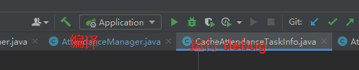
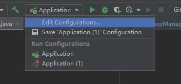
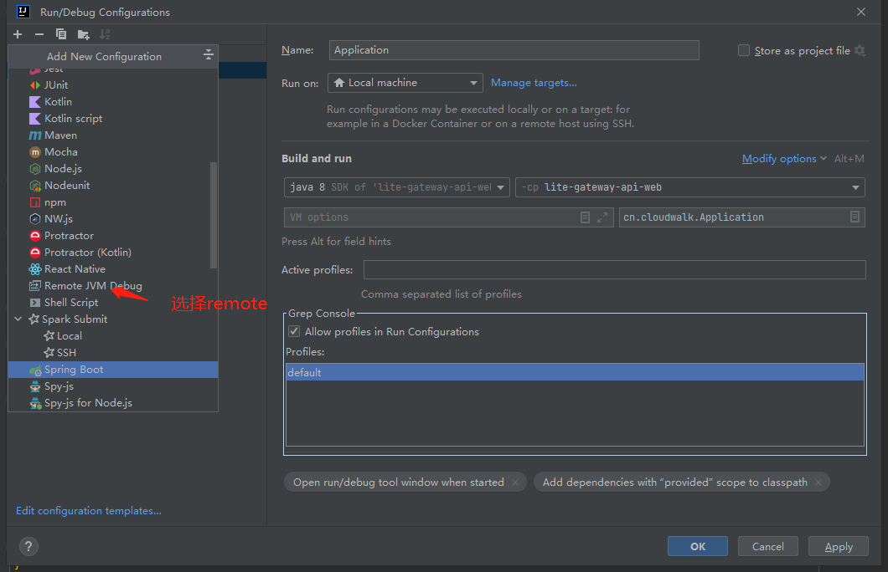
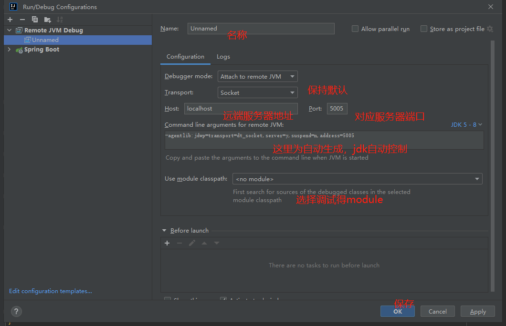

# 1.本地测试

## 1.1运行对应服务的application，可以打断点进行调式

## 1.2 remote远程断点测试

首先 Edit Configuration-->+(左上角加号)-->Remote(不同idea版本不一样)-->配置远程服务

**注意：注意端口别被占用。后续这个端口是用来跟远程的java进程通信的。**

然后运行配置就完成了配置！！

### 1.2.1 IDEA 远程调试的细节

* **1、细节1：停在本地断点，关闭程序后会继续执行吗？**
  * 会的，这点比较不容易记住

* **2、细节2：jar包代码和本地不一致会怎么样？**

  * 现象：debug的时候的行数会对不上。报错抛异常倒是不会

  * 结论：**要保证和远程启动的代码一致**。

* **3、细节3：日志打印在哪里？**
  * 日志不会打印在IDEA的控制台上。即`System.out` 以及 `log.info `还是打印在远程的。

* **4、细节4：调试时其他人会不会卡住？**
  * 大部分时候会，但是在事务型的业务下不会

* **5、细节5：本地代码修复bug远程调用的时候，发现了bug，本地改好后重新启动IDEA里的项目，再到页面调用一次，能修复吗？**
  * 不能，运行的还是远程部署的jar中的代码

* ##### 6、细节6：这个不算远程调试的问题，是dropframe的问题，如果drop frame了重新进行调试，会不会插入2条记录？

  * 如图 `userMapper.insert(eo)` ，本方法没有使用 `@Transactional` 修饰，mapper方法执行过后事务会被立即提交，则库表里多了一行记录，如果drop frame后，再次进行调试，再次执行这代码，于是又插入了一条记录。
  * 

补充：**关于什么是drop frame**

* **7、细节7：跟上面一样，是dropframe问题，如果把上述插入数据库的逻辑，换成调用远程的接口，在dropframe后，再次执行相同的代码，会不会导致远程接口被执行了2次？**

会的

### 1.2.2 缺点

* 1、难保证本地代码和远程一致，而且你也很难判断是否一致
* 2、通过远程调试发现了bug，但是又不能立即修复后继续调试，只能修复后部署后继续远程调试

# 2. 部署云端测试

